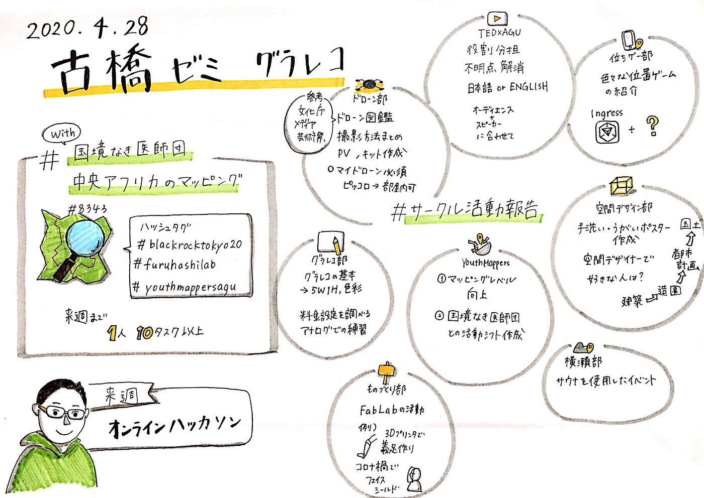
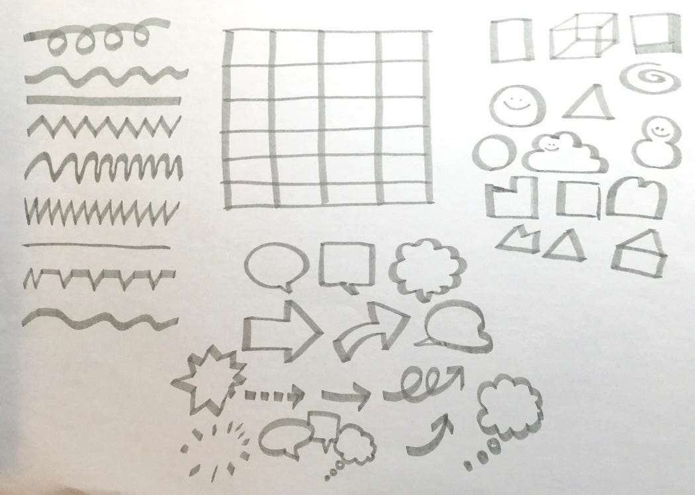
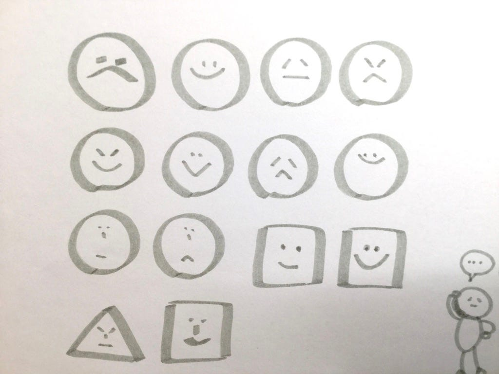
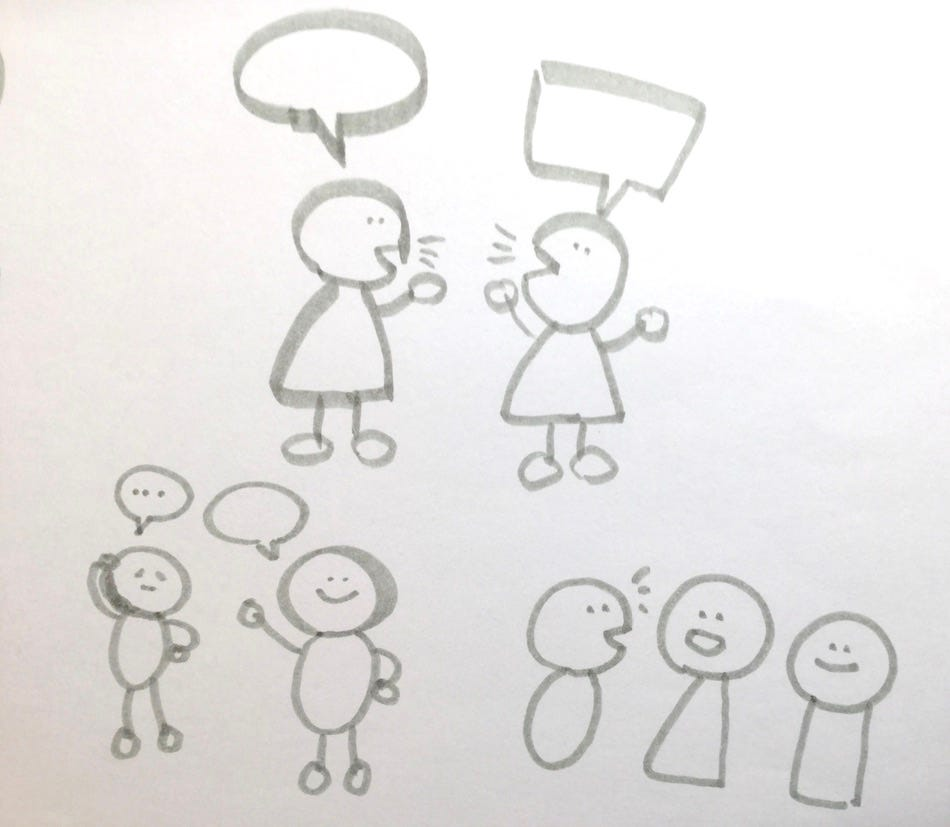
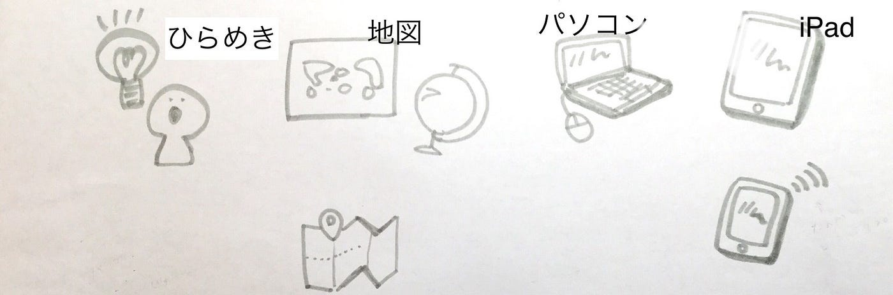
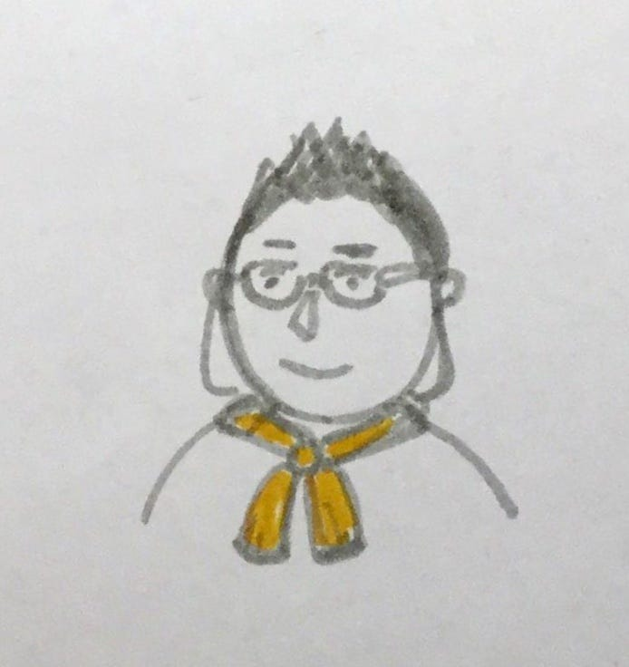
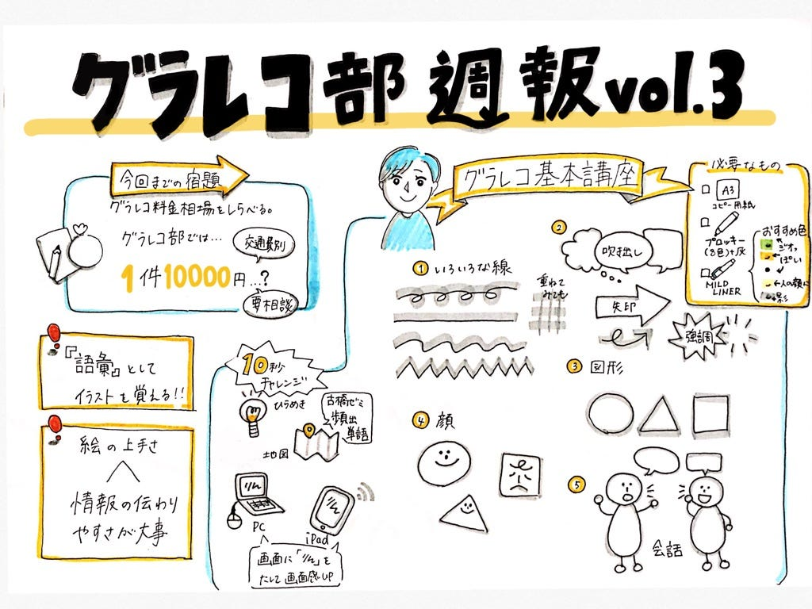

### グラレコ基礎講座開講

グラレコは筋トレと同じ。練習すればするほど身についていくもの。

というわけで、今回のグラレコ部ではペンの使い方、イラストの書き方といったグラレコの基礎を勉強しました。

### #初挑戦ゼミグラレコ

リアルタイムグラレコ初！medium初！週報担当も初！ということで緊張だらけのゼミでした。余白をどれぐらいあけながら描けばいいのか分からず、焦りまくりながらなんとか完成できました…。

部活のアイコンを参考にさせていただいた大岸さんの記事。

[グラレコ部週報：グラレコ的はじめの一歩
今週のゼミ、私はとっても緊張していたのです…。なぜなら、今回のゼミのグラレコ議事録担当が私だったから…。medium.com](https://medium.com/furuhashilab/%E3%82%B0%E3%83%A9%E3%83%AC%E3%82%B3%E9%83%A8%E9%80%B1%E5%A0%B1-%E3%82%B0%E3%83%A9%E3%83%AC%E3%82%B3%E7%9A%84%E3%81%AF%E3%81%98%E3%82%81%E3%81%AE%E4%B8%80%E6%AD%A9-dab1e930400c)

### #グラレコの料金相場とは

各々グラレコの相場を調べ話し合った結果… 。

> 一件 10000円くらい

> 交通費別途

> 気軽に相談してください

というように、グラレコ部での料金設定が決まりました！

参考記事

[2019年グラレコログと料金表｜安田遥｜note
今年の実績を載せていきます～～！ 安田遥と申します！グラレコを始めたのは2017年6月ごろ、当時所属していたワークショップデザインの勉強会である FLEDGE…note.com](https://note.com/apo_volleyball/n/na7aeb2ee4f45)

[グラフィックレコーディング料金表
会議や講演など様々な議論をリアルタイムに可視化する手法です。 話を聴きながら模造紙などに大きく描いて行くので、場の中で参加者全員と共有できたり、 進行中の議論の再確認や、絵でまとめてある為議事録としての短時間の振り返りなどに使えます。…ichi-den.sakura.ne.jp](https://ichi-den.sakura.ne.jp/wp/%E5%8F%96%E3%82%8A%E6%89%B1%E3%81%84%E6%A5%AD%E5%8B%99/%E3%82%B0%E3%83%A9%E3%83%95%E3%82%A3%E3%83%83%E3%82%AF%E3%83%AC%E3%82%B3%E3%83%BC%E3%83%87%E3%82%A3%E3%83%B3%E3%82%B0%E6%96%99%E9%87%91%E8%A1%A8.html)

### #グラレコ基礎講座

今回のグラレコ部でのメイン活動は、我らが部長、早﨑先生によるグラレコ講座！！！

##必要なもの

> **・A3のコピー用紙**

> 外部のイベントではもっと大きな模造紙に書くこともあるそうです。

> **プロッキー(8色) + 灰色**

> **・MILDLINER**

コピー用紙、プロッキーは研究室にあるものの現在のコロナ禍では取りにいけない！ということで家にあるもので代用しました。

実際に練習したものがこちら。

最後に、、、我らが古橋先生の顔を書いてみる。

書いてみながら、他の人の絵を参考にしたりととても楽しみながら学ぶことができました！

今回のグラレコ術ポイント

> **語彙としてイラストを覚える**

> **しかし、絵がうまいかよりも情報がうまく伝わるかが大事！！！！！**

リアルタイムで描くからこそ、どれだけ早くかけるか、そして情報がわかりやすいかが重要なのだと学びました。

今回学んだことを参考にグラレコを書いてみたのですが…

とにかくMILDLINERの**灰色**とてつもなく使える！ことを実感いたしました。影付けくせになってしまいそう…。

グラレコは筋トレというように、継続的に練習し奮闘していきたいと思います。

青山学院大学 古橋研究室3年

川嶋彩香
