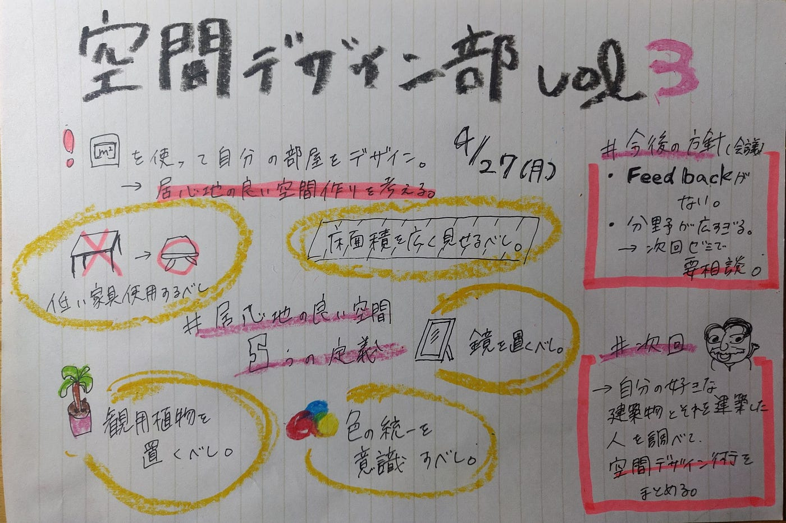

### 居心地の良い空間ってなんだ？

今回の空間デザインサークルのテーマは「居心地の良い空間を考える」で、magicplanという神アプリを使って自分の部屋をより自分好みに使いやすくデザインするという課題を設けてそれについて語り合いました。そこで気づいた「居心地の良い空間を作るための５つの定義」を紹介していきたいと思います。

私たちの課題↓

[https://speakerdeck.com/ayaka0324/kong-jian-dezainbu-chuan-dao-falsebu-wu](https://speakerdeck.com/ayaka0324/kong-jian-dezainbu-chuan-dao-falsebu-wu)

### 居心地の良い空間を作る５つの定義

#### _**①低い家具を使用するべし！_**

→低い家具を使用することで部屋を広く見せる効果が期待できる

#### ②観葉植物を置くべし！

→ヒーリング効果大、ただ置くだけでも癒されるのでこの期間にはとってもおすすめ‼

#### ③鏡を置くべし！

→よくスーパーなどでも使われている用法。部屋がアッと広く見えます。

#### ④床面積を広く見せるべし！

→いろいろなところに物を置かずにひとつにまとめたり押し入れにしまっちゃたり、、、とにかく見える部分を広くし部屋を広く見せる。

#### ⑤色の統一を意識するべし！

→いろいろな色を使用せずに壁や床天井の色に合わせた家具を置くことで部屋全体がすっきりした印象に！

このように5つの定義を考えた私たち

### しかし、、、

「feedback」がない！！！

私たち空間デザイン部は今年から開設され大体のテーマや方針は決まったものの自分たちのやってることが何のためになっているのかそもそもこのような定義は正解なのか具体的なゴールがなかったことに気づきました。

#### そこで４/３０（木）古橋先生に参加していただき再び話し合いました。

話し合ったこと↓

> ・空間デザインの方向性

> →私たちが空間デザインとは何かを深く知る必要性。（次回課題）

> ・空間デザイン部のゴール設定

> →「ポートフォリオ作成」、「相模原祭フラッグ」、「TEDxにおいてのバーチャル空間兼リアルなイベントの空間デザインを担当」、「行動学と絡めた空間デザイン」

> ・インプット、アウトプットについて

> →「自分の好きな作品良い作品をどれだけ目に通すことができるのか」「デザインの世界で使われている専門用語を学ぶ」

> ・Feed backについて

> →「slack」「zoom」「facebook」などを用いて客観的な意見をもらう。

### 次回

> ・好きな建築物、建築家を調べてその方が行っている空間デザイン術を調べて発表。

> ・自分にとって空間デザインとは？の定義を明確にして話し合い

