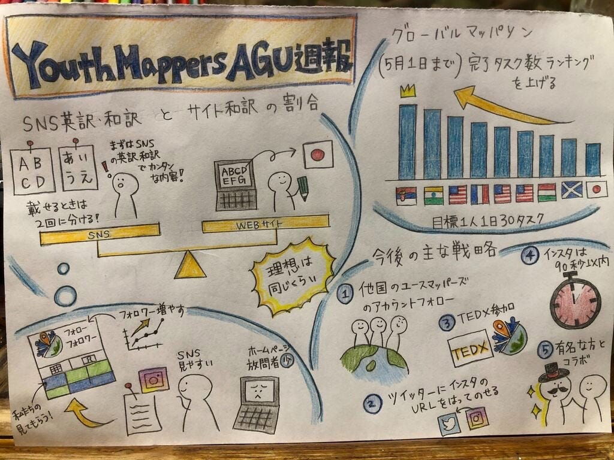

### SNSを活用していきます

こんにちは。今回担当する2年の村松です。

4月29日に第6回YouthMappersAGUの定例会議を行いましたので報告させていただきます。

**・先週の振り返り**

4月28日に開かれた勉強会に向けて、マッピングをZoomで数回行ないました。今回から新しく入ったメンバーも参加し、全員が足並みを揃えることができ、チーム全体のマッピングのレベルの向上を実感できました！

そして、SNS・ウェブサイトの和訳について話し合いました。今まではウェブサイトの和訳がメインでしたが、これからはSNSの投稿にも力入れていきます！まずはインスタグラムのフォロワーを増やすために、同じ内容を日本語版と英語版で2回掲載することに決定しました。そして、投稿を見てくださった方が、興味や詳しく知りたい場合、ウェブサイトの和訳のURLを貼ることに決定しました。理想は同時進行で行うことです！

**・今後のSNS戦略について**

まずはきっかけを作り、マッパーを増やすことを以下の5つを軸に進めていきます！

１他国のユースマッパーズやマッピング関連のアカウントをフォローすること

２TwitterにインスタグラムのURLを貼り、閲覧者を増やすこと

３青山学院大学のTEDXとのコラボレーション

４インスタグラムの動画の投稿を90秒以内に収めること

５有名人とのコラボレーション

**・今週の目標「グローバルマップソン（5月1日まで）完了タスク数ランキングを上げる」**

ノルマを1人1日30タスクを設定し、メンバーに完了タスク数の共有を行います！

#blackrocktokyo20 #youthmappersagu #furuhashilabをタグつけています！

**・今週のグラレコ**

