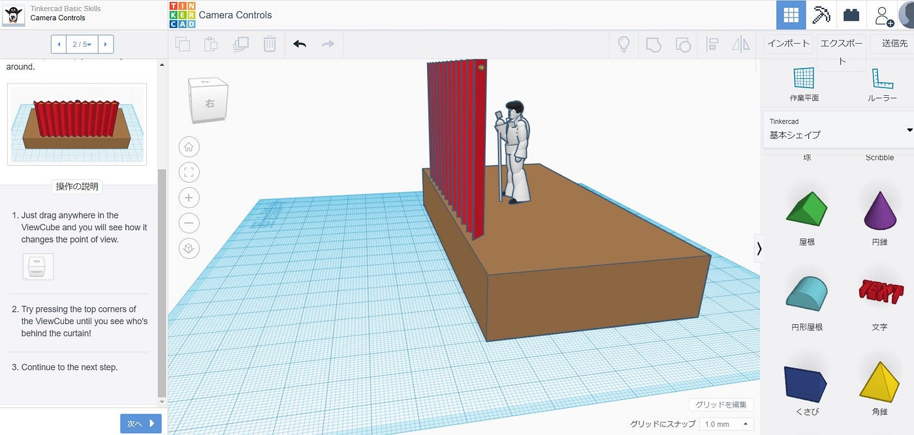
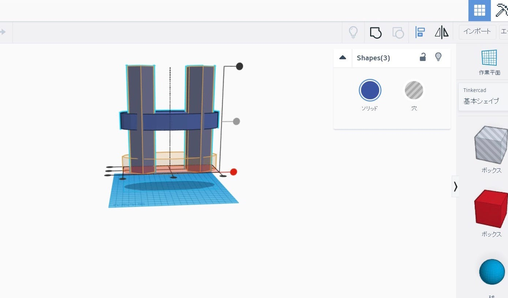
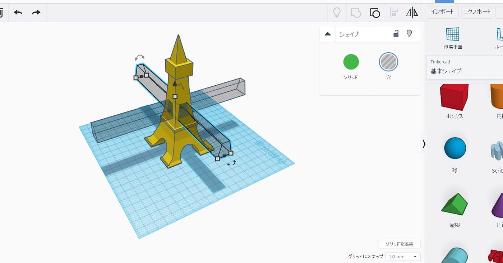
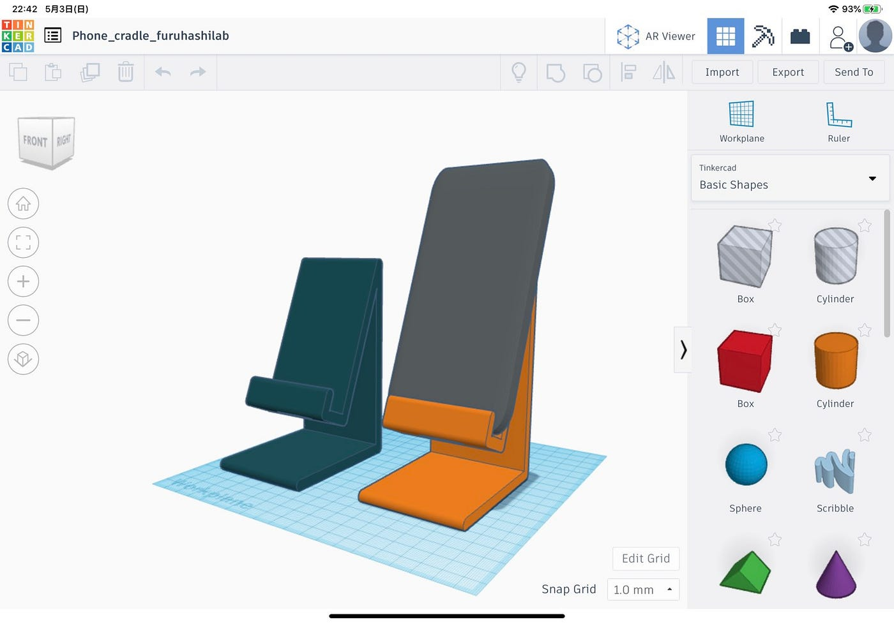
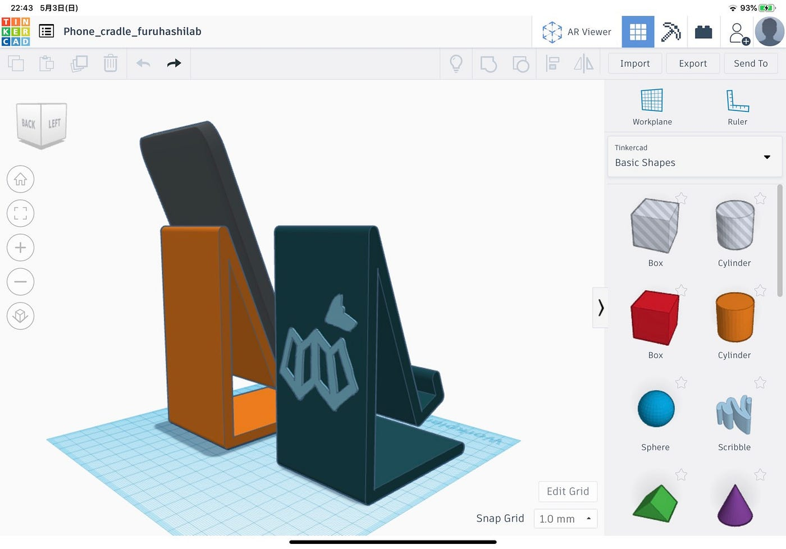
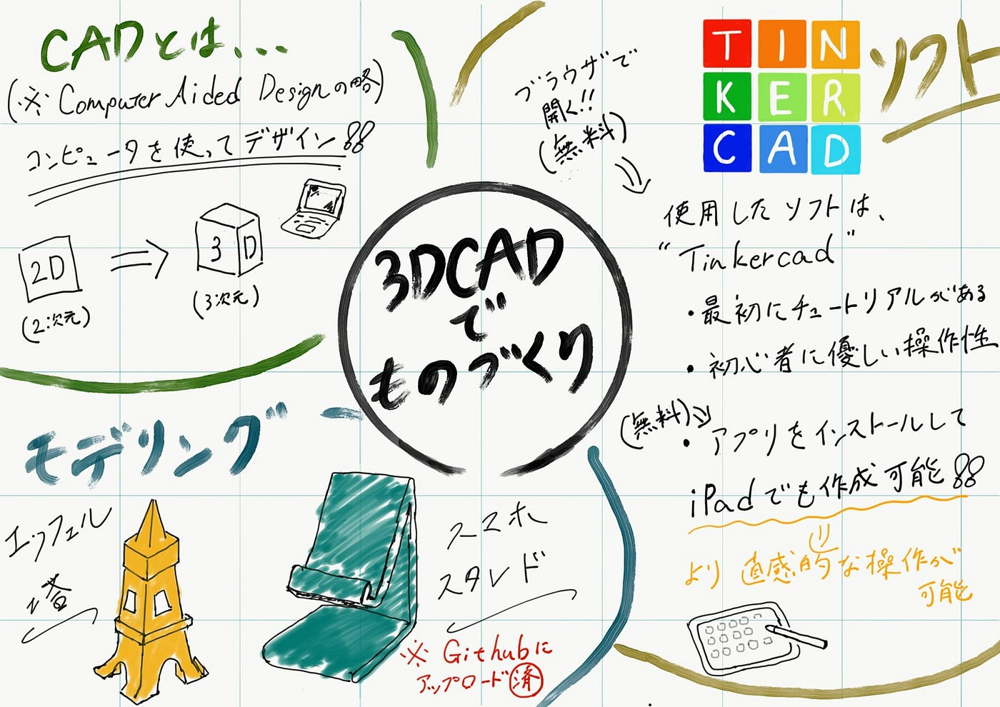

### 初めての3DCADでエッフェル塔とスマホスタンドを作ってみた

今週のものづくり部では3D CADを使って簡単なモデリングをしてみました。今回使用した[Tinkercad](https://www.tinkercad.com)という無料ソフトはブラウザベースのためダウンロード不要で特別な知識がなくても誰でも簡単に使うことができるツールとなっています。実際私たちも初めての3D cadでしたがとても使いやすかったです。

### CADとは何か

**CAD**とは **C**omputer** A**ided** D**esign の略です。つまりコンピューターを使ってデザイン、設計をするということです。CADが誕生する前は全て手書きで鉛筆や定規を使って設計されていたものがCADの開発によってより正確にできるようになり複製も楽になりました。2次元CADもありますが3次元CADでは立体をデザインすることができ2DCADでは表現できないような滑らかな曲面を表現できたり直感的な形状の把握ができるなどの特徴があります。

### 早速Tinkercadを使ってモデリングをしてみた

CADというものに対して知識ゼロだったのでなんか難しそうだな〜と思ってしまいましたが悩むよりとりあえずやってみようということで早速モデリングしてみました。

最初に簡単なチュートリアルがありました。見た目も複雑ではなく操作も楽です。大体の人はここのチュートリアルをやればすぐに何か作れると思いました。右の図形から基本シェイプや文字・数字などパーツを選び組み合わせることで自分の好きなように設計することができます。

これは最初に作ろうとしたペトロナスツインタワーの作成途中です。このようにドラッグして全体をグループ化をすることで高さを変えたり全体を動かしたりするときに便利です。

マレーシアのタワーは思うように作れずエッフェル塔を作ることにしました。これは穴を開ける作業です。この穴の形は最初に三角屋根のシェイプを置いてからボックスで上部分のとんがりを穴として消すことで作ることができました。１つ形を作ったら後はコピーペーストで量産できます。下の半円空洞も同じ手順です。

こちらは馬場作のスマホスタンドになります。

古橋ラボのマークがいい感じですね。

Tinkercadでのモデリング完了後はSTLファイルで出力しGitHubで公開しました。この後3Dモデルは古橋先生の3Dプリンタで印刷していただくことになっています。次回の週報は完成作品の実物報告から始めていきます。

神田作：[https://github.com/furuhashilab/fabla-bu/files/4569680/Eiffel.tower.zip](https://github.com/furuhashilab/fabla-bu/files/4569680/Eiffel.tower.zip)

馬場作：[https://github.com/furuhashilab/fabla-bu/files/4570366/Phone_cradle_furuhashilab.zip](https://github.com/furuhashilab/fabla-bu/files/4570366/Phone_cradle_furuhashilab.zip)

### 実際に3DCADを使用してみて

今回初のモデリングでしたがこの[Tinkercad](https://www.tinkercad.com)というソフトは操作面での不安はあまりなく初心者でも比較的簡単に使うことができると思いました。また視点をぐるぐる回していろんな方面から確認できるので直感的なデザインがしやすいです。これから何個か作成して練習していきたいと思います。

※このソフトはアプリ版もあってiPadでの作成も可能でした。

### 今回のグラレコ

