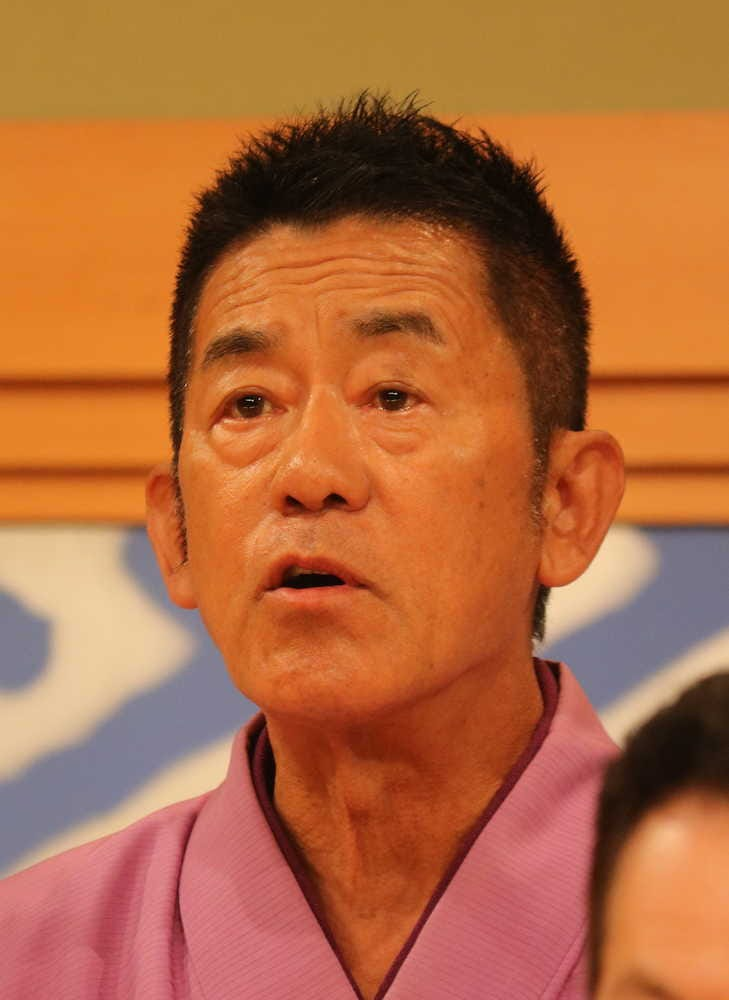
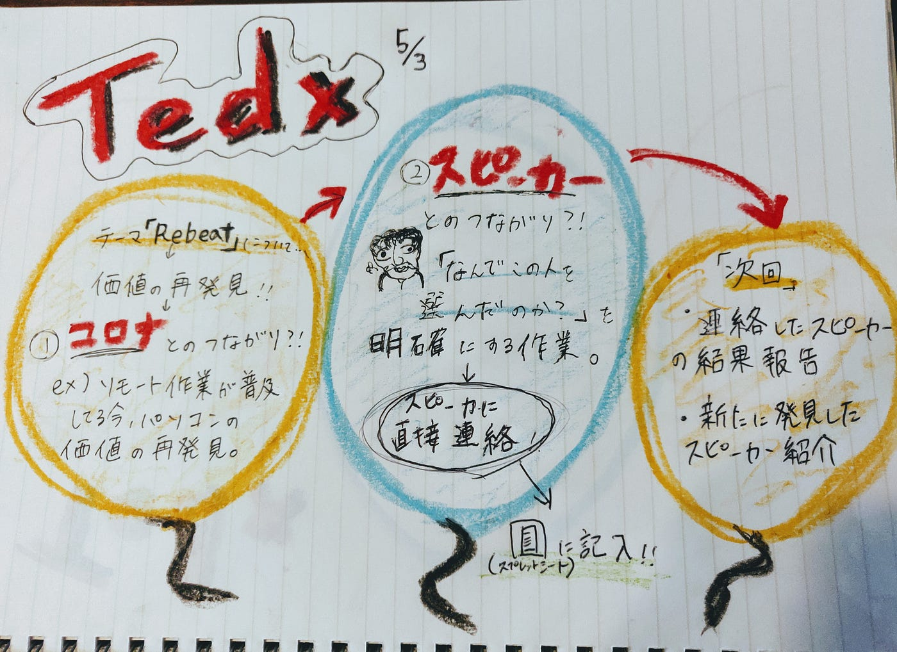

### Rebeatって何だ？

今回のtedx部ではメンバー一人一人がスピーカーを考え発表しそのあとrebeatの定義について改めて考え直しました！

### スピーカーの選出

スピーカーには円楽さんや滝川クリステルさんなどといった大物の方にもダメもとで声をかけるということになりました。

他にもヨーヨーの世界選手権の方々や青学出身のCEOの方々が上がりました。

### **しかし…**

#### **なぜこの人たちを選んだのか？**

がはっきりしていない方が多かったためテーマとスピーカーの関連性について一人一人明確にする話し合いました。

### 決定事項

> ●スピーカー候補へいつ、どのようにアタックするか？

> ・原則、本番はオフライン開催。

> ・ネット上でのTEDx開催の場合：アメーバピグみたいな形式、もしくはVRで利用

> →大学では前例が無いため、認知度UPのチャンス

> ※TEDxはオンラインで開催して良いのか？する場合の形式・準備→確認必要。

> ●**開催日程について**

> ライセンス期限：11月4日→開催日程は10月の土日（17,18,24,25のいずれか）

> ★機材搬入等の準備・リハのためスピーカーには3日間（最低2日間）予定を確保して貰わなければならない。

> ①１週間前 ②前日 ③本番

> ●コロナとRebeatの相性について

> ”日常の当たり前”がアフターコロナになった時、

> どのように”Rebeat”(再定義・価値の再発見)するか。

> Ex) 以前はオフラインで大学に行くのが当たり前。今はオンラインが主。

> “教育の価値”（質の確保、テスト、経済格差）が見直されている。

> ●スピーカーの選び方について

> ・テーマから絞る→スピーカー選択：

> 著名人含め全てのスピーカーに明確な選考理由を伝える必要がある

> よりストーリーのあるトークができる VS 選択肢が狭まるのでは？

### 次回

> ・一人一人が連絡したスピーカーの結果報告

> ・新たに発見したスピーカー紹介

