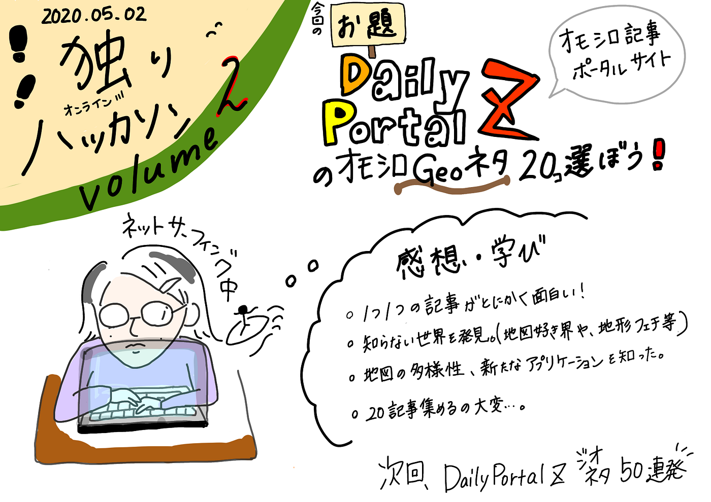

### オモシロGEOネタ２０選！（第二回 独りオンラインハッカソン）

古橋研究室で活動する事前課題として、古橋先生から３つの一人ハッカソン課題をいただきます。今回は第二回目です（前回はsound cloudを使った課題）。

タイトルやグラレコで「独り」という表記をしたのは、単純に孤独な作業だったためで、この状況を少し自嘲した言い方です。

さて、第二回の課題は

『[Daily Portal Z](https://dailyportalz.jp/about)』（オモシロネタ記事を共有する無料娯楽サイト）で見つけた地図や地理に関連した面白い記事を２０選ぶ。

というものです。

ただ面白いだけでなく、読んでワクワクする記事があると思います！

ぜひ見てください！！！

では早速シェアしていきます。

記事数が多いので、特に興味深かった記事にはコメントしています。

**1. [チーズで立体地図を作る**](https://backnumber.dailyportalz.jp/koneta05/07/19/01/index.htm)

チーズの立体ちーず....

私は立体地図キットで遊んだことはないですが、挑戦したいです。

**2. [3Dプリンタと地図データから街がよみがえる**](https://dailyportalz.jp/kiji/160710196951)

**3. [アメリカの非常階段ってなんかすてき**](https://dailyportalz.jp/kiji/170714200144)

**4. [高温すぎる日本全国をチーバ君にしてみた**](https://dailyportalz.jp/kiji/180817203714)

じわじわ、、、、読み進めると推し◯◯ー君が見つかります。

ちなみに私はエヒーメ君推しです。

**5. [香港は撫でまわしたくなる街だ**](https://dailyportalz.jp/kiji/170421199389)

**6. [存在しない街の犯罪物語〜空想地図がおもしろい〜**](https://dailyportalz.jp/kiji/140320163603)

**7. [地図を見ながらお酒を飲む「地図バー」に行ってきた**](https://dailyportalz.jp/kiji/map-bar)

**8. [理想的な「立体Y字路」を探して**](https://dailyportalz.jp/kiji/160826197281)

**9. [車が通れない道にはチェーン店がない〜ストへぇ白楽の見どころ**](https://dailyportalz.jp/kiji/streethee_hakuraku01)

**1o. [ダンボールで渋谷駅の地下地図を作る**](https://dailyportalz.jp/kiji/130510160573)

工作意欲がすごい、、！実際に渋谷駅で調査しているところがこの立体地図のクオリティと面白さを出すポイントだと考えました。

**11. [「床だけ地図」をつくる**](https://dailyportalz.jp/kiji/160114195488)

**12. [おしゃれ地図化計画**](https://backnumber.dailyportalz.jp/2010/09/23/c/)

**13. [揚げ物天国・タイの謎**](https://dailyportalz.jp/kiji/180117201767)

なるほど。。水と油の資源問題という視点から考えると、納得できるところ がありますね。

**14. 「[どうぶつの森」の主人公はどれくらい大変なのか**](https://dailyportalz.jp/kiji/how-hard-protagonist-doubutu_no_mori)

**15. [なんでもない地図を語る会**](https://dailyportalz.jp/kiji/nandemonai_chizu-kataru_kai)

**16. [千葉県の印西市が「住みよさ」６年連続全国１位ってマジか**](https://dailyportalz.jp/kiji/170629200016)

**17. [地理の教科書で見た「パイプライン」を見に行ってサンタの膝に座る**](https://dailyportalz.jp/kiji/pipeline-miru)

**18. [正しさよりも面白さを！地図は手書きにかぎる理由**](https://dailyportalz.jp/kiji/170702200049)

なんでも情報書き込むオンラインマップがあったら面白そう！

と思い調べてみたら、こんなアプリがありました。

FlipMap（フリップマップ）

[https://prtimes.jp/main/html/rd/p/000000086.000018628.html](https://prtimes.jp/main/html/rd/p/000000086.000018628.html).

ご存知の方が多そうですが、このアプリはユーザーが体験したことを 地 図上のスポットの情報として投稿、シェアできる地図SNSアプリです。

ダウンロードを試みると、現在入手できないとのこと。

その他にも特殊な用途がある地図アプリがあり、地図アプリの奥深さを学びました。

**19. [歩くと浮かび上がる地図**](https://dailyportalz.jp/kiji/150128192647)

**20. [日本列島の立体模型地図がすごすぎて動けなくなりました**](https://dailyportalz.jp/kiji/should_see_the_three-dimensional_map_in_tsukuba)

・

面白記事２０発いかがだったでしょうか！

Daily Portal Zでは奇想天外な発想、知らなかった世界、勉強になる情報

が集結していました。

特に私が学んだことは

#### ・**地図界隈は広い！**

地形や地図が好きで実際にアプリケーションを構築したり、イベントを開いたり、と自分のやりたいことを実践している方が全国にたくさんいる！

#### **・地図の多様性！**

地図と言っても簡略な地図を求めるのか、情報量を求めるのか、温かみを求めるのか、という風に用途や希望ごとに適した地図がある！

ことです。

しかし２０記事選ぶのは意外と大変。。。

地図や地理記事を求めネットサーフィンを続けると、頭の中が

マップや地形でいっぱいに、、！！！

古橋先生はこの現象を見越してこの課題をご教示してくれたのかも

しれない.......と思いました。

なんと次回は **Daily Portal Z ジオネタ５０**連発！の予定です。

まだまだ知識が浅い私ではありますが、この課題を通して

知識の底上げを図ります！

ご精読ありがとうございました。

・

青山学院大学 古橋研究室 3年

佐藤かほる
