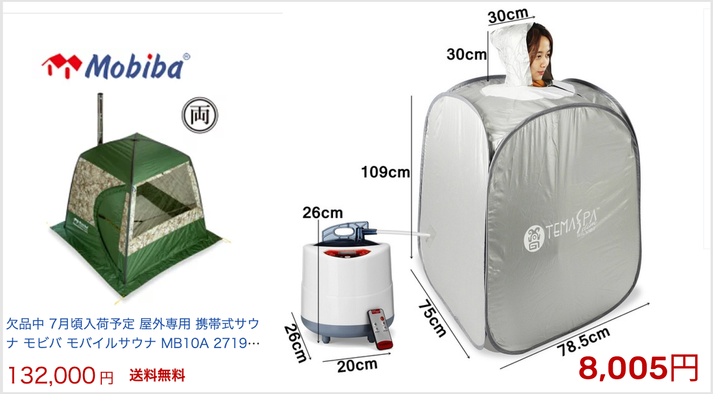

### 横瀬部週報

お久しぶりです！古橋ゼミ4年生、横瀬部のイジユルです！

前回のゼミにて、横瀬部のアンボからサウナを活用したイベント事例に紹介しました。今週のMTGでは、横瀬で実現な可能なサウナ施設について調べてみましたので、皆さんにも紹介をさせていただきます。

#### ①簡易式サウナテント

_最初は簡易サウナテントです。簡易サウナテントのメリットとしては携帯性、設置時間の短縮があります。横瀬キャンプの場所の特徴を考えるとこのテント式のサウナが一番現実的な方法ではないかという意見が出ました。価格も１人用は8000円から始め、３〜４人用は150,000円まで行くほど、バラバラでしたが、１人用を何個か備える事で費用を抑える事もできると共に、状況に合わせて、規模を調節する事もできると思うので、一番現実的で良いアイデアだと考えました。_

その他でも既存の商品を利用しない方法あります。

持っているテントを利用した**湿式サウナ**を作る方法です。

_まず石を利用して火鉢を制作→石を高温まで温めた後、火を消す→その上にテントを被せる→暑い石に水をかけて湿気を作る_

このような方法で簡単にサウナを作る事も考えられました。この方法のメリットとしては特にコストも掛からず、作れる事です。またテントだけ片付ければいいので、とても簡単だと思いました。しかし、一回性という問題がある為、多くの人が利用する時は湿気がなくなり、温度が下がるなどの問題発生する事も考えられます。

#### ②横瀬自作サウナ建築

_ユーチューブに検索すると既に自作でサウナを作る勇者がたくさんいました。その作る過程もそこまで難しいない為、コストさえ抑えられれば、DIYに詳しい横瀬部３人でも三日ぐらい作れるという判断が出ましたので、この案件も入れてみました。横瀬キャンプの主な場所である古橋先生の自宅の庭の一部を利用し、建築して置くと毎回、キャンプの度にさうなを楽しむ事ができかもしれません！しかし、それに関して建築法、古橋先生の許可、コストなど考えなければ、ならない事がたくさんある為、まだ議論と工夫が必要だと考えます。_

このサウナ施設のメリットとしては先ほど言った、長く使える持続性、そして、質高い施設でサウナを楽しめる、この二つがあると考えます。

### まとめ

以上、横瀬でサウナイベントのため、サウナを作る方法について調べてみました。あくまで利用者は古橋ゼミ、近所の住民で考えたので、規模がかなり小さくなりますが、しっかりとサウナができる方法を焦点で考えてみました。これからも持続的に事例や実現方法について調べて行きたいと思います。
