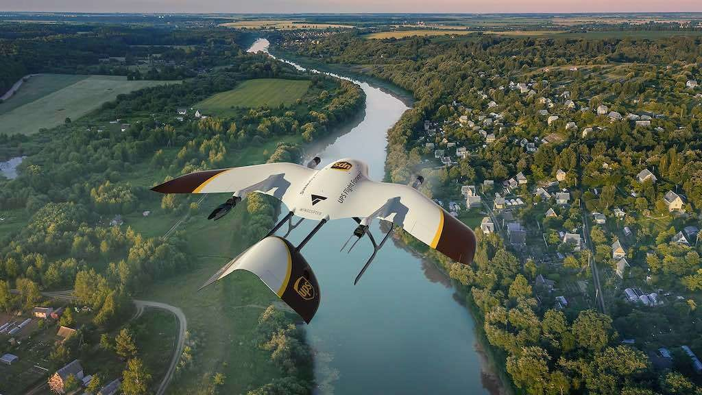
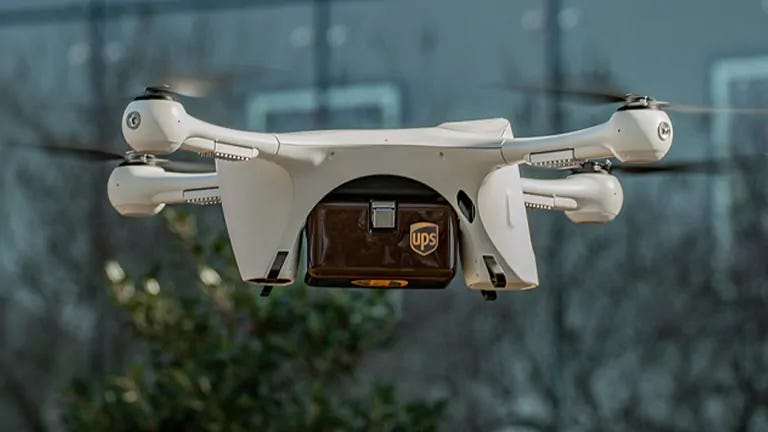
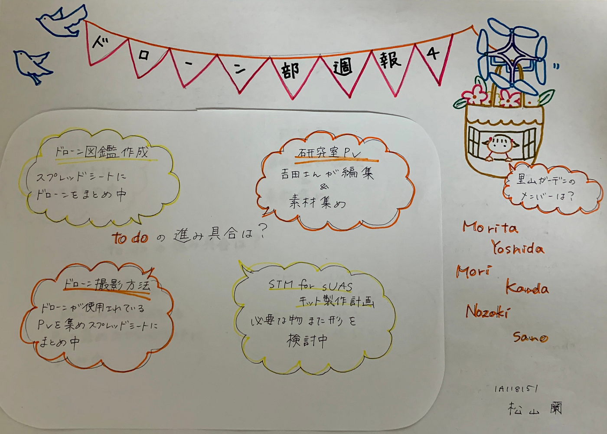

### ドローン部週報④

こんにちは。今回担当します松山です。

今回のミーティングでは

・to do の各班の進み具合の報告

・ハッカソン②の里山ガーデンを担当するメンバー決め

について話し合いました。

❘ to do 進み具合

＊ドローン図鑑作成

スプレッドシートにドローンをまとめ中

＊ドローン撮影方法

ドローンが使われているPVを集めスプレッドシートにまとめ中

＊研究室PV

編集と素材集め

＊STM for sUAS キット製作計画

必要な物また、形を検討中

❘ 里山ガーデンのメンバー

森田、吉田、森、神田、野崎、佐野

今回の週報では[「近未来のドローン配送」](https://headlines.yahoo.co.jp/hl?a=20200420-00010007-getnavi-ind)についてお話ししたいと思います。

新型コロナウイルスの影響で外出自粛生活が続いている中、オンラインショッピング利用者はますます増加しています。

そこで、アメリカの運送会社”UPSフライトフォワード”とドイツのドローンメーカー”ウイングコプター”が共同で宅配用ドローンを開発することを発表しました。

”UPSフライトフォワード”

主に医療用品を宅配

”ウイングコプター”

ドロ―ンを利用した宅配実績多数。商用利用だけでなく、緊急物資や医薬品の宅配プロジェクトにも利用されている。

＊共同開発による宅配用ドローンの特徴

・垂直離着離着が可能

・航続距離 １２０ｋｍ

・時速２４０ｋｍ（強風時でも時速７２ｋｍ）

・ティルトローター（垂直飛行、水平飛行をスムーズに切り替え、悪天候下でも安定飛行を維持）システムの使用

＊この新型ドローンはアメリカ連邦航空局（FAA）の承認が下り次第アメリカ国内外の宅配に活用される予定。

