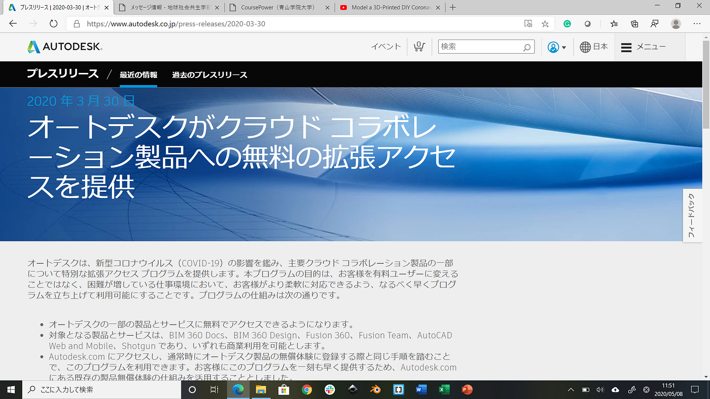
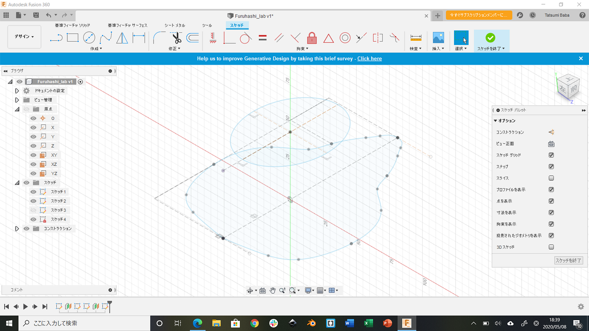
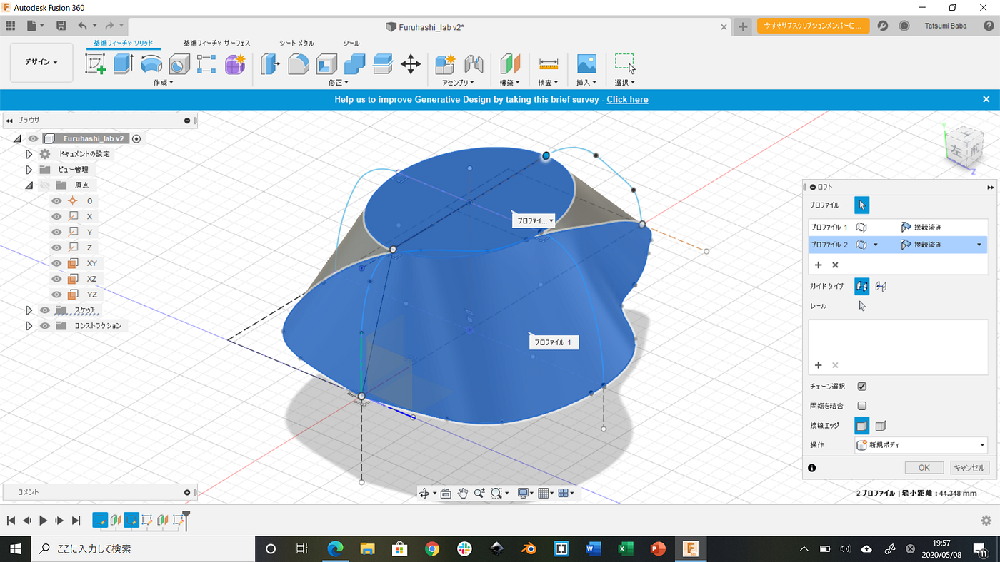
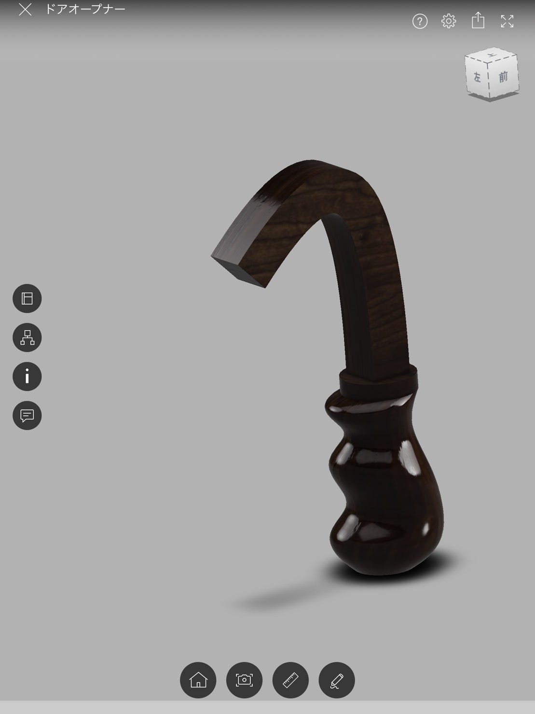
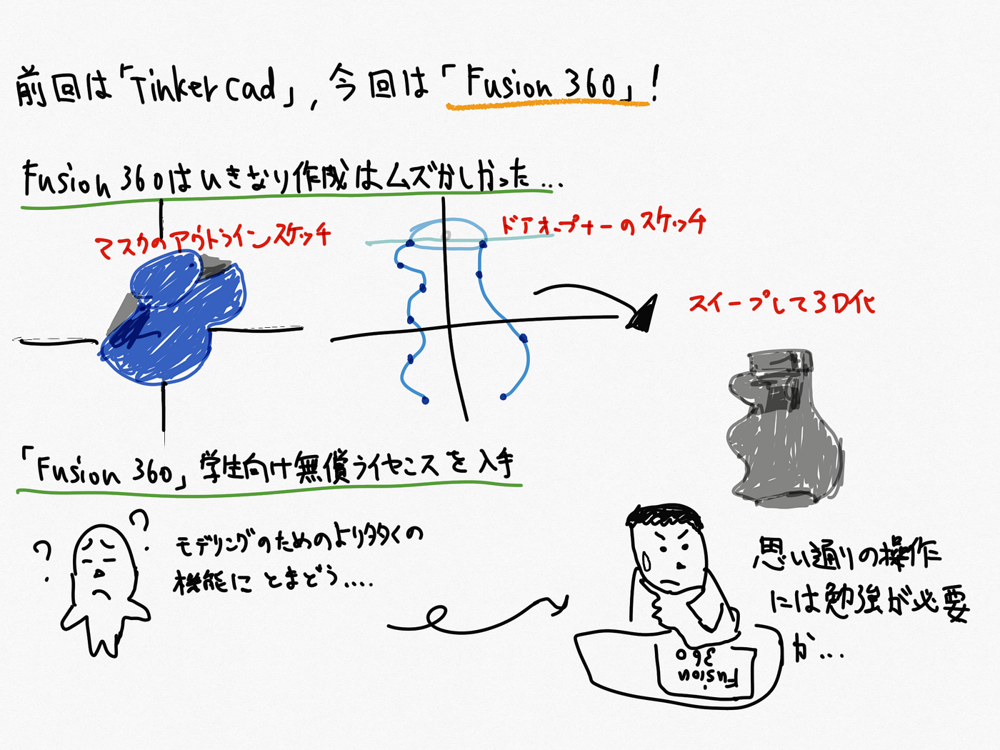

### Fusion 360 を使ってみたが…

今回も前回に引き続き3D[CAD](https://medium.com/furuhashilab/%E5%88%9D%E3%82%81%E3%81%A6%E3%81%AE3dcad%E3%81%A7%E3%82%A8%E3%83%83%E3%83%95%E3%82%A7%E3%83%AB%E5%A1%94%E3%81%A8%E3%82%B9%E3%83%9E%E3%83%9B%E3%82%B9%E3%82%BF%E3%83%B3%E3%83%89%E3%82%92%E4%BD%9C%E3%81%A3%E3%81%A6%E3%81%BF%E3%81%9F-60068da93ec9)を使ってみました。

前回使用したソフトウェアはTinkercadで、初心者にはもってこいのようなものでした。しかし今回は難易度をぐんと上げてFusion 360を使ってみました。

新型コロナウイルスの影響で、AUTODESKが無料で拡張アクセスを提供していました。

#### Fusion 360でモデリング開始！

調子に乗っていきなりドアオープナーとマスクの作成に挑戦してみたのですが、やっぱりFusion 360はまだ勉強不足なところが多く難しい、、、

マスクを作成してみようと思い、YouTubeの動画を参考にしながら、実践してみました。

この辺りまでは割とスムーズに操作出来ています。

（下＝マスクのアウトライン

上＝フィルターを埋め込む部分）

曲線を描くにも、始点と終点の間にいくつ点を打てば綺麗に曲がるか考え、寸法なども取り、試行錯誤して作成しました。

四方に上下を繋ぐ線を作り”ロフト”をかけたのですが、何回やっても上手くいきませんでした。

原因は、四方の線がしっかり上下のオブジェクトに繋がっていなかったというだけなのですが、調整が一向に出来ずにギブアップしてしまいました。。。

こちらは神田が作成したドアオープナーです。

こちらはしっかり出来ていますね、、、

このまま出力してプリンタにかけてもいけるのではないのでしょうか。

（ちなみにドアオープナーとは、手を触れずにドアを開ける為の道具で、コロナ対策として注目されているものです。）

#### Fusion 360を使用してみて

今回はFusion 360という事で比較的レベルの高いソフトを使用してみたのですが、一言で言うとやはり思っていた以上に難しかったです。

Tinkercadとの操作方法も全然違く、モデリングをする為のより複雑な機能が所狭しとあったという印象でした。また、ショートカットキーも所々違いがあり困惑する事もありました。直観的な操作もあまり出来ないかなという感想です。

#### 今回のグラレコ

