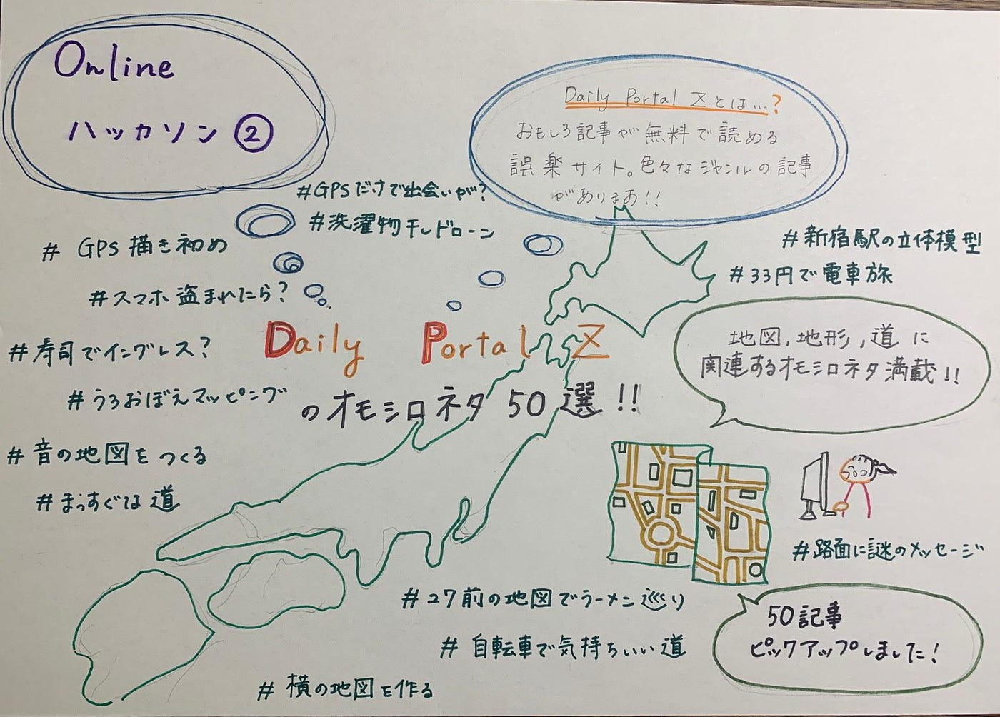

### 【ハッカソン】続・おもしろGEOネタ50選

前回佐藤さんの一人ハッカソンで、GEOネタに関する面白い記事を20個をDaily Portal Z で選んでもらいました。 [記事はこちら](https://medium.com/furuhashilab/%E3%82%AA%E3%83%A2%E3%82%B7%E3%83%ADgeo%E3%83%8D%E3%82%BF%EF%BC%92%EF%BC%90%E9%81%B8-%E7%AC%AC%E4%BA%8C%E5%9B%9E-%E7%8B%AC%E3%82%8A%E3%82%AA%E3%83%B3%E3%83%A9%E3%82%A4%E3%83%B3%E3%83%8F%E3%83%83%E3%82%AB%E3%82%BD%E3%83%B3-33b4eadf605a)から

今回私たちハッカソンの班ではこの記事を2.5倍の50個見つけてきました。今回はそちらを紹介します。

前回紹介がありました通り[Daily Portal Z](http://Daily Portal Z) は無料の娯楽サイトなので興味を持った人はぜひ面白い記事を見つけてみてください。

Daily Portal Zでは地図や地理系以外にもたくさん面白い記事がたくさんあります！

例として [自宅でできる二郎風ラーメンの作り方](https://dailyportalz.jp/kiji/141020165435) このような記事がいっぱいあります。

今回はなぜ面白いと思ったかの理由も全部記載しているので見てみたいと思った作品がありましたらぜひ見てみてください。

**[1．河原にある「土手けもの道」をじっくり見る**](https://dailyportalz.jp/kiji/11439)

地図にはない、人が近道するために自然と出来た土手けもの道がとても愛くるしく見えてきてしまいました。

**[2．料理のレシピを鉄道路線図っぽく表現してみる**](https://dailyportalz.jp/kiji/130529160762)

料理の材料、順番一目で見てわかる素晴らしさ！！！我が家は今日カレー駅に停車します。

**[3．明治の道だけを歩いて江の島を目指す**](https://dailyportalz.jp/kiji/10367)

100年以上前の人々が使っていた道ということを考えると趣があり、感慨深い気持ちにさせられました。

**[4．自転車で気持ちいい道**](https://dailyportalz.jp/kiji/140813164853)

今すぐとても滑らかな道を自転車で思いっきり走りたくなる衝動に駆られる記事です。

**[5．Googleマップで名前だけ見て気になる場所を見つける→調べずに行ってみる→ほぼ予想外で笑える**](https://dailyportalz.jp/kiji/google-maps-adventure)

新感覚のクイズみたいでワクワクします。広がった想像を面白く覆される感じが良い。

**[6．中学社会科地図帳のかわいすぎる「名物アイコン」を鑑賞する**](https://dailyportalz.jp/kiji/map-kawaii-icon)

子供が興味がもてそう、どれもかわいすぎます。一推しは帝国書院のタイ。

**[7．店内に県境のある店巡り**](https://dailyportalz.jp/kiji/180629203273)

町田のヨドバシカメラは東京と神奈川の県境らしいです。無意識に県をまたいでいたとは…

**[8．もしも伊能忠敬がスマホを持っていたら**](https://dailyportalz.jp/kiji/160922197490)

16年かけて日本地図を手掛けたのはすごい…確かにスマホを持たせてあげたいと思いました。

**[9．まっすぐな道**](https://dailyportalz.jp/kiji/111110150428)

これを見ればまっすぐな道に魅了されてしまうこと間違いなし。

**[10. 島国フィリピンの形をフィリピン人に書いてもらう**](https://dailyportalz.jp/kiji/kakeru-Philippines)

フィリピンの形は、人の形なんてびっくりです！

**[11．タイで見つけた憧れの日本**](https://dailyportalz.jp/kiji/170722200218)

タイ人が想像する日本の伝統的なものがぎゅと詰まったショッピングモール

**[12. 27年前のガイドブックでラーメン屋巡り**](https://dailyportalz.jp/kiji/120223153771)

現在のガイドマップではなく過去のガイドブックを利用することで当時あったものと現在あったものを比較することができ、すごく楽しそうです。今も経営しているラーメン屋は少し趣があり、麺をすすりたくなりました。

**[13．サントス散歩神保町で古地図ざんまいの巻**](https://dailyportalz.jp/kiji/130602160797)

地図好きにはたまらないお店

**[14．音の地図をつくる**](https://backnumber.dailyportalz.jp/2007/10/18/c/)

地図にカーソルを当てるとなんとその付近の音がでてきてより地図がリアルになったみたいでとても面白いです。2ページ目の部屋の場所によって違う音が出るのは空間デザインにももしかしたら使えるのかな、、、と思いました。

**[15.「うろおぼえマッピング」が楽しい！**](https://dailyportalz.jp/kiji/131011162029/page/1)

地図に載っている情報をもとに場所を探し当てるのが面白いと思いました。地図の条件も変えることにより遊びの幅が広げられて自分もやってみたくなりました。

**[16．スナック感覚で天地創造できる「え～でるすなば」で佐渡ヶ島や能登半島を創造**](https://dailyportalz.jp/kiji/150729194184?no=004)

ゲームセンターで砂を積んでその高さによってプロジェクトマッピングしてくれるゲームは斬新で面白かったです。

**[17．寿司で「イングレス」の説明をしたい**](https://dailyportalz.jp/kiji/141117165647)

なぜ説明するのに寿司を用いたのかはよくわからないが知っていることが出てるとなるほど！！っとなり面白い。

**[18. スマホが盗まれた時のために訓練をしよう（iPhone/Android対応）**](https://dailyportalz.jp/kiji/170625199989)

実際に携帯が盗まれた場合の訓練があり、実際の状況がわかりとてもためになり面白かった。

**[19. iPhoneで遊ぼう！地球宝探しゲーム！**](https://backnumber.dailyportalz.jp/2010/09/09/a/)

緯度経度をもとに実際にある宝を探すのはとても面白いと思った！！

**[20.「地図の資料館」で幻の女だけの島（の地図）を発見**](https://dailyportalz.jp/kiji/130307159895)

鬼のような姿をした女性だけの島が、昔日本にあると信じられていたそうです。鬼嫁だらけ、、、怖いですが面白そうです。

**[21．GPS書き初め2019・泉北亥**](https://dailyportalz.jp/kiji/gps_kakizome_2019)

かなり時間をかけているので大変そうですが、クオリティも良く、完成したとき達成感を得られそうです。

**[22．地面に書かれた「あっ！」を見に行った**](https://dailyportalz.jp/kiji/130214159564)

事故の軽減のために路面標示を「あっ！」にして目を引くことは画期的な発想だと思いました。

**[23．県境またがり神社を訪ねて**](https://dailyportalz.jp/kiji/121125158480)

長野県と群馬県の境界線の表記が実際にあってとても面白かったです。

**[24．四国を正しく書ける人はどれくらいいるのか**](https://backnumber.dailyportalz.jp/2006/07/13/c/)

四国を完全に均等に四等分だと思っていたのでびっくりしました。

**[25．こちら新宿東口においマップ調査班**](https://dailyportalz.jp/kiji/171113201192)

普通は目で見て地図を作るのを、匂いで作ることによって、今まで自分が知っていた街とは異なる、新たな街が生まれると思いました

**[26．おねしょで世界地図を作る**](https://backnumber.dailyportalz.jp/2008/06/10/a/index.htm)

どんな手を使っても頑張って世界地図を作ろうとしていて面白かったです。水をかけるときのスタイルにこだわっていておねしょを頑張って作っていました。

**[27．みんなで決めよう”最強のまち”**](https://dailyportalz.jp/kiji/170922200732)

それぞれがデザインした最強の街は個性があって面白かったです。油田をいれて税金をなくすという考えにははっとさせられました！

**[28．横の地図を作る**](https://backnumber.dailyportalz.jp/2008/04/08/c/)

いつも上からの地図になれているために、横の発想はなかったのですが、高低差のある場所ではわかりやすいかもしれないと思い面白かったです。

**[29．渋谷の駅前が廃道になるようすを見に行く**](https://dailyportalz.jp/kiji/10572)

廃道という言葉は物寂しいですが、たとえ廃道になっても、綺麗になって次の建物の一部となる場合もあるので少し嬉しい気持ちになりました。

**[30．路線図をゼロから作り直してデザインを学ぶ授業**](https://dailyportalz.jp/kiji/rosennzu-design)

楽しくデザインを学べそう

**[31．新宿駅の立体型模型ですっきりする**](https://dailyportalz.jp/kiji/161122198124)

新宿駅の構内は複雑すぎて毎回迷子になる。
模型つくるのは名案。ふつう無理だけど、、

**[32．33円の電車賃で遠くを目指す**](https://dailyportalz.jp/kiji/140326163661)

中国なんぞ今は行けないけれど、、
３３円でどこまでいける？

**[33．理想の「線路沿いの道が終わる場所」を求めて**](https://dailyportalz.jp/kiji/140613164367)

何とも言えない良さのある場所、この道にはまってしまって、何度もこの記事を見てしまします。

**[34．町の名前が教えてくれる**](https://dailyportalz.jp/kiji/120308154090)

町の漢字の由来から過去にあったものや場所を推測できて他にも調べてみたいと思いました。

**[35．ゆういち？路面に現れた謎のメッセージ**](https://dailyportalz.jp/kiji/180424202679)

4方向どこから見ても「ちゅうい」となるはずが、ゆういちに見えてしまう！笑

**[36．どこまでが日本地図か**](https://dailyportalz.jp/kiji/150806194249)

デフォルメされた日本地図にするために、完璧な日本地図から半島などを削っていく…何とも切ない気分になり、削ってほしくない気持ちになりました。

**[37．飛べ！選択物干しドローン**](https://dailyportalz.jp/kiji/150926194654)

すごい発想だけどいつ使うのだろうか。。

**[38．自動運転から空飛ぶ車まで…ロンドンで「未来の乗り物」を体感した**](https://dailyportalz.jp/kiji/move2020)

これが近未来か

**[39．もう走ってた！全国初、一般客を乗せる自動運転バスに乗ってきたぞ**](https://dailyportalz.jp/kiji/jidou-unten-bus)

自動運転レベル５が待ち遠しい

**[40．GPSだけで出会えるか**](https://dailyportalz.jp/kiji/140710164592)

アプリはGPS鬼ごっこがあるけど昔は自らやってたみたい

**[41．駅と駅のどの間のどの街ともいえない感**](https://dailyportalz.jp/kiji/130930161927)

駅近ばかり行ってると思いつかないなー

**[42．山手線はどこ行きなのか？**](https://dailyportalz.jp/kiji/130524160731)

考えたこともなかった。。。

**[43．Googleマップで名前だけ見て気になる場所を見つける→調べずに行ってみる→ほぼ予想外で笑える**](https://dailyportalz.jp/kiji/google-maps-adventure)

遊びを考える天才

**[44．わざとラフな地図を書いてもらって道迷い放題**](https://dailyportalz.jp/kiji/180601203045)

クオリティの高いgoogleマップが当たり前でもう道に迷わないからこそもう道に迷うことが娯楽に

**[45．ソーシャルディスタンスを表す図はどう描かれているか**](https://dailyportalz.jp/kiji/social_distance_zu)

バーチャルディスタンスをもっと身近な存在に感じるための良いアイディア！

**[46．地図をなぞって、どこにもない地図を作る**](https://dailyportalz.jp/kiji/140417163873)

練習すれば出来そう！

**[47．昭和の地図に残された、３つの謎を追う**](https://dailyportalz.jp/kiji/151102194962)

コナン？

**[48．路地とファッションショー**](https://dailyportalz.jp/kiji/roji-fashon_show)

昔ながらの路地をランウェイに見立てオシャレに見せる方法。インスタグラムの投稿ためならどんなところでも映えにするんだなあ。

**[49．東京100円自販機マップ**](https://dailyportalz.jp/kiji/121207158662)

この地図は非常にありがたい！
特定のものをターゲットにした地図、もっとつくってほしいな。

**[50．富士山も温泉も長い駅も！品川区の「へぇ～」スポットめぐり**](https://dailyportalz.jp/kiji/shinagawaku-heeeee)

散歩の達人を集め、地図を片手に品川区めぐり。

### ５０記事集めてみて…

記事を50個集めてみた感想としてはやっぱり地図は汎用性があるためにいろいろな使い方ができるので見ていて面白いし多様性があるんだなと再認識しました！

また私たちが日ごろ使っている使い方ではない使い方や考え方があり勉強になりました。

しかし前回と合わせて70個記事を見つけようとすると記事がかぶったりして確認するのが大変でした。

スライドはこちら

グラレコはこちらです。

