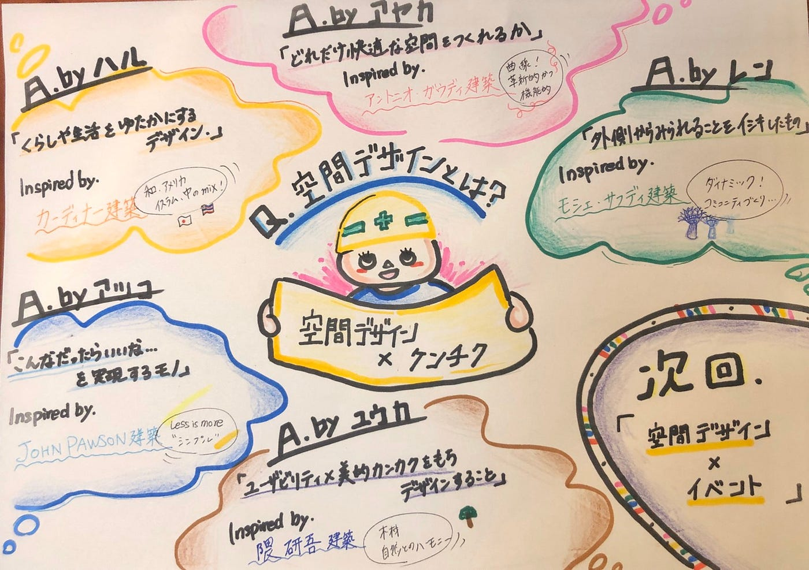

### 建築における空間デザイン術とは

#### 「建築から空間デザインの着想を得てみよう！」

今週の空間デザイン部は各自建築家、建築物からどのような空間デザインあるのか考えてみました！！！

また空間デザインの定義について考えてみました。

▶︎水谷 陽

「暮らしや生活を豊かにするためのデザイン」

希望通りの空間を演出、設計する能力が求められるもの

▶︎青木 怜

外側からみられる意識が強くある！

都市全体から設計すること！

確かに、シンガポールのマリーナベイサンズって独創的な形でありながら見事にシンガポールを象徴する建物として成り立っていますよね！

奥が深い！！！

▶︎斉藤 祐花

空間…何もなく空いているところ

デザイン…美的造形な感覚を兼ねてデザインすること

「ユーザビリティを意識しながら美的感覚を持ちデザインすること」

やはりユーザーにとって心地の良い空間ということは重要そうですね！

▶︎川嶋 彩香

アントニオ・ガウディの建築

自然の中から美しさを見出し、自分の建築に取り入れる！

それでありながら機能性を失わないというところがまたすごいです。

さすが世界的巨匠、、！

空間デザインとは「 どれだけ快適な空間を作れるか」です！

▶︎若松暖子

ミニマル建築は最近流行っているのではないでしょうか？

LESS IS MORE の考え方は 断捨離など多くものに生かされているように感じます。

継ぎ足していくのではなく差し引きすることでその空間の中で邪魔にはならず、本当に必要なものが見えてくるのかもしれないですね！

私個人では空間デザインはこんなだったらいいなを実現する場所ではないかと考えました。

建築家から考える空間デザインの定義は実に様々であるなとみんなの話を聞いていて思いました。

最小限を目指す建築、いびつな形を求める建築、曲線を重視している建築、たくさんの建築様式を盛り込んだ建築、ユーザビリティを意識した建築など、、、正解はなくて様々なニーズがあってこそのデザインであるのかなと感じました！

▶︎空間デザイン部としてのゴールが決定👏

> **TEDx AGU の空間デザインを行う**

→それに向け、デザインの基礎知識をインプット

→今年のTEDx の開催方法が未定（リアル？ or バーチャル？）

→どちらにも対応できるように準備していく

今週のグラレコ

▶︎ ▶︎▶︎次回

・イベント空間における空間デザイン術とは

・空間デザイン部における自分のゴールを設定する
