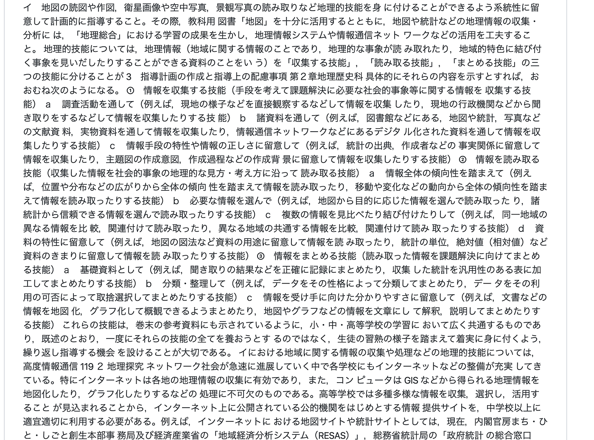
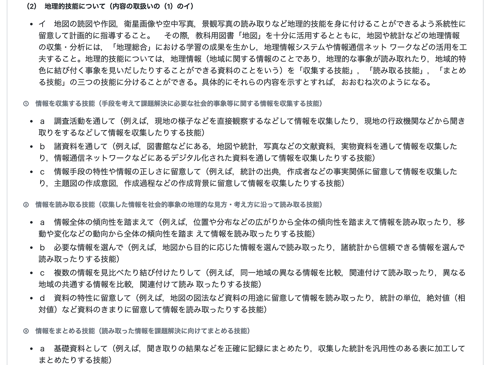
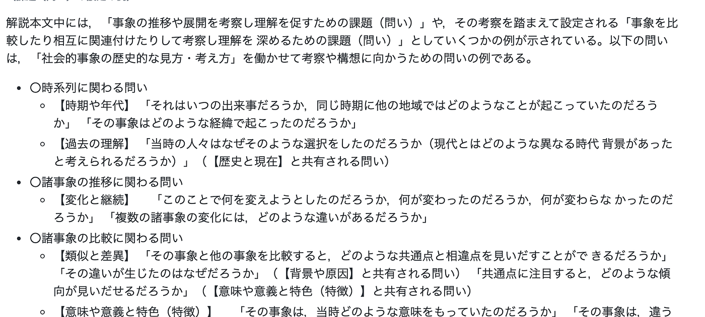
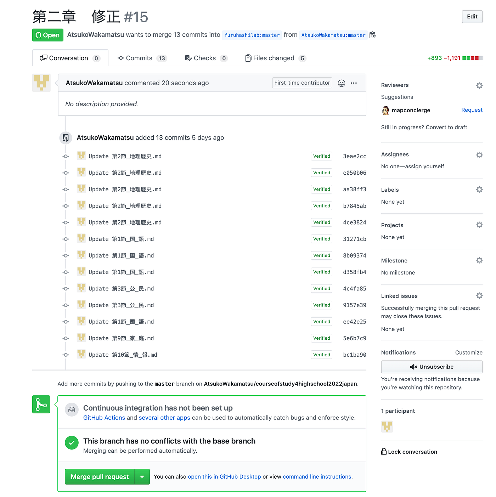
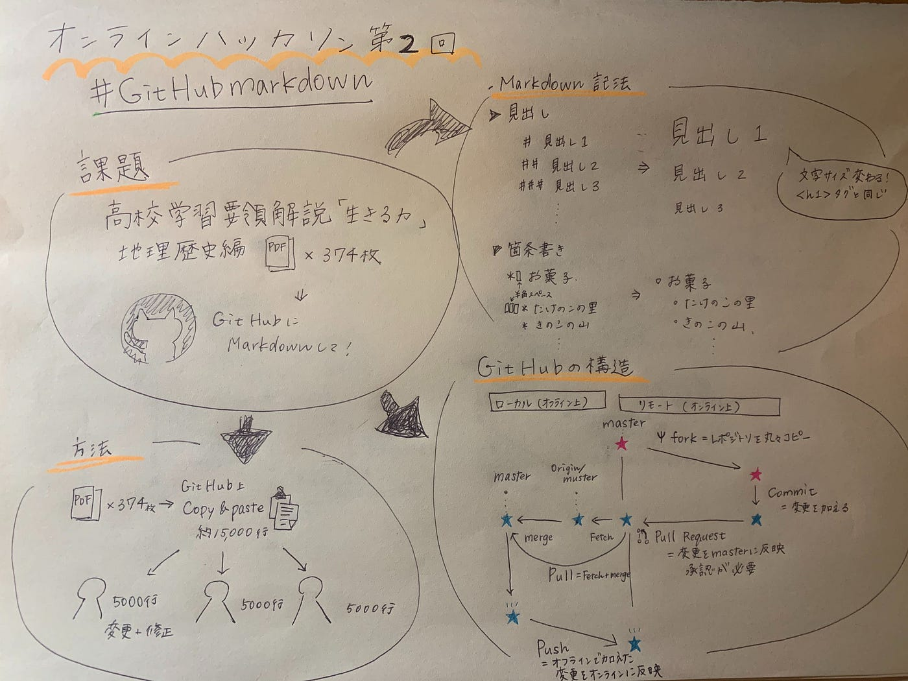

### 15000行をMarkdown式に！

古橋ゼミ、オンラインハッカソン５月編！

私たちの班は[高校学習指導要領解説「生きる力」地理歴史編](https://www.mext.go.jp/content/1407073_03_2_2.pdf)を

GitHub上にMarkdown方式でupするというものでした！

▶︎完成したものは[こちら](https://github.com/furuhashilab/courseofstudy4highschool2022japan/tree/master/%E9%AB%98%E7%AD%89%E5%AD%A6%E6%A0%A1%E5%AD%A6%E7%BF%92%E6%8C%87%E5%B0%8E%E8%A6%81%E9%A0%98%E8%A7%A3%E8%AA%AC%E3%80%8C%E7%94%9F%E3%81%8D%E3%82%8B%E5%8A%9B%E3%80%8D)です

PDF374枚分、その行数はなんと約15000行、、、

メンバーは３人なので1人5000行、、、

これを

⬇︎

このようにMarkDown式に比較的見やすい形に変更していくという作業です！

＜作業の流れ＞

①furuhashilab/[courseofstudy4highschool2022japan](https://github.com/furuhashilab/courseofstudy4highschool2022japan)/高等学校学習指導要領解説「生きる力」/地理歴史編をforkする。

②fork先がfuruhashilabであることを確認（これ大事）

③できたら古橋先生から古橋研究室のGitHub編集権限を頂く

④branchを使い、back upを取っておく

⑤自分のまたは古橋研究室のGitHub編集権限を使い、PDFの解説資料を参考にeditしていく

⑥editが終わったら変更内容をわかりやすく明記し、commit change

⑦全ての作業が終わったらpull requestをし、承認作業を行い終了。

しかし、GitHubそのものの仕組みがあまりわかっておらず悪戦苦闘しました。今後GitHubを使う全てのユーザーが同じ失敗をしないように今回おきた２つの事件を参考に解説していきたいと思います（笑）

> 事件①MarkDownってどうやるの

> 事件②自分の変更した部分が反映されてない！！！！

> 事件①Markdownってどうやるの

**Markdown**（マークダウン）とは、メールを記述する時のように書きやすくて読みやすいプレーンテキストをある程度見栄えのするHTML文書へ変換できるフォーマットとしてジョン・グルーバーによって開発されました。（Googleより引用）

だそうです。新しい記述方法という認識で大丈夫ですかね笑

今回使ったMarkdown記法は２つだけです

1. **見出し**

# →これは見出しを意味します

# →2個つけると文字は<h2>を示します

※シャープとの間に半角スペース1つないと反応しません

**2. 箇条書き**

＊ →箇条書きを示します

改行して半角スペース3つあけると改行がさらに改行が細かくなります

※シャープとの間に半角スペース1つないと反応しません

他にもMarkdownの書き方が気になる人はこちらのサイトが参考になるのでぜひ！▶︎[「Markdown記法 サンプル集」](https://qiita.com/tbpgr/items/989c6badefff69377da7)

> 事件② 変更が反映されてない！

今まで大量にマークダウンしてきたのに、反映されていない！

努力が水の泡に、、、という悲しい事件がおきました。

古橋先生のレポジトリをfork（レポジトリを自分のGitHub上に丸々コピー）したのち、変更を加えてcommitボタンを押した！

→自分のGitHub上には反映されている

→古橋先生のレポジトリには反映できていない

**⇨pull requestが承認されていない可能性**

GitHubのシステム上、マスターからforkしたものに対してpull requestを送って承認してもらわないとマスター上に自分のGitHub上でコミットしたものは反映されないんです！

変更内容を「第二章 修正」などどのような変更を行ったかを明記し、Pull requestを送ります。

マスター（編集権限有）から承認をもらってやっと反映されます！

今回15000行のデータのMarkdownは全て気合と根性で行いましたが、atomの置換処理などで簡単に改行を消す方法もあるそうです

次回はその使い方ができるようになれたらいいと思います。

＜発表用資料＞

＜グラレコ＞

