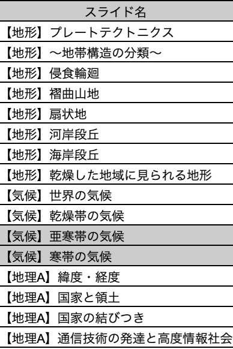
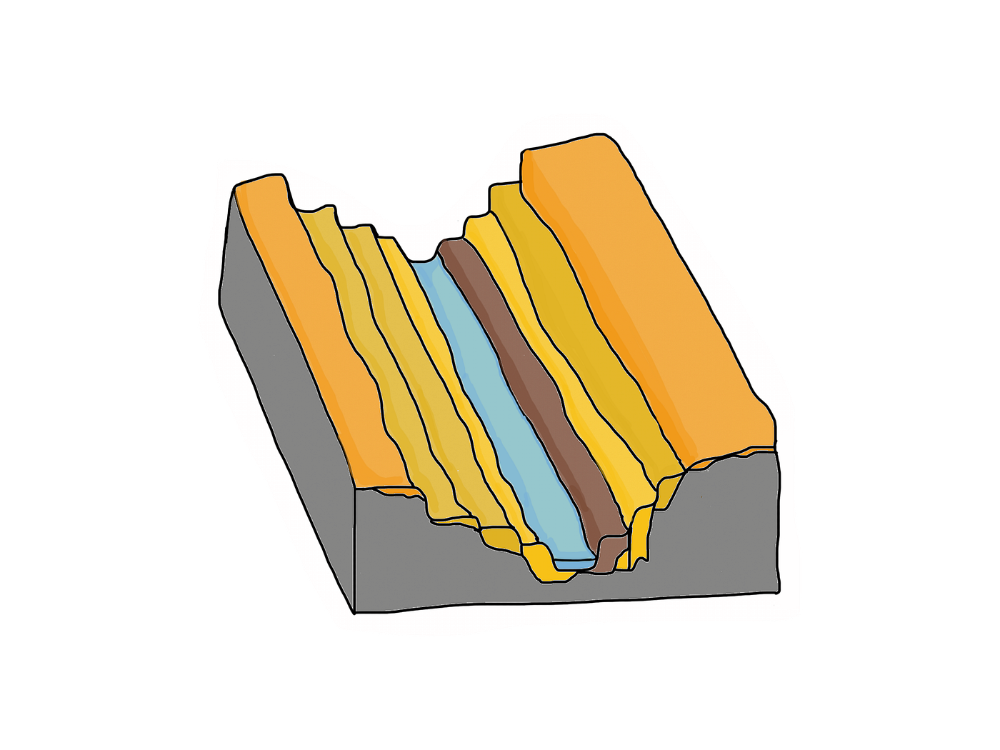
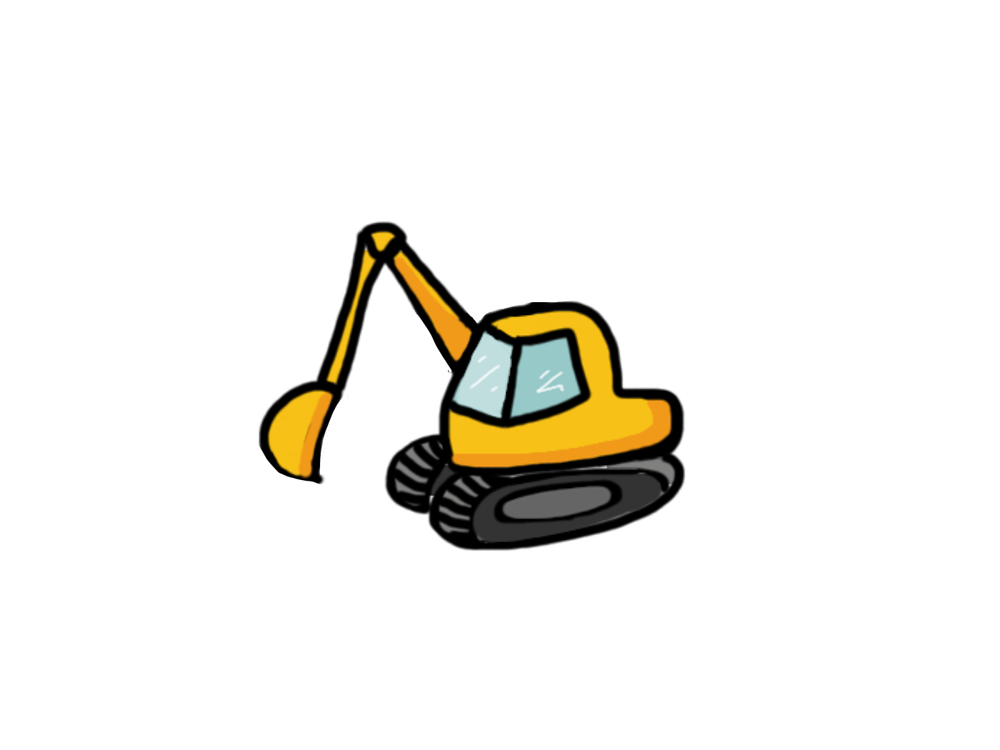
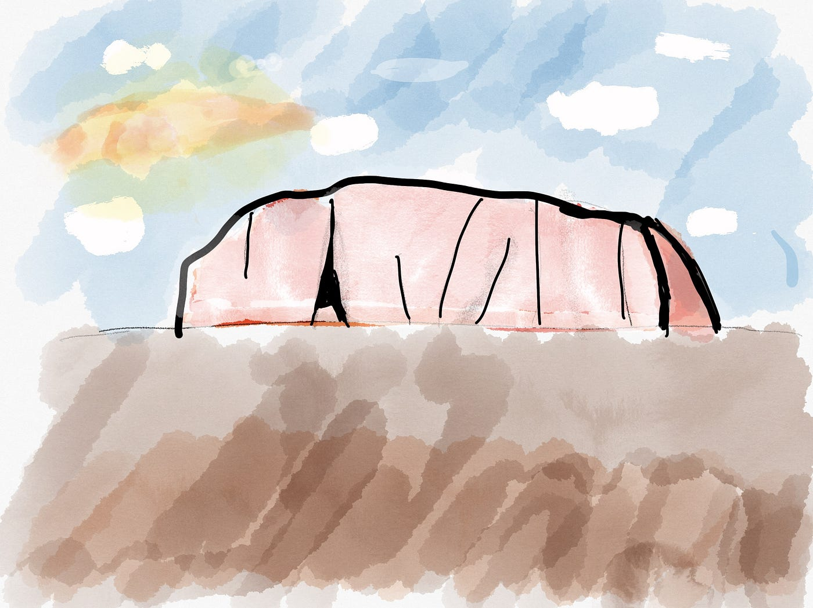
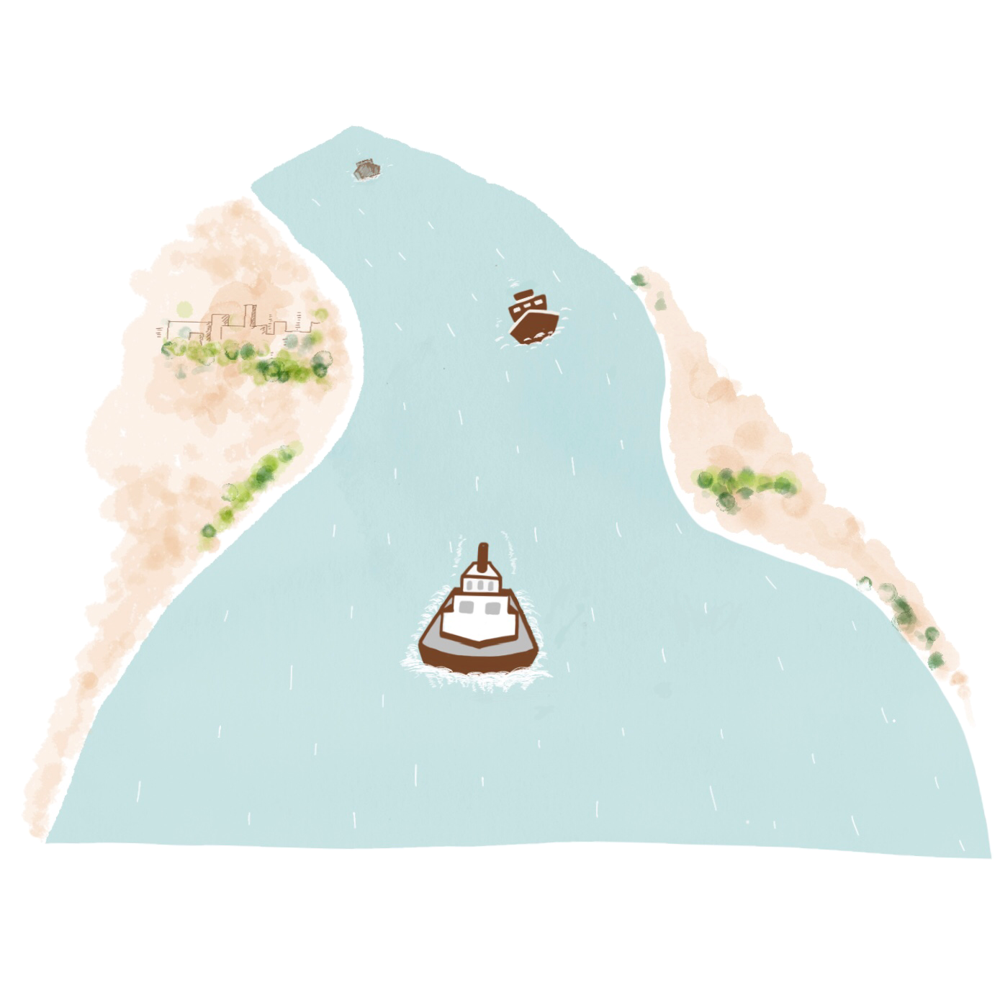
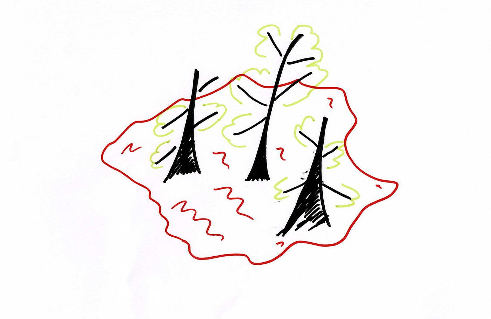

### -ICTでシェアする地理教材研究会-

今コロナウイルスの影響で、様々な場所でオンライン化が進んでおります
そんな中、学校での授業でパワポやGoogleスライドを使用する場面が増えてきています！

教材として色々画像使いたいのに著作権が・・・泣
言葉だけで概念や理論を説明するのは難しいから絵や図が欲しい・・・。

なんて声が往々にして聞こえてきます！

そんな問題を解決するため、今回のハッカソンで私達は著作権を気にせずに使えるand概念や理論をわかりやすくグラレコするという課題に取り組みました！

大まかな活動内容については、こちらを参考にしてください！

[https://docs.google.com/presentation/d/1pqI9mSMlE8JBhQhsXBzpBeIVZtf2MwraJiOSapC6w9o/edit#slide=id.gc6fa3c898_0_10](https://docs.google.com/presentation/d/1pqI9mSMlE8JBhQhsXBzpBeIVZtf2MwraJiOSapC6w9o/edit#slide=id.gc6fa3c898_0_10)

このハッカソンでは、一人ひとりが担当の場所以下参考を決めて、その中でグラレコしたほうが良いものをピックアップして作業しました！

絵のうまいゼミ生がバシバシ絵を書いていたので、ここではその一部を紹介していきたいと思います！

↑これは先生の娘さんが作ったそうです！さすが、古橋先生の地を引いているだけあります！

↑これは我らのゼミのグラレコ隊長のはやさきが描いたものです！
うますぎる・・・・。船ってこういうふうに描くんですね。勉強です笑

↑これは恥ずかしながら、著者の平澤が描いたものです・・・泣
赤土を表したかったのですが、微妙な絵が完成してしまいました・・・。

まだまだ、勉強が必要です！
