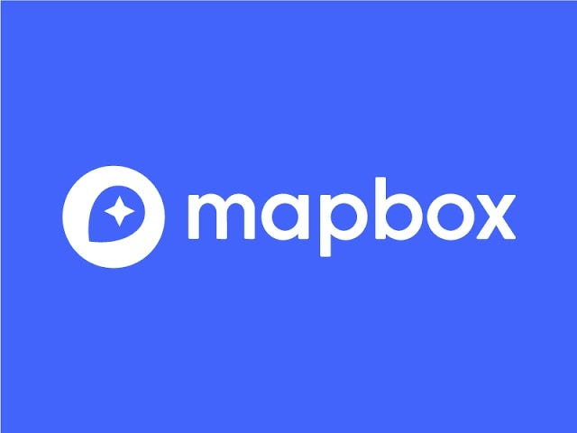
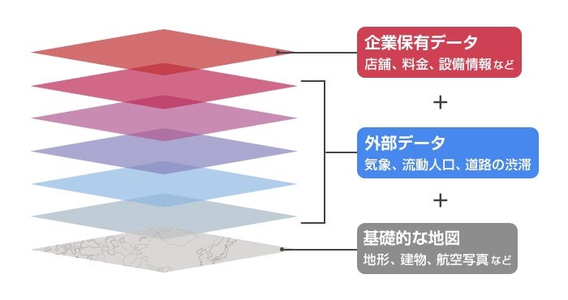
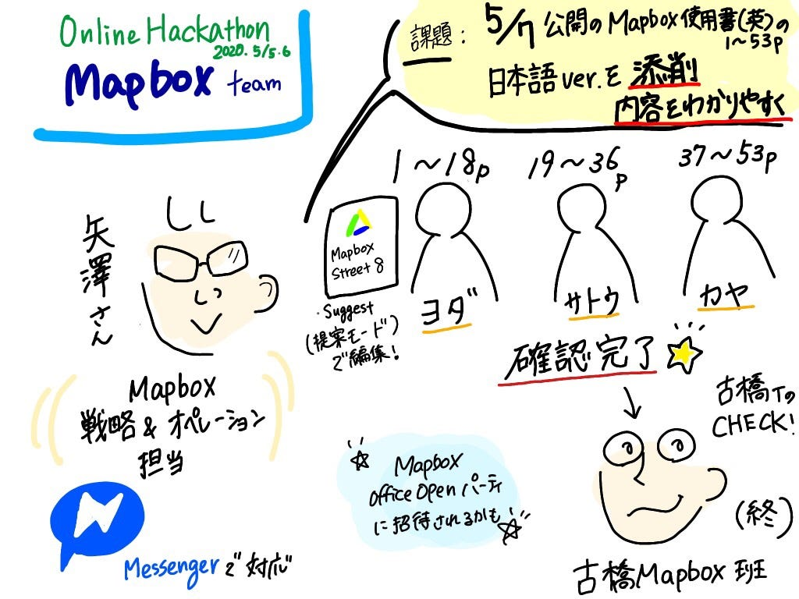

Mapbox班

こんにちは！私たちMapbox班は、Mapbox Streets v8の最終チェック作業を行いました。

まず、[Mapbox](https://www.mapbox.jp/)さんとは、、

オンラインカスタムマップのプロバイダーです。開発者向けに地図開発プラットフォームを提供する米国・Mapboxは2019年11月に日本での事業を開始しました。そして、5/7にはゼンリン地図を含む、Mapbox地図を公開されました！

Mapboxが提供するデータは地形、建物、航空写真などの通常の地図情報だけでなく、気象、流動人口、道路渋滞などの外部データも含まれ、企業が保有する独自のデータを加えることもできる。

デイブ・コール氏によると、他の地図プロバイダーを利用して地図を開発する場合、パラメータを使用して地図を変更することはできても、Mapboxのように外部データにアクセスすることも、自社が保有するデータを使用することもできません。 Mapboxの開発プラットフォームはオープンかつモジュール式であるため、高いカスタマイズ性を誇っています。また、私たちが開発して業界標準となったベクタータイル*というデータ形式は、大量のデータであっても高速かつハイパフォーマンスに、モバイル環境で地図を表示することを可能にするそうです。

さて、今回私たちは、その5/7にゼンリン地図を含む、Mapbox地図が公開されるにあたり、日本語の仕様書も作るそうなのですが、その仕様書のcheckを[Mapbox戦略&オペレーションの矢澤](https://www.facebook.com/yazawa.yoshi)さんから任せていただきました。

その仕様書というのが、[Mapbox Streets v8](https://docs.google.com/document/d/1cBpGes3bxG1_HcrSmXjwGTfBzYE7svw4I1StQneNDVY/edit)です！

私たちがcheckする点は、

- 日本語が適切かどうか

- 内容が分かりやすいかどうか

です。

[Mapbox Streets v8](https://docs.google.com/document/d/1cBpGes3bxG1_HcrSmXjwGTfBzYE7svw4I1StQneNDVY/edit)の中身を解説する文章は、全部で、53ページ分あり、

- 1〜18→よだ

- 19〜36→さとう

- 37〜53→こや

のような感じで、checkする場所を分けて作業に取り掛かりました！

矢澤さんから、ドキュメントのコピーを取ってるので、suggestモードでそのまま編集していいとの事だったので、何箇所か編集させていただきました！

実際やってみて、専門用語が多く、日本語が合っているのかどうか、内容が適切か、checkするのがとても大変でした。

ただ、編集する中で、これは、IT用語なのか！など、新しい学びを得ることが今回のハッカソンでできました！

最後にグラレコと[プレゼン資料](https://docs.google.com/presentation/d/1QeC1WseMiFfWPCqSN_8yPEyNZ4G9a4LNSgN2jL7Gd9s/edit#slide=id.g77cc93e740_0_0)です。

参考文献

- Mapbox.Japan

[Mapbox Japan: リアルタイムのロケーションプラットフォーム
Mapboxはカスタムしたナビゲーションの構築や地図の作成、自動車分野における新たなUXの開発を可能にします。Mapboxはカスタムしたナビゲーションの構築、地図作成、または自動車体験を開発者に可能にします。 高品質のローカルデータ…www.mapbox.jp](https://www.mapbox.jp/)

- FUTURE STRIDE ソフトバンクのビジネスwebマガジン

[「地図」のユニコーン企業が日本上陸。Mapboxが起こすイノベーションの正体 - ビジネスWebマガジン「Future Stride」｜ソフトバンク
（2020年2月3日掲載） 開発者向けの地図開発プラットフォームを提供するMapboxが2019年11月から日本で事業を開始した。…www.softbank.jp](https://www.softbank.jp/biz/future_stride/entry/technology/20200131/)
