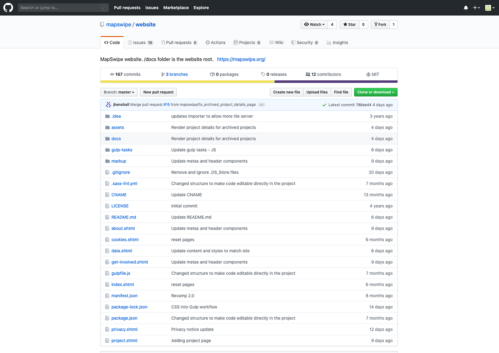
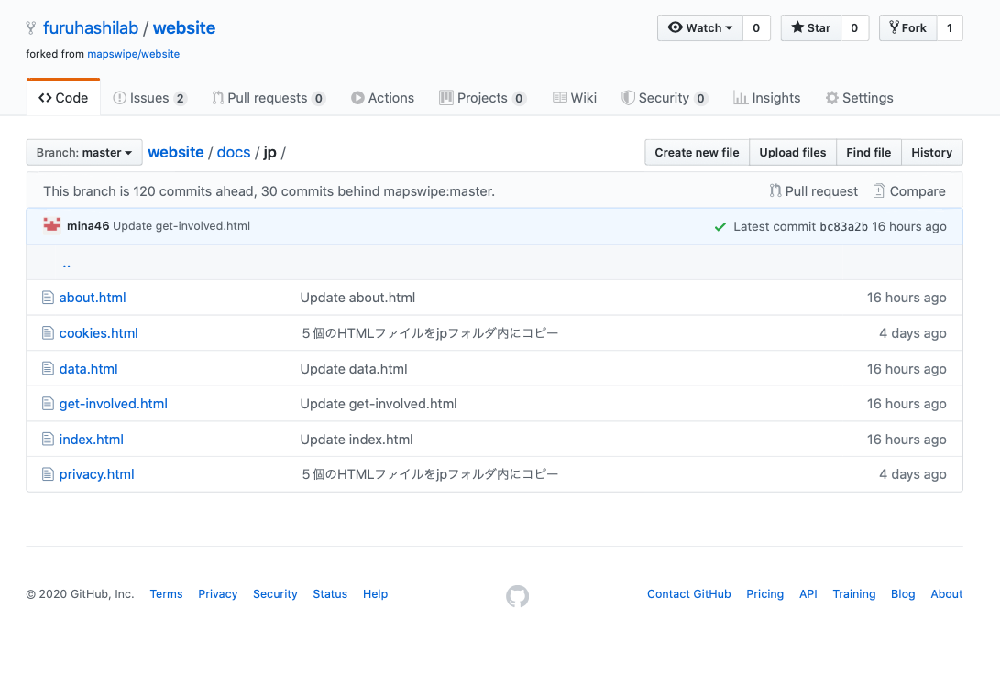
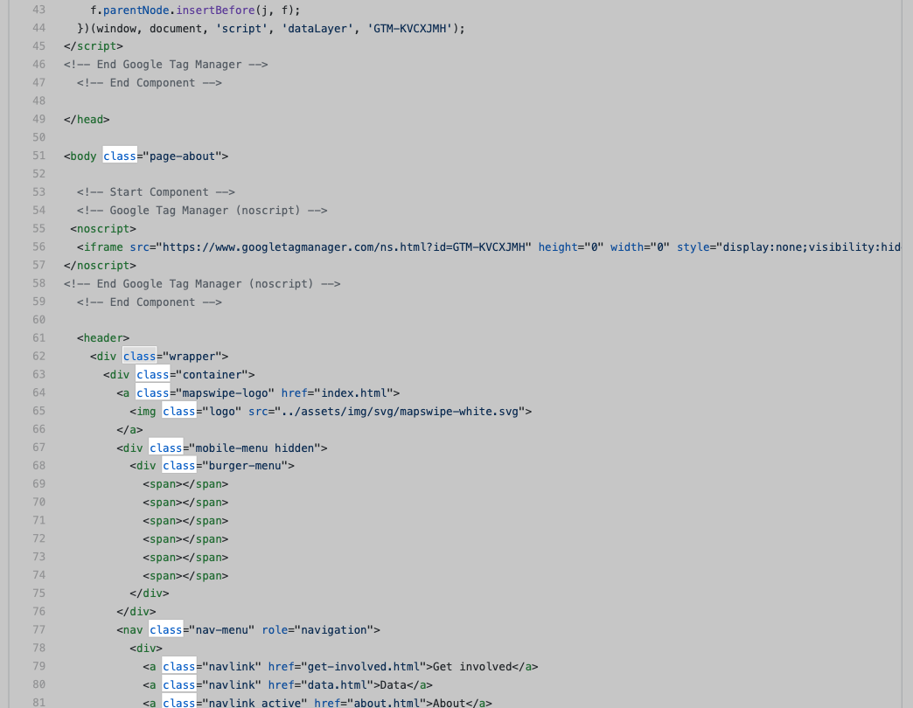
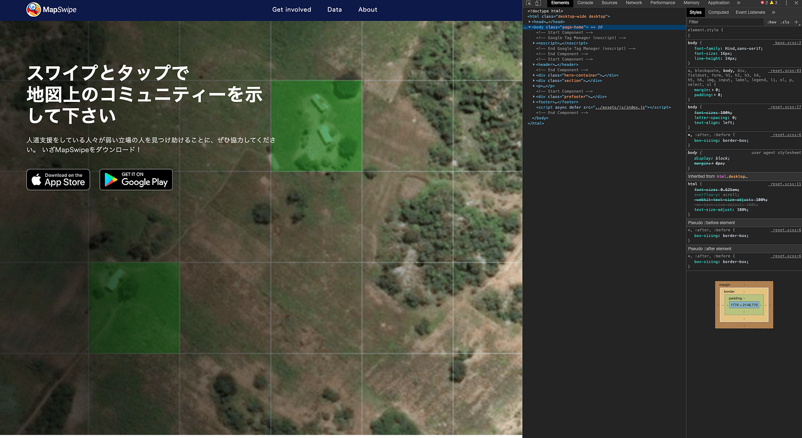
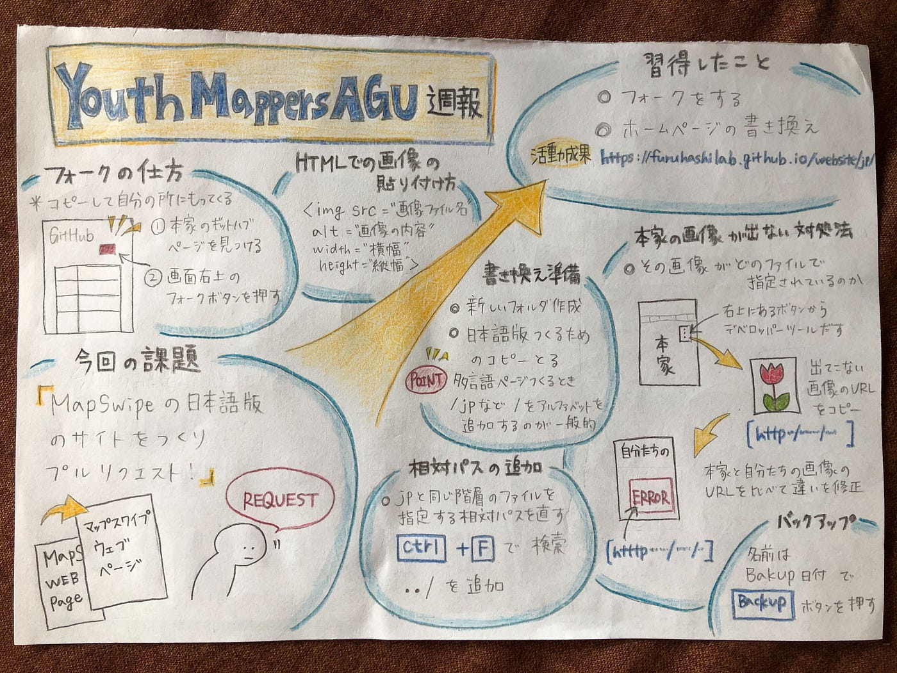

### YouthMappersAGU ハッカソン

こんにちは、YouthMappersAGU3年の日向野邦春です。今回、我々のチームはMapswipeの和訳版の公式ページの作成を行いました。

[MapSwipe | Every swipe helps put families on the map
Humanitarian organisations can't help people if they can't find them. MapSwipe is a mobile app that lets you search…mapswipe.org](https://mapswipe.org)

こちらが本家の公式サイトになります。プログラミング言語はHTMLで構成されていて比較的分かり易かったんだと思います。

#### 今回のハッカソンの達成目標

Github上で日本語化したいウェブサイトをフォークし、書き換えてプルリクエストが送れるようになる！

#### 習得した事

①日本語化したいウェブサイトのフォーク方法

1,本家のギットハブページを見つける

2,画面右上のフォークボタンを押す

3,フォーク先を指定

②ホームページの書き換え

**a.書き換えの準備**

本家のウェブサイトを書き換えないように、日本語版をつくるためのコピーをとる（多言語ページをつくる際は、ファイル名に /jp など / とアルファベットに文字を追加するのが一般的） 新しいフォルダーをつくり、/jpの者をすべてそこに入れると扱いやすい

**b.相対パスの追加方法**

/jpと同階層になってしまったファイルを指定する相対パスを直す

../ が一つ上の階層への相対パスになる（/jpと同階層になってしまったファイル名を ”ctrl + F” （検索機能）で検索すると見つける手間が省ける

**c.** **本家サイトの画像が出ない場合の対処法**

（imgタグの画像はbを参照）

**d. 本家サイトの画像が出ない場合の対処法の詮索法**

その画像がどのファイルで指定されているのかを探る。

本家のウェブサイトを訪れて、デベロッパーツールを使って確認する。（こんかいの 場合はcssのあるファイルに色々描かれていることが分かった。）

自分の作っている画像が出ないウェブサイトでエラー画像を右クリックし、画像の リンクをコピーして見比べることで何が間違っているか確認する。

【今回は/で始まる相対パスが原因でエラーが生じていたので（つまり本家のサイトの アドレス冒頭に/以下が付く設定になっていたが、自分たちの新しい日本語ウェブサ イトはアドレスが冒頭から異なる）、自分たちが作った新しいウェブサイトの絶対パ スに置き換えることで解決した】

**e. htmlでの画像の貼り付け方（img タグ）**

**f. バックアップの方法**

Branches のところに ”backup 日付” という名前にしてBranches をクリック

3、活動の成果

そしてこちらが私たちが作った日本語サイトです。古橋先生の手とり足とりで教えていただきながら作成しました。

今後は自分たちだけで日本語版サイトを公開していけるようにさらに技術を磨いていきたいと思います。

[MapSwipe | Every swipe helps put families on the map
Humanitarian organisations can't help people if they can't find them. MapSwipe is a mobile app that lets you search…furuhashilab.github.io](https://furuhashilab.github.io/website/jp/)

