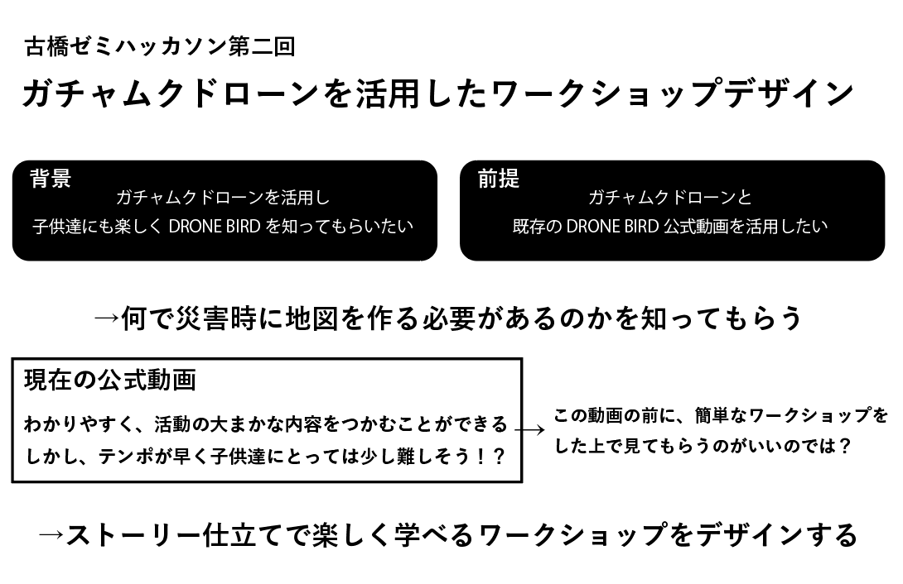

### ふるはし研究室の災害教室

こんにちは、古橋ゼミの安保龍一です！

今回オンラインハッカソンの第2回目ということで、我々のグループでは「ガチャピン＆ムックを使ったドローンワークショップの提案」を行いました。

**①今回のハッカソンの達成目標**

ガチャピンとムックのドローン（DJI Tello）を用いた、子供向け防災ドローンワークショップの発案。

何で、災害時に地図をマッピングする必要があるのか伝える。

**②経緯**

みなさんご存知のように、古橋ゼミの活動の中に防災訓練の参加があります。そこでは地域に方々に、ドローンバードの活動を知ってもらうために資料を展示したり、実際にドローンの操縦体験を行っています。

私も昨年12月に狛江市で行われた、狛江市総合防災訓練に参加しました。当日は約200名の地域住人に参加していただきましたが、大人の参加者にしかドローンバードの展示資料を見ていただくことができませんでした。そこでどうにかして子供達にもドローンバードの活動や、防災に興味をもって欲しいと思い今回のドローンワークショップ発案に至りました。

[12/2 防災訓練＠狛江市
こんにちは安保龍一です。medium.com](https://medium.com/furuhashilab/12-2-%E9%98%B2%E7%81%BD%E8%A8%93%E7%B7%B4-%E7%8B%9B%E6%B1%9F%E5%B8%82-878e8d58fb6)

**③現状**

[ドローンバードのHP](http://dronebird.org/)にてドローンバードのPVが公開されています。

非常にわかりやすく、活動の大まかな内容をこの動画から掴むことができると思います。

しかし、、、

子供がこの動画を見た際にどこまで理解できるでしょうか？大人向けに作られているので、アニメーションがメインでテンポも速く、文字による説明等がないため、子供が動画を見て理解するのはやや難しいという印象を受けました。

そこで今回、ドローンワークショップ発案に伴い一週間という限られた時間ではありましたがサンプルの動画を作成しました。防災とはどんなことをするのかという観点から、ワークショップのイントロダクション動画になります。既存のドローンバードの活動動画に繋がるようにしています。

**④動画作成で注意したこと**

> ・動画のテンポを子供向けに

> 動画の店舗をゆっくりにして子供達でも理解できるように、また子供達が自分で考える時間ができるように作成しました！

> ・グアレコ要素を取り入れる

> 文字に絵を加えてより想像しやすくしました！

> ・ストリー性

> ガチャピンとムック、そしてガーとムーで災害時に何が必要なのかということをストリー化しました！

> ・防災トレーナー「ユルピン」

**⑤まとめ**

今回は子供向けのドローンワークショップにフォーカスして、どうしたら子供たちに伝わるかというところにこだわりました。

今後の運営は青山学院大学の[UN:LIMITEDフィールドスタディ愛好会](https://unlimited-agu.amebaownd.com)が中心になってやっていくのとこと。子供達の学習環境の整備の一環として古橋ゼミとしてもサポートしていきたい。

プレゼン資料
