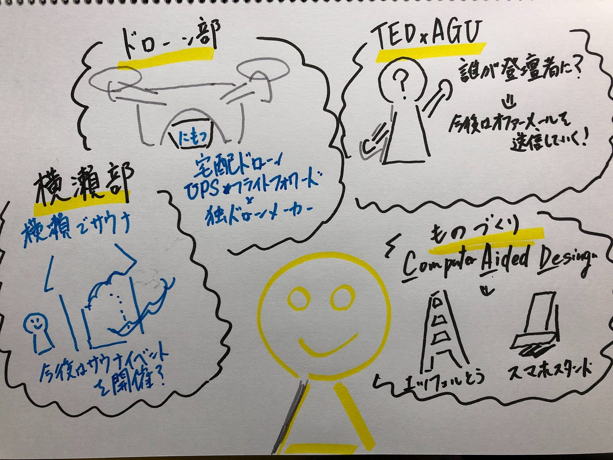
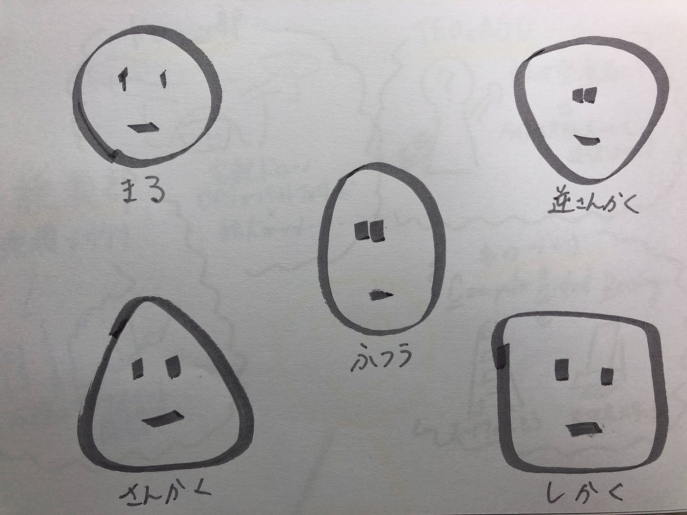
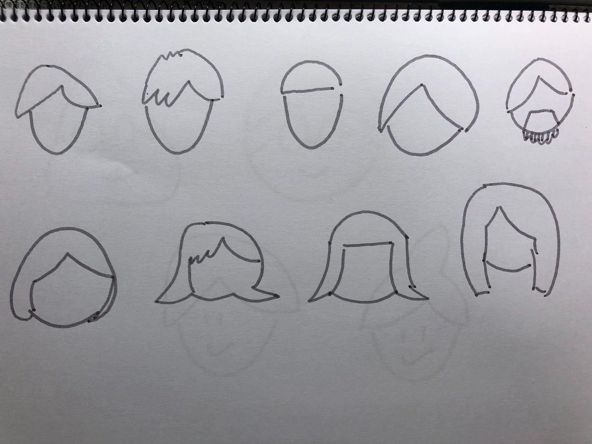
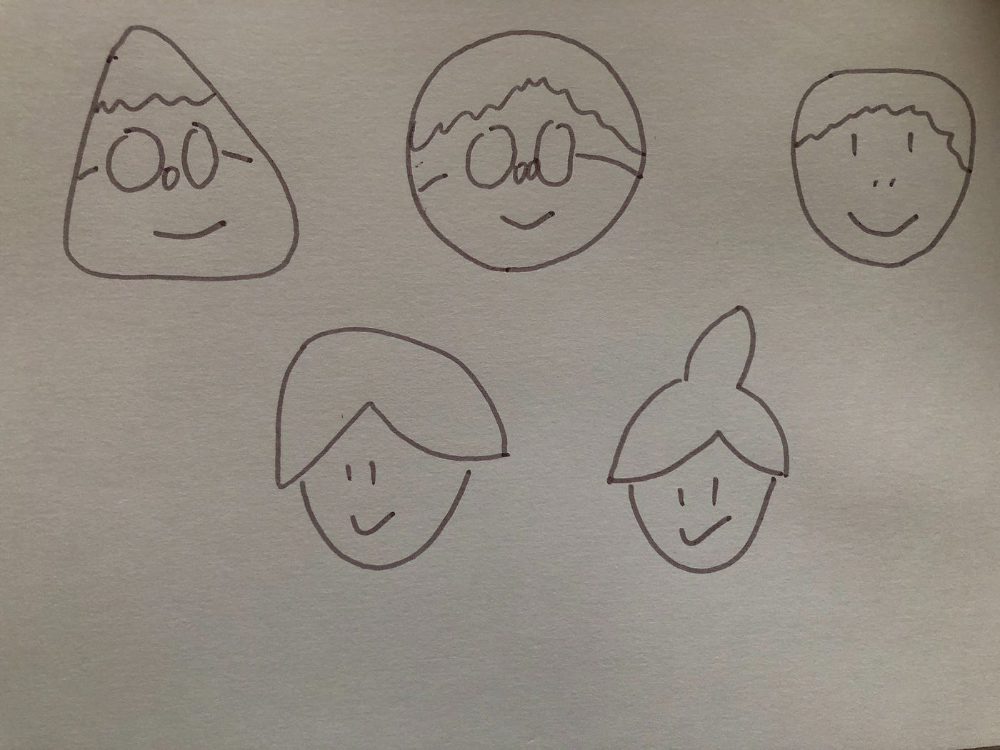

### グラレコ部週報

こんにちは！4年平澤彰悟です！
今回始めて、グラレコ部の週報を書きます！

とりあえず、先週のゼミのグラレコです！

多くの部活動が、今後の部としての方針や開催するイベントを考えている様子がうかがえました！

このなかでも、ものづくり部がエッフェル塔とスマホスタンドのモデリングを行っていたのが衝撃的でした！まだゼミが始まって間もないのにCADを使いこなしていて、びっくりです・・・・。

グラレコ部の週報として、今回私が選んだテーマは・・・・

### 人の顔ってどうやってかけばいいの？

グラレコで必ずといっていいほど、毎回描くもの。それは人です！多くの人は棒人間ではなく、人の表情を書いていると思います！

しかし、グラレコ初心者の私にとって、人の顔を描くのも一苦労・・・。
なので、今回は初心者のワタシだからこそ、描きやすいと思う人の顔について紹介します！

今回の記事は[この記事](https://note.com/kuboasa/n/n9cd641e5ec03)を参考にして書いています！ぜひこちらも見てみてください！

人の顔というのは以下の5タイプに分けられるそうです！

顔がかけたら、次は髪型です！

髪型を描くときは、髪の毛を最初に描き、その後に輪郭を描くと上手くいくと思います！

そして、輪郭と髪型を合わせるとこんな感じです！

まだまだ私は下手くそですが、一応人間には見えるはず・・・・。笑

グラレコで人を描くのは苦手という方も多いと思いますが、この記事が参考になれば幸いです！
