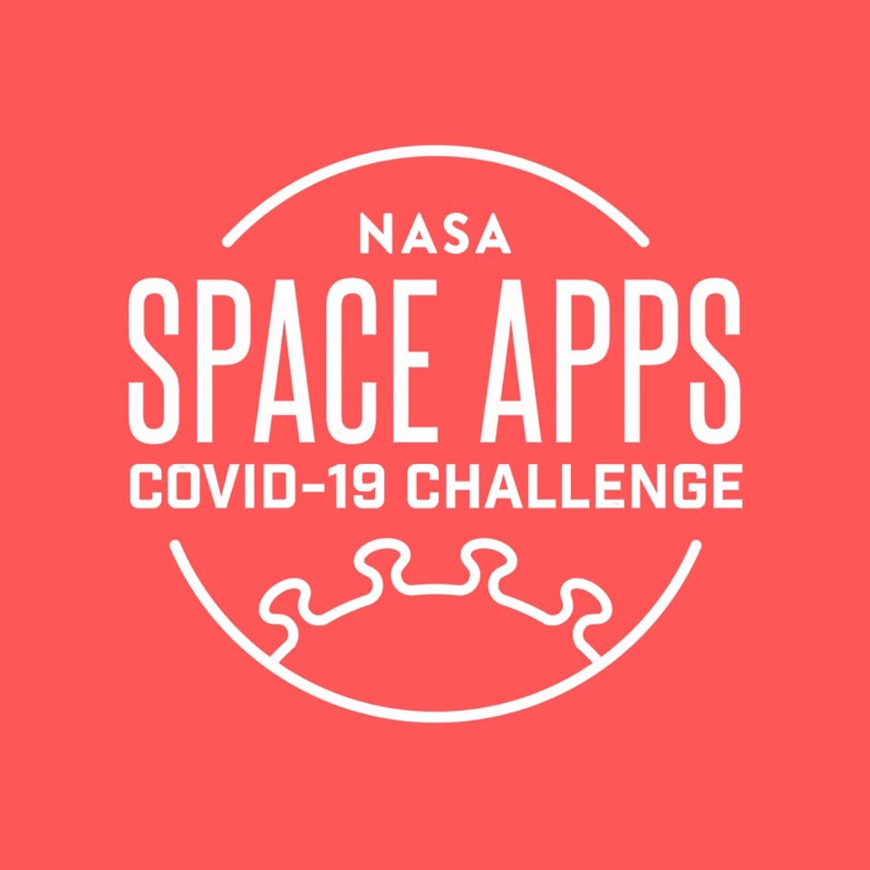
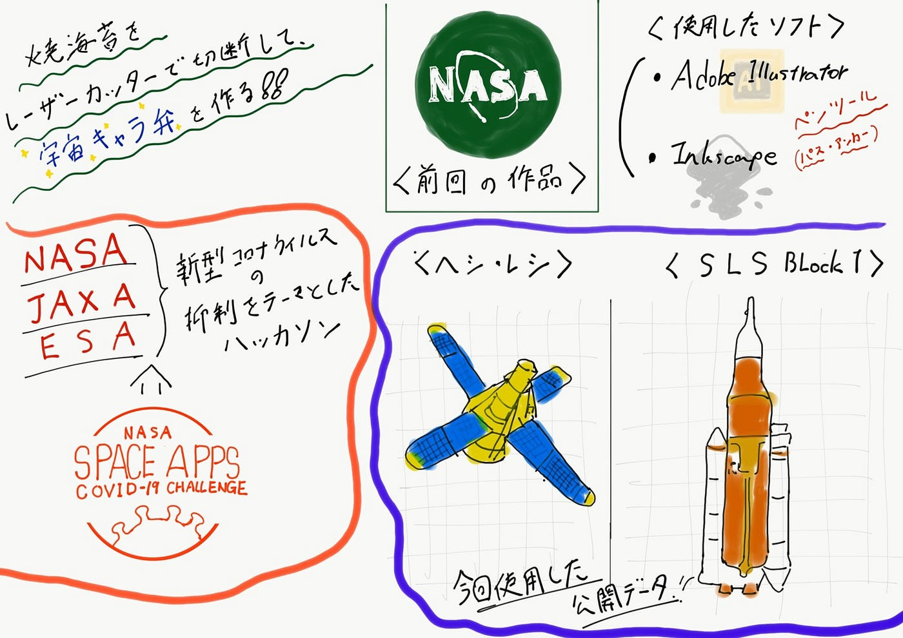

### 家にいても宇宙を感じられるデザインを目指して

今回のハッカソンでは5/30,31にオンラインで開催されるSpace Apps COVID-19 challenge に向けて簡単に宇宙キャラ弁を作れるデータセットを作成しました。具体的にはNASAやJAXAが公開しているデータを基に焼海苔にレーザーカットするデザインデータを作成しました。

今回のSpace Apps Challenge はNASAとESA（欧州宇宙機関）、JAXA（宇宙航空研究開発機構）が共同で、新型コロナウイルス（COVID-19)の抑制をテーマとするハッカソンを開催しています。

そこでこのハッカソンではコロナウイルスのために家に引きこもっている子供たちでも宇宙に興味を持ってもらうことを目指して焼海苔に施す宇宙のデザインを考えました。

手順としてはまずNASAの3Dモデルを公開しているポータルやJAXAが公開している小惑星Itokawaなどの3Dデータを参照し各自でデザインの基となるデータ決めて、ソフトにインポートしてからトリミングやトレースなどの加工をし二次元に落とし込むという作業できた。最終的に焼海苔に施すデザインになるのでできるだけシンプルにデータを二次元化することを心がけました。

データは二次元ベクターデータであるSVG形式で作成しました。今回は無料で使える「[Inkscape](https://inkscape.org/ja/)」と有料の「[Adobe Illustrator Draw](https://www.adobe.com/jp/products/illustrator.html?gclid=EAIaIQobChMI9NiF3qut6QIVxbWWCh1w-ANnEAAYASAAEgLFLPD_BwE&sdid=19SCDRPS&mv=search&ef_id=EAIaIQobChMI9NiF3qut6QIVxbWWCh1w-ANnEAAYASAAEgLFLPD_BwE:G:s&s_kwcid=AL!3085!3!340307349057!e!!g!!adobe%20illustrator)」で作成しています。

詳しいデータの作成手順はこちらになります。

次回のSpaceApps Challengeのオンライン開催は5/30(土)-31(日)に予定されています。開催までにいくつかバリエーションを増やして子供たちがもっと宇宙を感じることができるようなデザインを追求していきます！！

#### 今回のグラレコ

