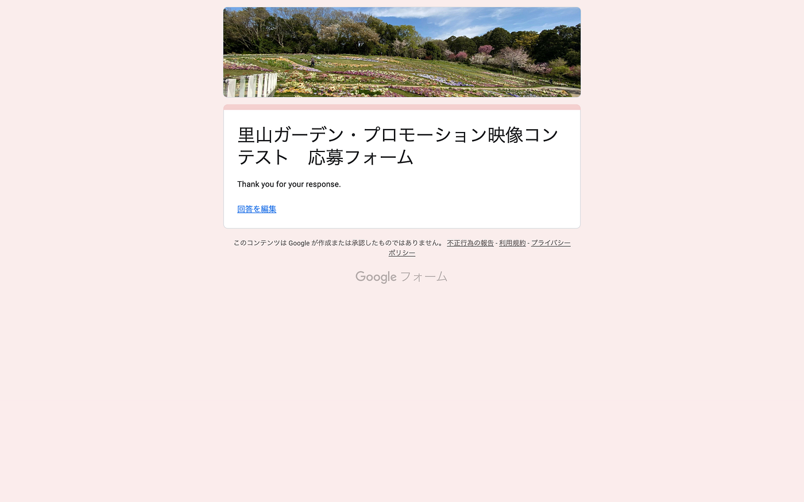
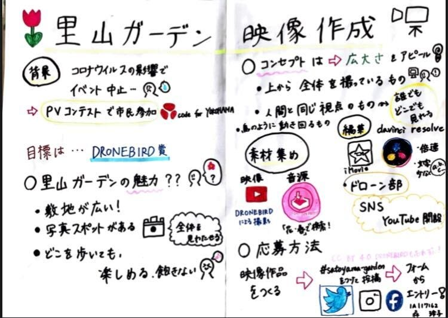

### 里山ガーデンPV、DRONEBIRD賞への道

2020年度に入り、大手ドローン製造会社[DJI](https://www.dji.com/jp)から2つの新製品が発売されました。一般人向けに[Mavic Air 2](https://www.dji.com/jp/mavic-air-2?site=brandsite&from=nav)、産業用には[MATRICE 300 RTK](https://www.dji.com/jp/matrice-300?site=brandsite&from=homepage)とドローン界隈では少し盛り上がりを見せつつあります。

ドローンと言えば、そうドローンと言えば青学の古橋研究室ですよね。古橋研究室にはさらにドローンに特化しているドローン部があるのです。今回はドローン部のリーダー森田がブログ書かせていただきます。

今回はドローン部で映像コンテストに応募することが確定しました。普段であれば実際に撮影を行ったかもしれませんが、今回はコロナの影響もあり[code for YOKOHAMA](https://code4.yokohama/)様と我が教授が代表を務める[NPO法人クライシスマッパーズ・ジャパン](http://crisismappers.jp/)の活動の一つである[DRONEBIRD](http://dronebird.org/)提供の素材で映像を作成することになりました。

今回私たちドローン部が応募することになったのは、「**[里山ガーデン・プロモーション映像コンテスト](https://code4.yokohama/satoyama-garden/?fbclid=IwAR1-yPXSPQqy9xMvYumXXd3T_g7xMCaexMgZMIbsUy4PAAQzwHDkYp5hEdQ)」。**こちらは横浜市管轄のプロジェクト「[ガーデンネックレス横浜](https://gardennecklace.city.yokohama.lg.jp/)」の一つであり、そのメイン会場となる[里山ガーデンフェスタ](http://www.satoyama-garden.jp/)のPV制作となります。例年里山ガーデンでは10,000㎡にも及ぶ広大な土地に満面の花で埋め尽くされ、年二回春と秋にフェスティバルが挙行されます。しかし今年はCOVIC-19の影響でイベントが中止になってしまいました。そこでcode for YOKOHAMA様が、「_テクノロジーの力で「里山ガーデンフェスタ」に新たな市民参加の形を作れないか」_という想いから開催が決定したコンテストになります。

```
里山ガーデンの位置情報
```

[MAPS.ME (MapsWithMe), World Offline Maps | Get MAPS.ME mobile apps for iOS, Android, Kindle Fire…
MAPS.ME (MapsWithMe) offers world offline maps for travelers. All countries and cities. USA map: New York, San…maps.me](https://maps.me/ge0?latlonzoom=03g0vvUxaq&name=%E9%87%8C%E5%B1%B1%E3%82%AC%E3%83%BC%E3%83%87%E3%83%B3)

#### # 目標

- グランプリ賞
┗「里山ガーデンフェスタ」の公式プロモーション動画に決定
┗里山ガーデントートバッグ、ピンバッジ、表彰状

- DRONEBIRD賞の獲得
┗DRONEBIRD Tシャツ、ステッカー、表彰状

#### # **[里山ガーデン](http://www.satoyama-garden.jp/)の魅力とは**

- 敷地が広いこと

- その敷地を活かして、辺り一面に多種多様な花が咲いていること

- どこを歩いていても楽しめる

- ガーデン内に写真スポット（ガーデン全体を見渡せる）があること

#### # **コンセプト**

- 視野を鳥越
┗上から見たらより綺麗
┗鳥のように3次元空間を自由に動き回る

- 動画だからこそ誰でもどこでも視聴できる
┗広大な土地なためご老人などは回りきれない可能性
┗花粉症で外に出たくない人向け
┗オンラインデートが可能
┗オンラインセラピー

#### # **素材集め**

## 映像

- **上から全体を撮影しているような映像は活用**
┗広大な土地をアピール
┗全面に広がる花を強調

- **花の近くを通っているような映像**
┗臨場感を出す
┗人間と同じ視点から見る広大さのアピール

```
code for YOKOHAMA
```

## 画像素材

```
里山ガーデン 写真データアーカイブシステム
```

[OpenPhoto.jp | 里山ガーデン・プロモーション映像コンテスト写真素材
Code for YOKOHAMA 主催、「里山ガーデン」の魅力を伝えるプロモーション動画を募集します。ドローン動画など春爛漫の美しい里山ガーデンの姿を捉えた素材写真を無償で提供しています。openphoto.jp](https://openphoto.jp/c/satoyamagarden)

## 音源

```
DOVA-SYNDROME
```

- 検索ができる
┗花=>明るさ
┗春=>ポップさ

- フリー素材

- 圧倒的素材数
┗10,000曲以上ダウンロード可能

#### # **編集**

- 倍速などを活用し抑揚をつける
┗ドローンの高低差をより表現できるように
┗ポップな音楽に合わせリズミカルに

- あえて文字は少なめ
┗既存の素材でできる限りの紹介

- 限られた素材の中での作成
┗コンセプトに合う素材が少ない
┗解像度の違い

## 編集から見える撮影での課題

- ゆっくり一定のスピードで撮影する
┗編集で速度は変えられる
┗早く撮ると画質が追いつかない
┗動きをより滑らかに

- ジンバルの動かし方
┗急に動かすと映像が乱れる
┗より繊細に動かすことを意識

- 機材は統一した方が良い
┗解像度の違い

## 編集ソフト

- iMovie
┗シンプルな作業に最適
┗情報を加える時は不向き

[iMovie
Mac上でもiOSデバイス上でも、最高傑作を生み出すのがこれまでにないほど簡単になりました。クリップを選んだら、そこにタイトル、音楽、エフェクトを加えるだけ。iMovieは4Kビデオにも対応するので、映画のようなクオリティで観る人を圧倒する…www.apple.com](https://www.apple.com/jp/imovie/)

- DaVinci Resolve
┗テキストの種類豊富
┗作業量が多い時は有効

[DaVinci Resolve 16
DaVinci Resolve…www.blackmagicdesign.com](https://www.blackmagicdesign.com/jp/products/davinciresolve/)

#### # **投稿**

## 応募方法

1. 映像作品を作成

1. ハッシュタグ（#satoyama_garden）をつけてSNSに投稿

1. [応募フォーム](https://docs.google.com/forms/d/e/1FAIpQLSd8gDELMp66p465-a0Ac3RmG2_847aXt8Av703RhRXLjJ5FYA/viewform)からエントリー



## ドローン部用SNSの開設

- [Instagram](https://www.instagram.com/fc4drone/)

- [Twitter](https://twitter.com/drone4agu)

- [YouTube](https://www.youtube.com/channel/UCcvq12AgQvfybU1LyuSaW9Q/?guided_help_flow=5)

```
発表用スライド
```

```
グラレコ
```



```
作品
```
