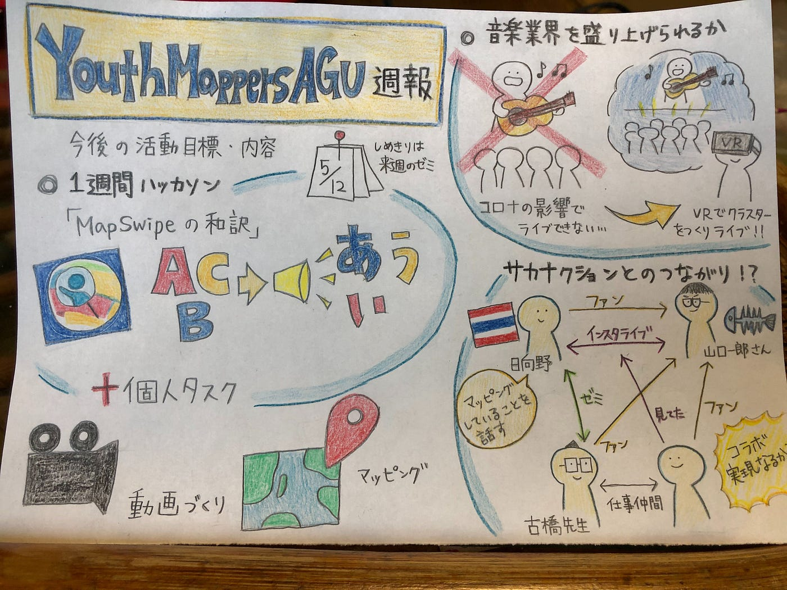

### より活発な活動をするために

YouthMappers AGUの髙橋です

5月4日に行った定例会議の内容を報告します

#### **先週の振り返り・反省**

先週の活動目標は4つです。

１．グローバルマッパソンでのノルマ（各自毎日30タスク）：全員が達成しました。メンバーによっては合計100以上のタスクを完了しました。

２．グローバルマッパソンについてのSNS投稿：期間中に書いたものを投稿できなかったため事後報告版の記事に書き換え投稿することにしました。

３．ウェブサイトの日本語化の方法習得：5月5日からの古橋ゼミのハッカソンで取り組むことになりました。

４．先週できなかったMapSwipeに関するウェブページの和訳：ターゲットにしていたウェブページをインターネット上で見失ってしまいました。同じようなことが起こらないようにするため、今後和訳すべきウェブページを洗い出し優先順位も付けて一覧を作成する予定です。

#### **今週の活動目標・内容**

上述の通り、5月5日からのハッカソンでサイトの日本語化について学ぶことになりました。今週はこのハッカソンに集中します。この作業は、自分たちが和訳した様々なウェブサイトをそのままにせず、たくさんの人の手に届くようにするために重要な作業だからです。

また、SNSの投稿については定期投稿を継続していきます。

取り組むべきことが明確になってきました。まだまだ活動は加速段階にありますが、今週のハッカソンでの学びをはじめマッピングに関連する資料を公開する準備が着実に進んでいます。SNSでの周知や自分たちができる新しい取り組みについても定例会議で活発な議論ができているので、それらをできるだけ早く実現できるよう活動していきます。

