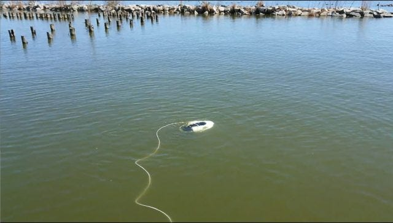
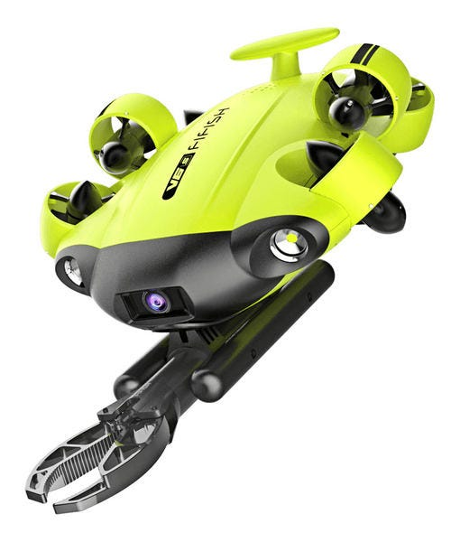
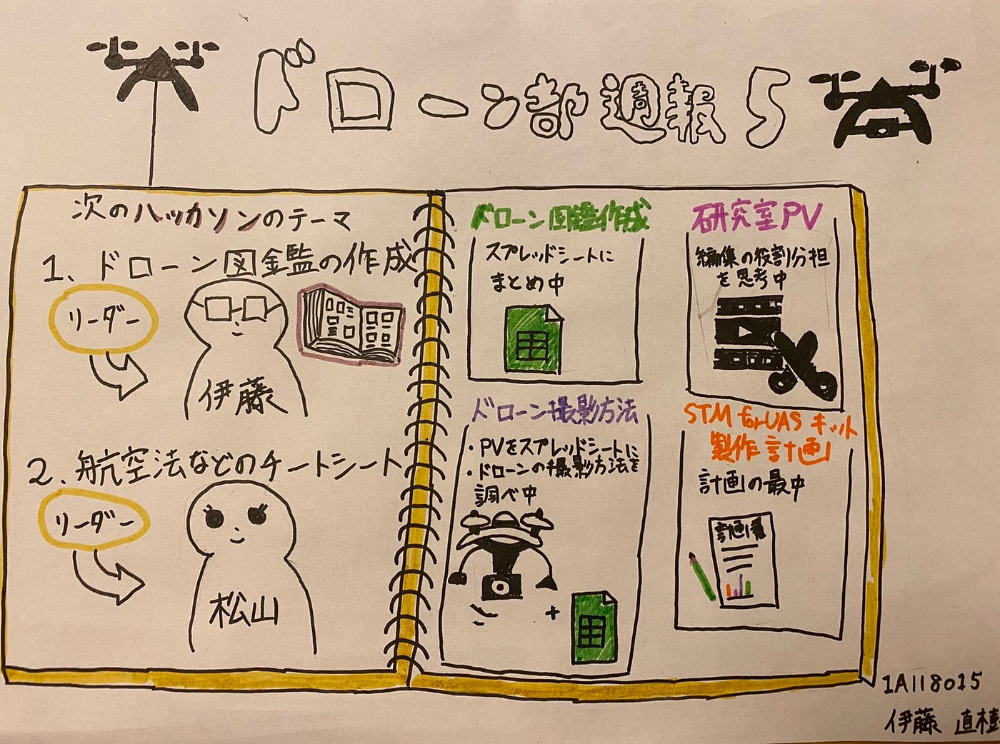

### ドローン部週報⑤

今回のミーティングでは

**次回のハッカソンの内容とTo do の進捗状況について話し合いました。**

次のハッカソンを行うときの課題として

1. ドローン図鑑の作成をハッカソンでも行っていきます。リーダーはTo doと同じように伊藤が担当します。

1. 航空法などのチートシートを作成します。リーダーは松山が担当することになりました。

To do の進捗状況を次に話し合いました。

**・ドローン図鑑**

ドローンの機体を企業ごとに分担して、スプレッドシートにまとめていっています。

**・ドローンの撮影方法**

ドローンが使われているPVを集めスプレッドシートにまとめていくと同時に新しいドローンの撮影方法を探しています。

**・研修室PV**

動画編集時の役割分担などを現在模索しています。

**・STM for sUAS キット制作計画**

現在計画中

今回の週報では「[水中ドローン](https://dronemedia.jp/bw-space-pro-4k-review/)」について話していきたいと思います。

水中ドローンとは空は飛ばずに水中を潜水潜航可能な小型で無人機です。人が泳いではたどり着くことは難しい深いところもこの水中ドローンは可能にします。そしてそのような場所で撮影もできるということは色々な使い道がありそうです。

空を飛ぶドローンと何が違うのかというと

1. 規制がほとんど存在しない。

空を飛ばすドローンでは航空法など飛ばせる場所に制限がありますが、２０２０年４月の時点では水中ドローンを規制する法律はまだ内容です。

2. 有線接続

空中のドローンではほとんどの場合無線接続で機体とコントローラーが接続されています。一方で水中ドローンでは電波が水の中では届かないことから有線で接続されています。

水中ドローンの用途

水中ドローンの用途として、現時点では調査や安全管理、水難救助等が多いそうです。

ここで新たに５月中旬で新しく発売される「[水中ドローン](https://drone-journal.impress.co.jp/docs/news/1183031.html)」を紹介します。

QYSEA社の「FIFISH V6s」という名前です！

水中での点検や作業に特化した産業用水中ドローンです。

６つのスラスターで水中を３６０度動くことができ、アームもついているため水中での作業性がすごく優れています。

重量は4.1kgでスピードは1.5m/s、最大深度は１００mで稼働時間は約６時間となっています。カメラの画質も4Kに対応しているので解像度いいです。

空だけでなく水中でのドローンの今後の活躍が気になります。

今回のグラレコです。

