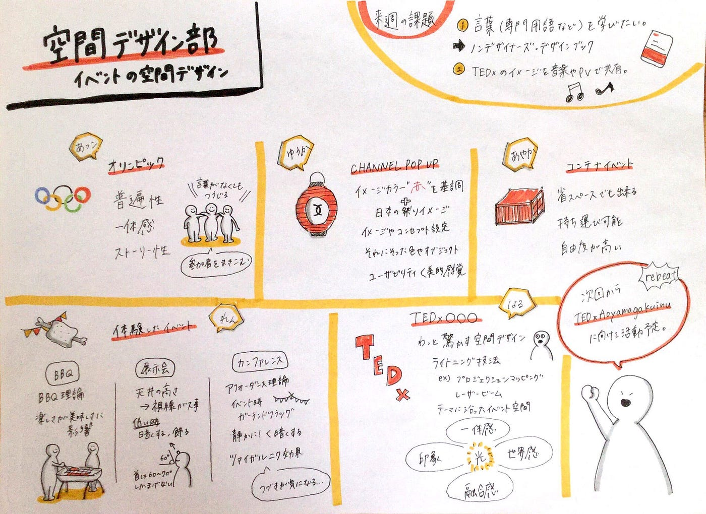

### 最高のイベントにするには？

TEDxAGUで本気を出そうと方向性が定まってきた空間デザイン部です。

イベントのデザインをするということで、今週はその名の通り

#### **「イベントにおける空間デザイン」**

というテーマでやっていきます！

### ＜今週の活動＞

まずは、メンバーそれぞれがインプットしたイベント空間デザイン術を紹介します。

若松流

オリンピックの開会式は毎回インパクトの強いパフォーマンスを繰り広げている。**ストーリー性**があり、観覧者も巻き込みながら一体感を作り出してイベントの盛り上がりを予感させる演出がなされている。

青木流

イベント空間をデザインする際に使えそうないくつかのキーワードが挙がった。

> **天井の高さ**：高ければ高いほど良い
 **アフォーダンス理論**：環境そのものが意味を持っている
 **ツァイガルニク効果**：中断している事柄に対して人はより強く興味が湧く ようになっている

川嶋流

小規模で柔軟にイベントができる「コンテナイベント」

> 持ち運び可能
自由度の高さ

会場作りの実践練習にはもってこいの方法かもしれない。

斎藤流

ChanelのPOP UPイベントから「色」の重要性について考察

> イメージカラーの「赤」を基調
ユーザーの美的感覚を意識

コンセプトに沿った色選びが鍵になる。

水谷流

空間デザイン部の目標であるTEDxの実例から考察

> ライトニング技法：光を使った空間デザイン
光を中心に一体感、世界観、融合感を作り出す

さて。

イベントはどのように設計していけば良いのでしょうか？イベントには、 大まかに２つの要素があると思います。

**「空間」と「時間」**

会場の事前準備で作る飾りや美術などは「空間」で、イベント中に起こる様々な演出や音楽は、本番の進行のなかで発揮され、「時間」に沿って流れていくものです。

完成して本番を待つ「空間」と本番で流れる「時間」の２つを意識してデザインしなければならないのがイベントだと思います。

この２つを含めてイベントの全体像を想像、共有するには「音楽」が鍵になると考えました。音楽はストーリーや空間をイメージする要素としては最適で、先に曲でイメージを全員に共有しておこう！ということになりました。（当日曲をかけるかどうかは別です）

ということで！

### ＜来週の課題＞

#### 1. コンセプトに合わせてTEDxのイメージの音楽やPVを探してくる！
 2. 同時にデザインの基礎を固めたい！→ノンデザイナーズ・デザインブックをまとめる。

そして、来週からTEDxAGUに向けて本格的に活動していきます。最初は会場の規模感の把握や設計を理解するところからですね！

それではまた！

今週のグラレコはこちら！

