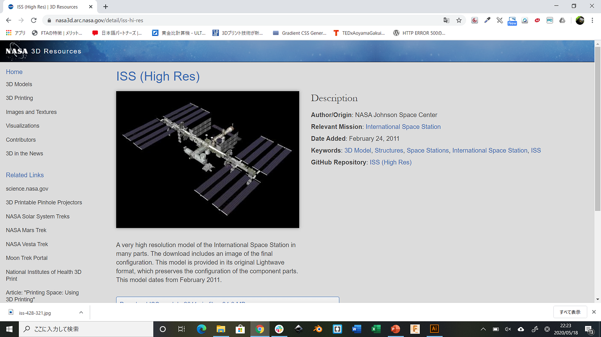
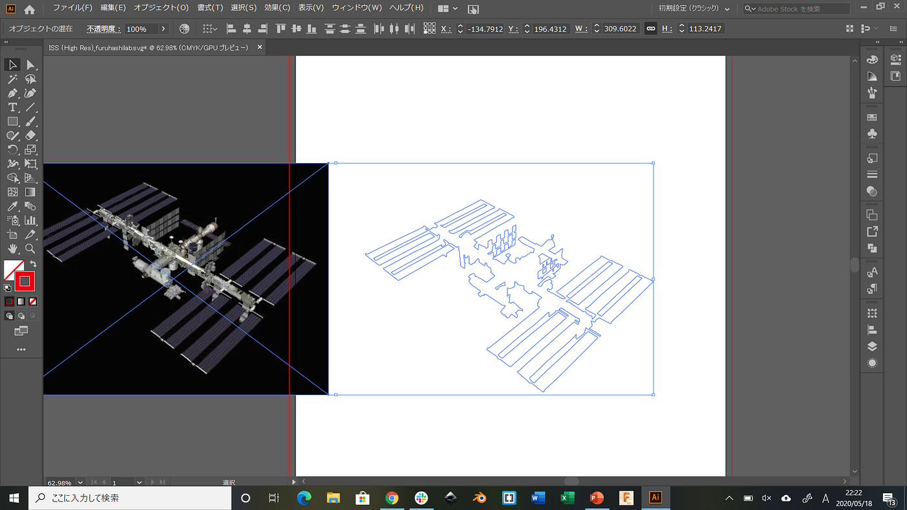
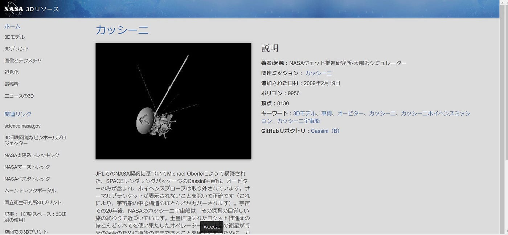
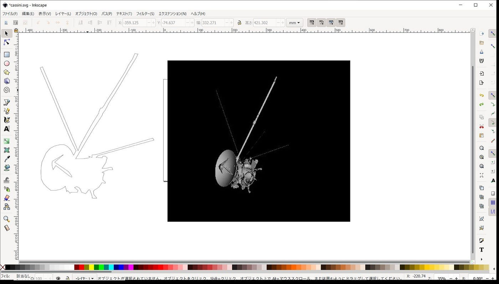
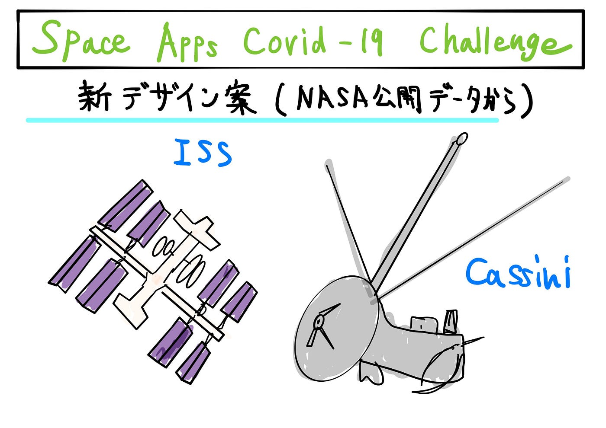

### Space Apps COVID-19 Challenge用のデザインの別案と修正

今週の週報では、今月末にあるSpace Apps COVID-19 Challengeの為に前回に引き続き、焼きのりの別デザイン案と前回のデザインの修正を行いました。

今回は、前回も使ったNASAの公開データにあるISS（High Res）をベジェ曲線で描きました。

使用したソフトはillustratorです。画像はオートトレースせず、地道に作業していきました。一筆で描けるところは出来るだけ繋げて描き、それ以外の細部もレーザーカッターにかけた時に分かりやすいようにしました。

パス：塗りつぶし＝なし、線＝赤・0.1 pt

保存：SVG形式（[今回のGistページ](https://gist.github.com/Babby168/4de3d5174571f5eb12e9fa8cf7c8ed83)）

神田は、同じくNASAの公開データから”カッシーニ”を選び、上記の事を行ないました。

使用したソフトはinkscapeです。このように輪郭をくり抜くだけではなく、中にある窪みも描いている様です。

保存：SVG形式（[Gistページ](https://gist.github.com/cancancanda/7b27c7d1028666f717a7c5175db1f58b/revisions)）

これら上記のものもレーザーカッターに実際にかけていないのでどこまで細かいところまで切れるのか分からない部分もありますが、Space Apps COVID-19 Challengeに参加するにあたって、「宇宙好きの子供たちが外出自粛期間に自宅で、宇宙をモチーフにした海苔弁を楽しんでもらおう。」というコンセプトで活動していこうとしています。月末の本番に向けて頑張っていこうと思います。

**＜今回のグラレコ＞**

