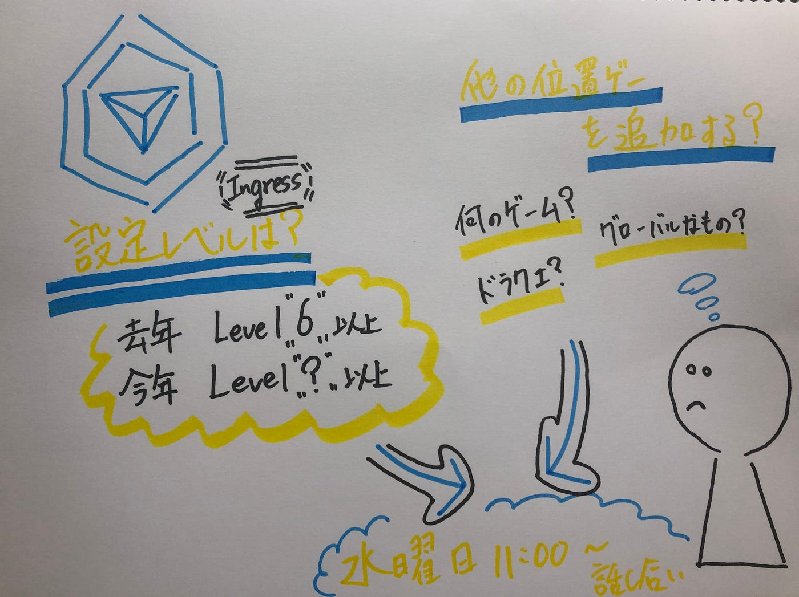

### 位置ゲー部週報

こんにちは！4年の平澤です！

今回の週報のテーマは

### 今年のIngressのレベル設定どうする？
他の位置ゲー追加する？？

ということです！

去年はIngressの[レベル設定がLv.6以上と設定](https://github.com/furuhashilab/README)されていました！
今年は3年生の意見や4年の経験も活かしつつ、設定レベルをあげようということになりました！

また、pokemonGO, Ingress 以外の位置ゲーも追加していく形に話しがまとまりました！

以前からお話があったように

・グローバル性
・難易度
・普及率

に気を配り新たにゲームを設定していこうと思います！

2020/05/20 にMTGを行い、具体的なレベル設定、新規ゲームの決定を行う予定ですー！
