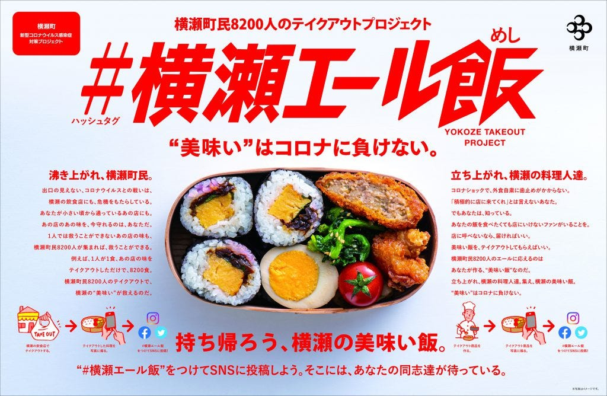
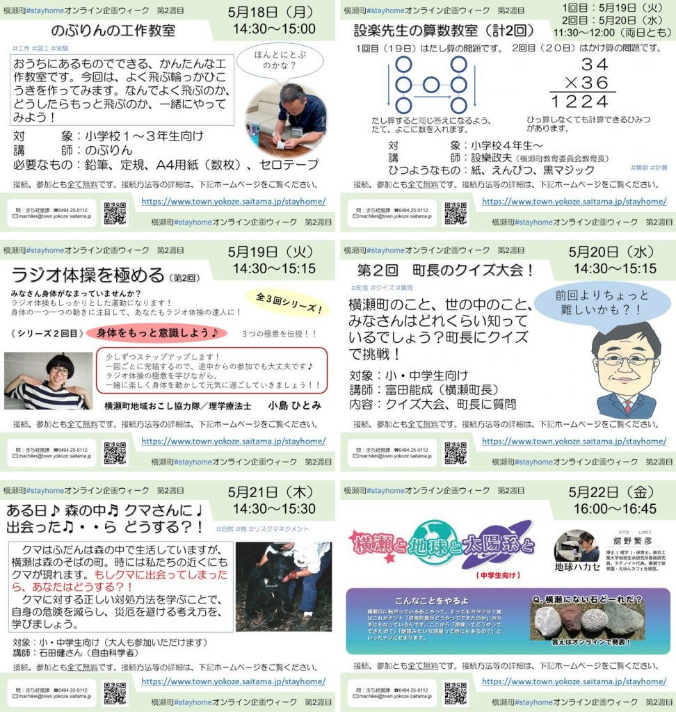

### 横瀬町でイベントや催し物を開催することはできるのか【横瀬部週報】

こんにちは！横瀬部の大庭です！

今回はタイトルにもあるように、横瀬町でイベントを開催できるのかということについてMTGを行いましたので、本記事でまとめていきたいと思います！

皆さん御察の通り、背景には、新型コロナウイルス感染拡大防止のための緊急事態宣言や自粛要請があります。

横瀬部として、今年度はサウナを活用したイベントを横瀬町で行うとを目標に活動をしています。

しかし、

「そもそも、イベント開催できるの？」

「いつかは出来るだろうけど、いつになったら出来るの？」

このような疑問から、現在の横瀬町や秩父エリアでのイベントの開催状況を調べてみました。

### はじめに

まず、イベントを開催するに当たり、横瀬町のスタンスを把握することは必須でしょう。

しかし、そこ以外にも調べておく点がいくつかありそうです。

今回は、以下の点に絞って議論をしました。

> ・横瀬町でのイベント開催状況

> ・コロナに関するイベントIN横瀬

> ・日本政府のイベントへのスタンス

> ・青山学院大学の校外活動へのスタンス

### 横瀬町でのイベント開催状況

まず、最初に現在の横瀬町でのイベント開催状況を調べてみました。

横瀬町の公式サイトで、5月のイベント開催状況がまとめられていましたので、こちらを参考にさしました。

> 5月20日（水）中止 よこぜ歩楽～里ウォーキング塾
5月20日（水）中止 赤ちゃんくらす子育て支援課
5月21日（木）延期 9～10歳か月児健診
05月23日（土）中止 町民ハイキング
5月28日（木）中止 乳幼児健康相談
5月29日（金）延期（予定）メタボ予防講座
5月30日（土）中止 ダイエットセミナー（男性）

参照：[新型コロナウイルス感染症拡大防止に関連するイベント等の中止・延期について](https://www.town.yokoze.saitama.jp/kurashi/kenko/3936)

このようにみてみても、全てのイベントが延期もしくは中止となっていることがわかります。

この結果から見ると、現実的に夏以降の開催になりそうです。（夏も危うい…）

### コロナに関するイベントIN横瀬

それでは、全てのイベントが中止になっているのでしょうか？

そいう訳ではなさそうです、横瀬では積極的にオンラインイベントを開催していることもわかりました。

**①#横瀬エール飯**

全国で話題になっている、「＃○○エール飯」のイベントを横瀬でもやっているようです。

これは、コロナウイルスの影響で、痛手を受けている飲食店をテイクアウトやデリバリーで盛り上げようという取り組みですね

**②#StayHomeオンライン企画**

横瀬町主催で、家から楽しめるコンテンツをオンラインで届ける取り組みも実施されています。

例：工作教室、算数教室ETC

### 日本政府のイベントへのスタンス

横瀬でのイベント開催状況を把握しておくことも重要ですが、この状況下では政府のイベントに対するスタンスを把握しておくこともしなければならないでしょう。

緊急事態宣言が発令している、現在ではイベントや催し物を開催することは、難しいですが、徐々にこれに関連するニュースなどもで始めています。

埼玉や東京では、いまだに自粛要請が継続されていますが、一部の都道府県をのぞいて、14日に国の緊急事態宣言の解除されました。

それでは、それらの都道府県のイベントへの自粛要請はどうなのでしょうか？

NHKによると、自主要請解除も、イベントの自粛要請を継続しているのは、要請を緩和した自治体も含めると、全体の８割となっています。

また、８つの特定警戒都道府県は、いずれもイベントの自粛要請を継続しています。

> 【もともと要請なし】
鳥取、島根、山口、徳島

> 【容認】
青森、岩手、栃木、佐賀

> 【一部容認】
宮城、秋田、山形、福島、茨城、群馬、新潟、富山、福井、山梨、長野、岐阜、静岡、愛知、三重、滋賀、奈良、和歌山、岡山、広島、香川、愛媛、高知、福岡、長崎、熊本、大分、宮崎、鹿児島、沖縄

> 【要請継続】
北海道、埼玉、千葉、東京、神奈川、石川、京都、大阪、兵庫

> これらの結果をみてみると、イベントも徐々にイベント開催が容認され始めていることがわかります。

しかし、厳しいガイドラインなどが設けられ、人数制限や消毒などは必須になってきます。

### **青山学院大学の校外活動へのスタンス**

最後に、古橋ゼミとしてイベントを開催するということで、青山学院大学の校外活動についても把握しておかなければなりません。

現在のところ、構内立ち入りが禁止され、部活動や愛好活動などの校外活動も一部を覗いて基本的に禁止がされています。

しかし、6月以降どうなのかなどより詳しい情報は出ていません。

ただ一点参考になりそうな情報が出ていましたので共有をしたいと思います。

青山学院大学の公式HPにある「新型コロナウイルスの影響拡大に伴う課外活動に関する要請」が以下のように更新されました。

> 2020年5月31日（日）以降の活動についても、大学の対面授業が再開され、安全に活動ができる状況となるまでは、活動を中止とさせていただきます。

### まとめ

今回は、横瀬部として横瀬でのイベント開催が出来るのか、またいつ頃開催できるのかという部分を検討するために情報取集を行い、共有してきました。

日々状況が変わる中で、今の時点でイベント開催時期などを決めることは難しそうです…

また、情報があれば共有をしていきたいと思います！
