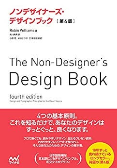
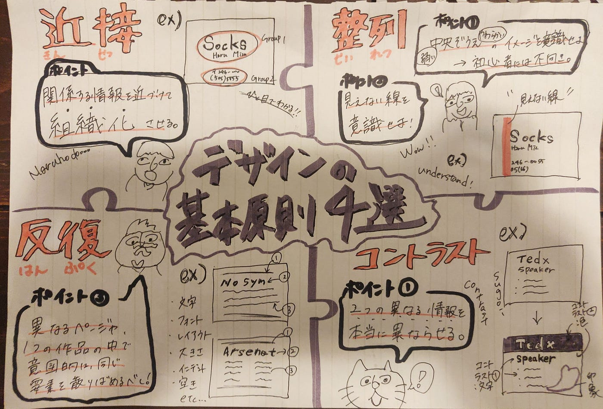

デザインこれだけはおさえておきたい基本原則４選！！

今回空間デザイン部では、これからの様々な活動を見越して「最低限専門知識を学ぶべきでは？」を考え、デザインの基礎中の基礎！を古橋先生バイブル本「ノンデザイナーズデザインブック」より学んできました！

そして今回はこの本の４つの基本原則をメンバー一人一人まとめてプレゼンテーションするという活動を行いました。

水谷→”近接””

若松→”整列”

川嶋→”反復”

青木→”コントラスト”

### この４つの原則により”センスがなくても”デザインはぐっと良くなることがわかりました。

→ 内容の詳細はパワポとグラレコにて!!!!

> **次回**

> →今回学んだ基本原則と新しくカラーについて各自学習し、「TEDx」の開催ポスターを作成する。

