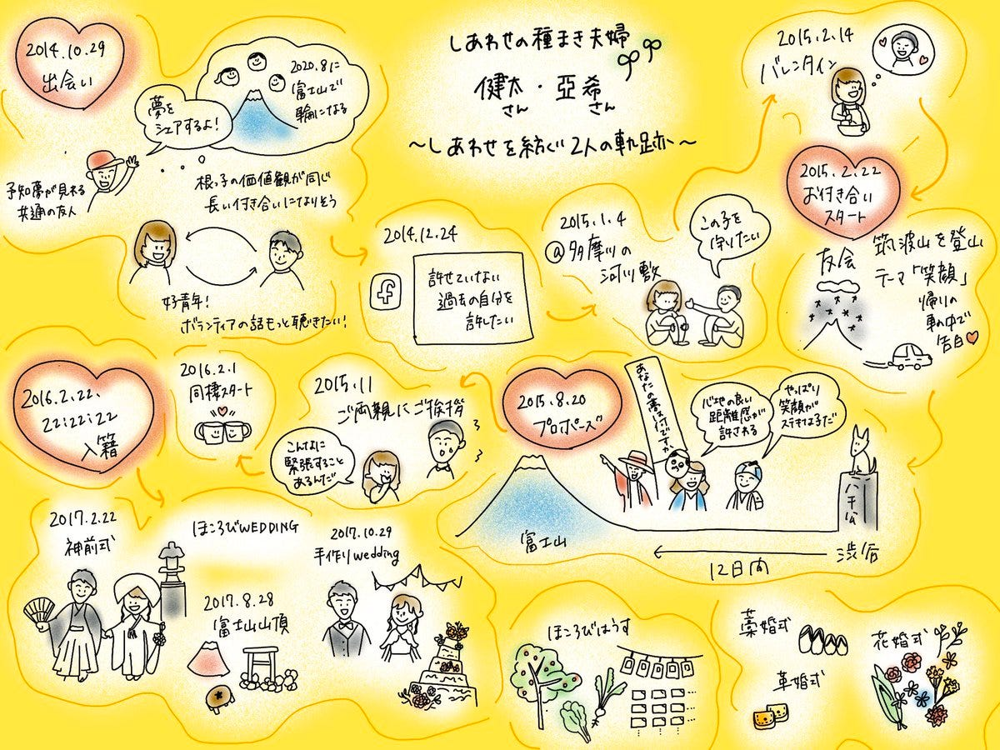
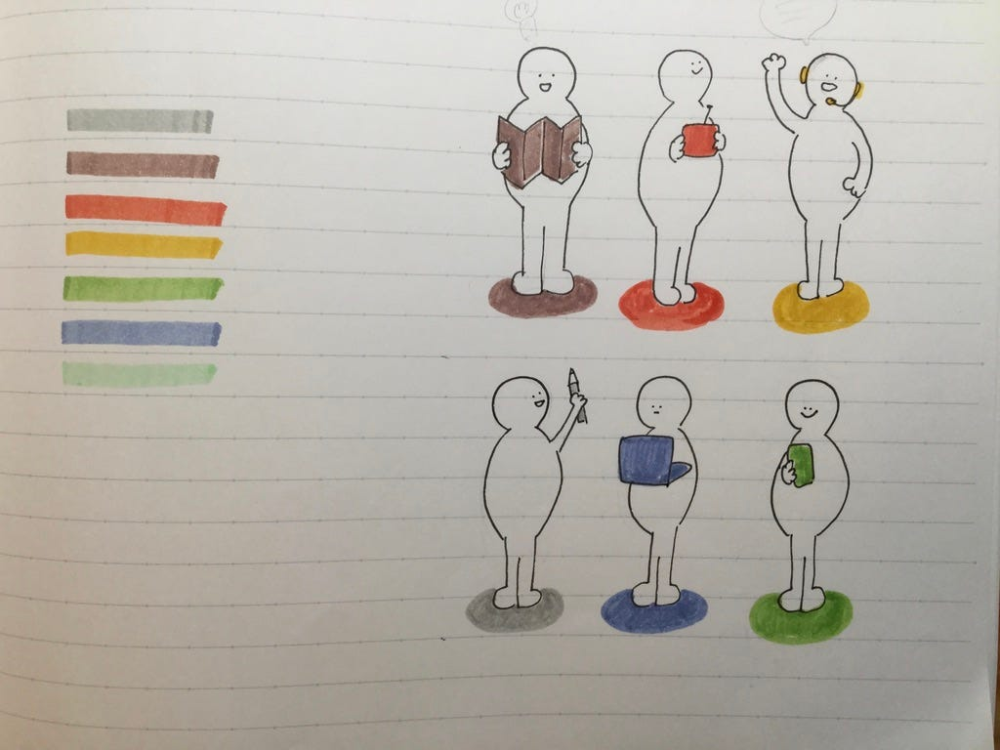
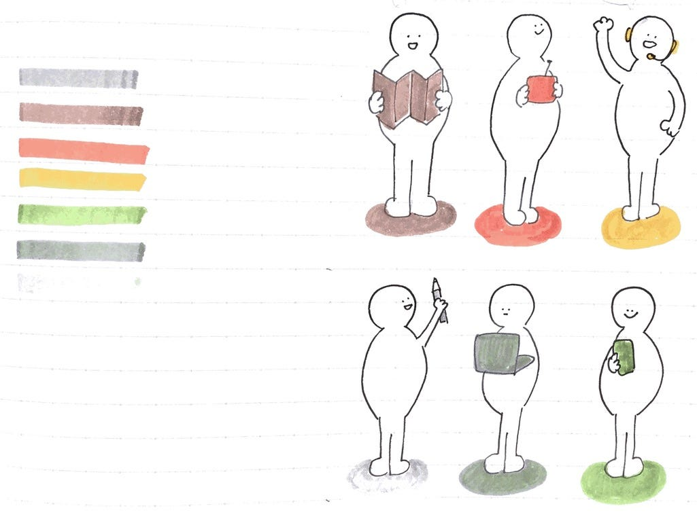
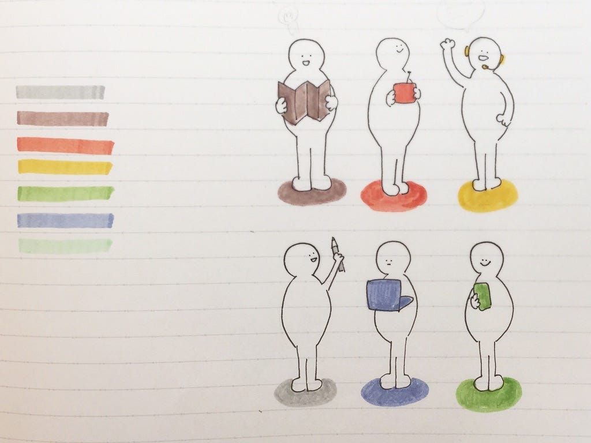
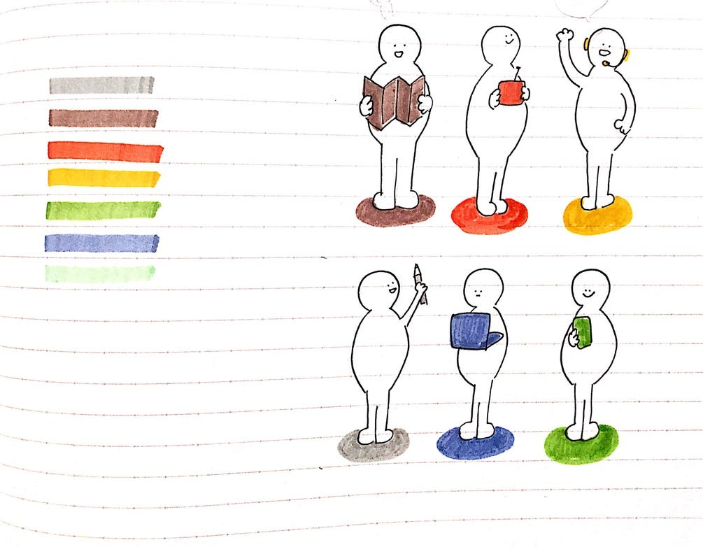

### いろんなグラレコ

今回のグラレコ部では「グラレコがどのような現場で使われているのか」調べ共有しました。

### ＃今週のグラレコ

### ＃いろんな現場で使われているグラレコ

授業、会議、音楽、演劇、人生と様々な分野にグラレコが進出しているようです。グラレコって無限大の可能性を秘めているのではないでしょうか。

特に気になったのが人生をグラレコするという活動。人生グラレコってどういうこと？！と思うでしょう。新型コロナウイルスにより結婚式が延期や中止になったカップル向けに、出会いから結婚までの過程をグラレコするというものでした！

履歴書の代わりとかになったりしそう…？

[プロジェクト実績一覧(グラフィックレコーディング)
共創型サービスデザインファーム株式会社グラグリッドのグラフィックレコーディング実績一覧ですglagrid.jp](https://glagrid.jp/result-graphic-recording)

[「コンセプトの再構築」！研究と音楽をつなぐグラフィックレコーディング～SAIHATE LINESでの挑戦｜グラグリッド編集部｜note
2019年3月23日(土)、北海道大学遠友学舎にて、研究と音楽のフェス" SAIHATE LINES"が開催されました！…note.com](https://note.com/glagrid/n/n7d07ca1ca0c1)

[言葉にできない体験を描くと、解釈はより広く深まっていく。演劇グラフィックレコーディングの作品全公開！｜precog｜note
演劇を観たあと、情報や気持ちを処理しきれず、どう人に伝えればいいかわからないことってありませんか？ 演劇作品『 プラータナー：憑依のポートレート』の公演に付随して開かれた「 『プラータナー』スクール…note.com](https://note.com/precog/n/na67174b38088)

### ＃アナログを綺麗にデジタル化したい

前回の週報でもあったように、なかなかうまく色味が反映されない問題。現在私のiPadに入っているアプリ達で実験してみました。

#### ＃＃使用したアプリ

> **[Scannable**](https://evernote.com/intl/jp/products/scannable)

> **[フォトスキャン**](https://www.google.com/intl/ja/photos/scan/)

> **[CamScanner**](https://www.camscanner.com/user/download)

#### ＃＃使用したペン

> **マイルドライナー6色**

> _ダークブルー、グリーン、ゴールド、バーミリオン、ブラウン、グレー_

> **FABER-CASTELlのライトグリーン**

#### ↓こちらの画像を使い実験しました。

#### ①Scannable

#### ②フォトスキャン

#### ③CamScanner（増強・鮮明化後）

#### ＃＃結果

> ① Scannable→淡い色味、青がうまく反映されてない

> ② フォトスキャン→優しい感じ

> ③ Camscanner（編集機能で増強・鮮明化）→すごいくっきり

色合いだけで見るとフォトスキャンが一番マイルドライナー感を出せているような気がします。

今回は３つのアプリしか試せなかったので、他のアプリも試していきたいです。

青山学院大学 古橋研究室3年

川嶋 彩香
