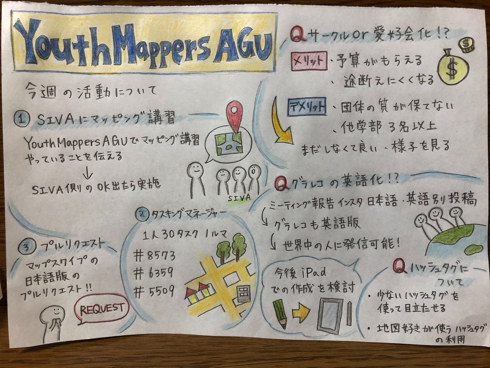

### マッピング頑張ろう

YouthMappers AGUの木多です。

5月18日に行った定例会議の内容を報告します

### 先週の振り返り・反省

先週の活動目標は特に決めず、ハッカソンで疲れた体を休める時間とし、やる気のあるメンバーは各自でマッピングを進めてくれました。

また、現在行っているSNS投稿を、英語と日本語に分けて投稿すべきかや、日本語版とは別に英語版のグラレコを作って載せるべきか否かを話し合いました。結論としては、日本語と英語を分けて投稿をし、グラレコ も英語版を作って載せるべきという結論になり、グラレコ 作成者の負担を減らすため、iPadを導入した方が良いという流れになりました。

他の議論としては、古橋先生から提案されていたyouthmappersAGUをサークル化するかどうかについて議論しました。サークル化するメリットとしては、予算の確保やこの活動を持続するための人員確保が見込めるなどがありましたが、結論としては、今の活動の質を保つために1年間はこのままの体制で様子をみるということになりました。

### 今週の活動目標・内容

今週のタスクとしては、新しくなったタスキングマネージャーに慣れるためにも、一人30タスクをクリアするという目標を設定し、進めていきます。

また、ボランティアサークルのSIVAの人達にマッピングを手伝ってもらおうという話になり、youthmappersAGUでマッピング講習をしていくという流れになりました。

また、日本語訳したいウェブサイトの洗い出しも各自進めていきます。

今週のグラレコ はこちらです。

