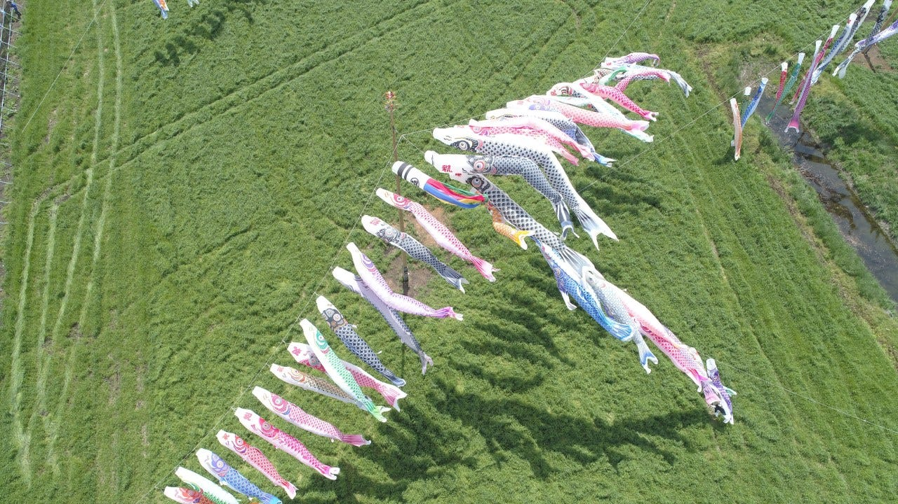
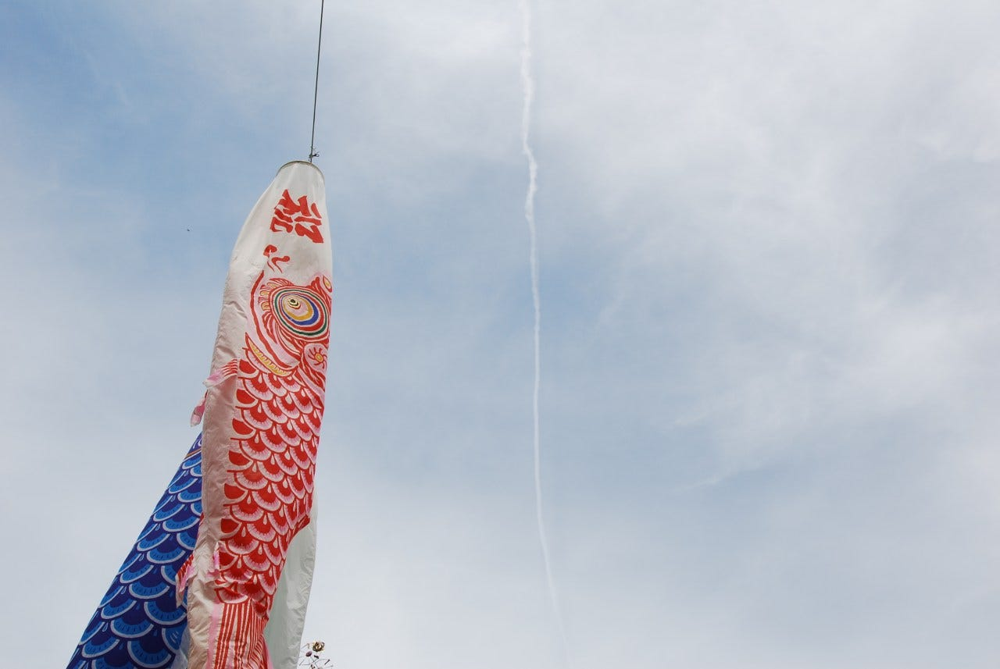
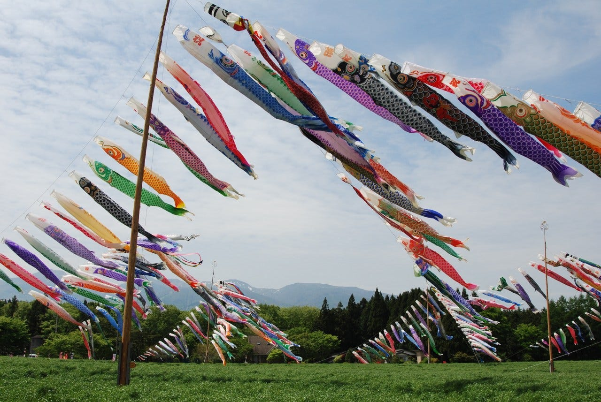
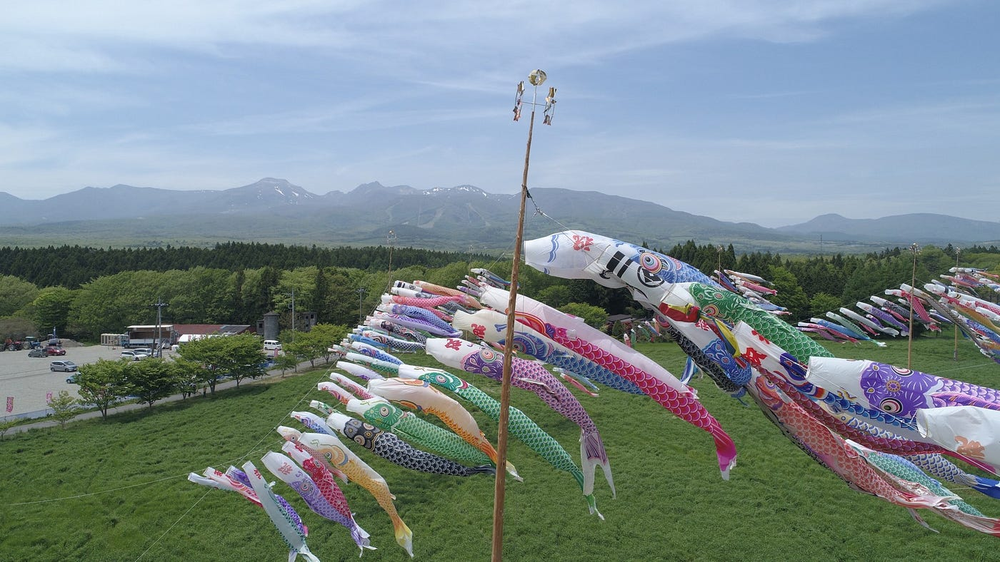
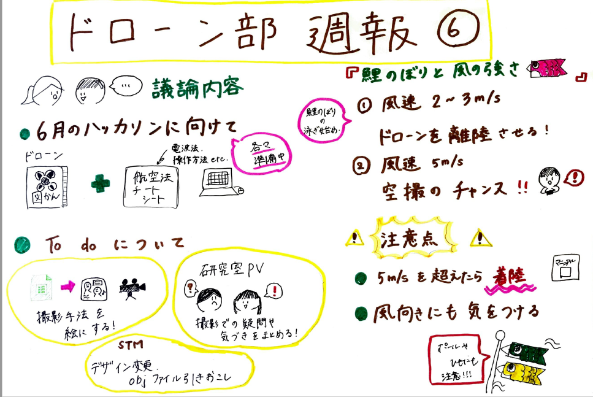

### ドローン部週報⑥

こんにちは。古橋ゼミ4年の森玲子です。

### **～今週のドローン部での議論内容～**

**＃ハッカソンに向けて何をするか**

１．ドローン図鑑

- スプレッドシートを完成させ、スライドにまとめる

- アプリを追加（DJI、パロットなど）

２．航空法等のチートシート作成

- 書く内容は**子供が見てもわかるように**！それを**見れば、ドローンを飛ばせるように**する

- 各自、法に関することを調べて、最終的にチートシートとしてまとめる

**＃To doの今後の方向性について**

１．撮影手法

- PVとその撮影手法がまとまってきた

- 挿絵を作る、PVをまとめた動画も作成する

2. 研究室PV

- 里山ガーデンの動画を作成済み

- 撮影に関する疑問、撮影前の気づきなどをまとめる

**3. **STM

- objファイルを引き起こす

- デザインの変更

- 3Dプリンター140×140サイズを基本とする

### ～ドローン空撮における鯉のぼりと風の強さの関係について～

今回私はドローンで空撮する時に注意すべき点である、「風の強さ」について気になり、鯉のぼりを例として調べました！

１．風速０m/sの鯉のぼり

だらりと下に垂れ下がってしまいます。上空から撮影しても良い絵は撮れません。

２．風速２～３m/s程度の鯉のぼり

鯉のぼりが泳ぎ始める段階の速度です。

ドローンを離着陸させるのにも問題のない速度なので、離陸させるタイミングとしてはちょうどいいでしょう！

適切な高度まで上がったら、その場で待機させたり角度を調整すると良いです。

３．風速５m/s程度の鯉のぼり

鯉のぼりが元気に泳ぎ始める速度で、空撮しがいのある映像を撮ることが出来るので、鯉のぼりとロープに注意して空撮を行いましょう。

もし、風速5m/sを超えてしまうようなら、安全確認をして着陸させなければいけません。（[国土交通省の飛行マニュアル](https://www.mlit.go.jp/common/001218180.pdf)から）

この他にも、風向きの変化により鯉のぼりの尾が機体に向かってたなびくことも起こり得るため、注意しましょう。

今回は鯉のぼりを題材として調べましたが、他にも例はあると思うので調べてみたいと思います。

写真の引用は以下のサイトから行いました。

[ドローン空撮を楽しもう！！空撮における鯉のぼりと風の強さの関係
緊急事態宣言の延長で、全国の５月の鯉のぼり公開イベントも制限されているところが多いと思われます。必然的に空撮も難しい状況かと思いますが、今回は鯉のぼりを撮影する際の風の強さについて整理してみたいと思います。…viva-drone.com](https://viva-drone.com/2020-carp-may/)

～グラレコ～

