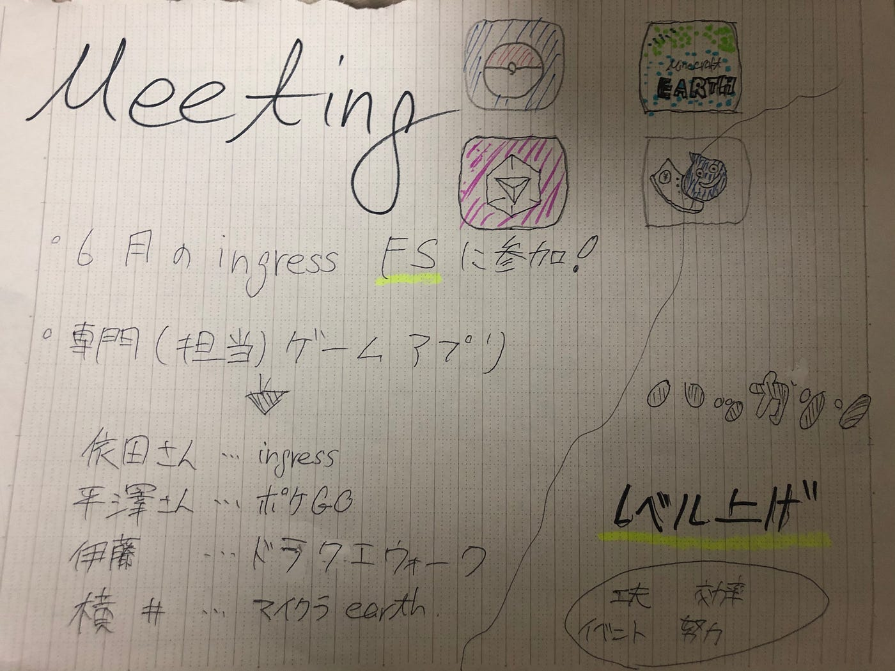

### 位置ゲー週報：ミーティング

我ら位置ゲー部は、先日ミーティングを行い、それぞれが何をするのか、部として何をするのか決めました！

### 部として

反省点・・今月のingress FSに参加できなかったこと、またそれを知らない人がいたこと。

来月のFSには出来るだけ多くの人が参加する。また各位置ゲーのイベントを把握する。

そして位置情報ゲーム部として、それぞれ専門とするゲームを決めました

依田さん:ingress 平澤さん：ポケgo

伊藤：ドラクエウォーク 横井：マイクラearth

### ハッカソン

レベルを上げる＿ある程度目標を決めてそれを達成できるようにする。ただ単純作業で上げるのではなく、効率のいいやり方を探すなど工夫して頑張ろう！

また、マイクラを活用して、新たな位置情報ゲーム部としての新たな取り組みをするかも、、、

