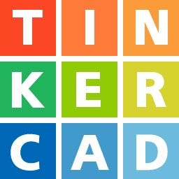
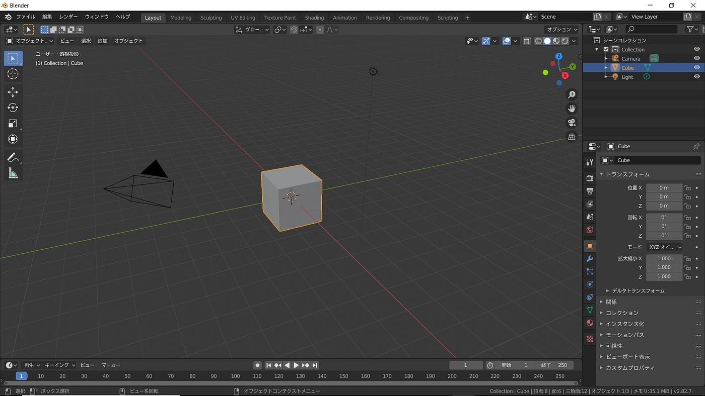
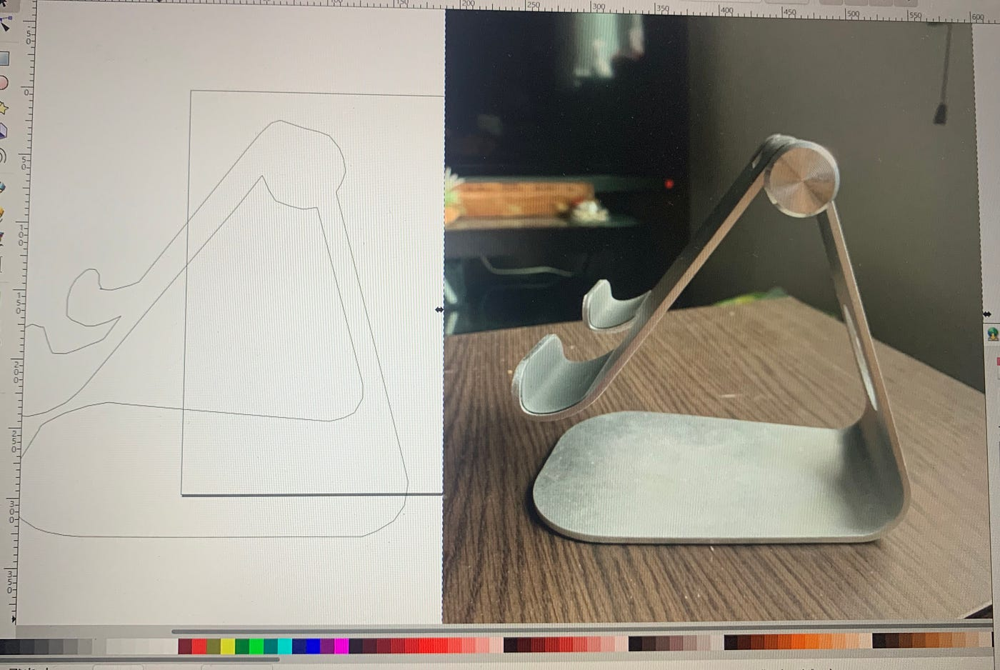
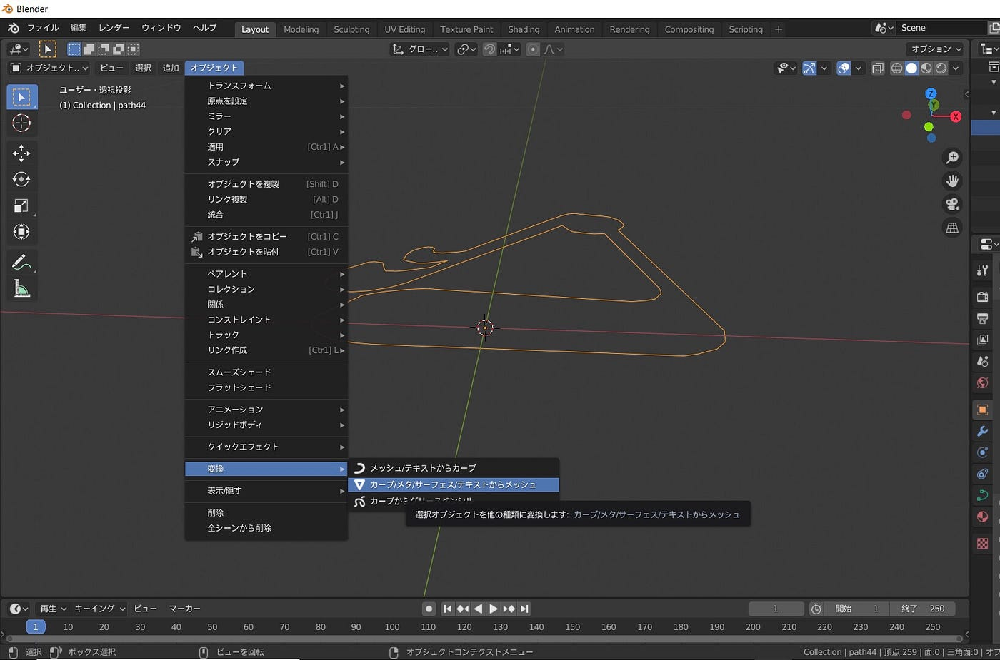
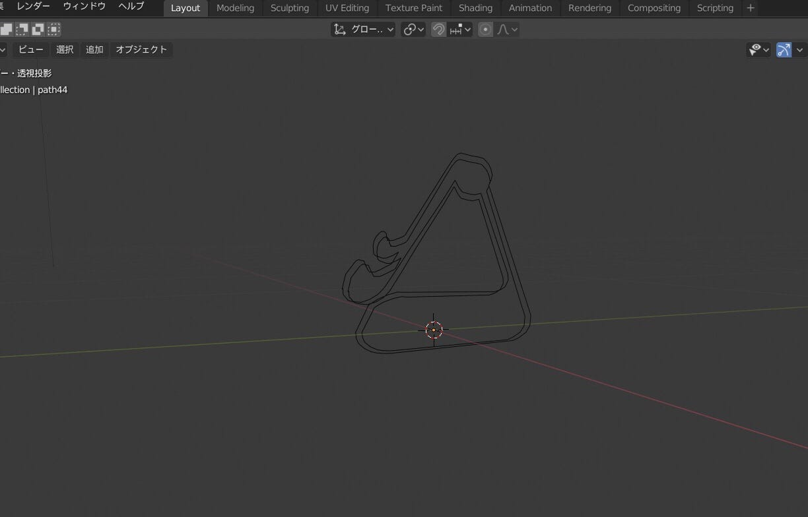
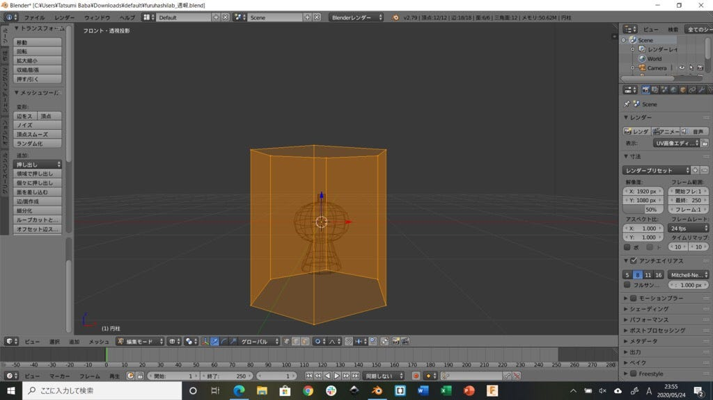
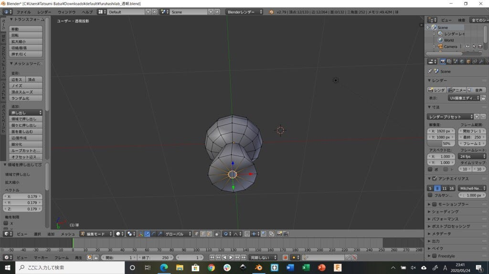
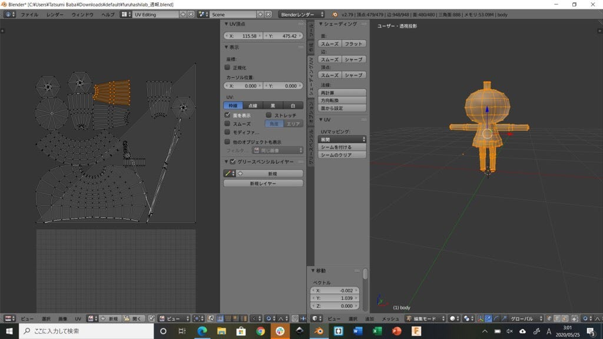
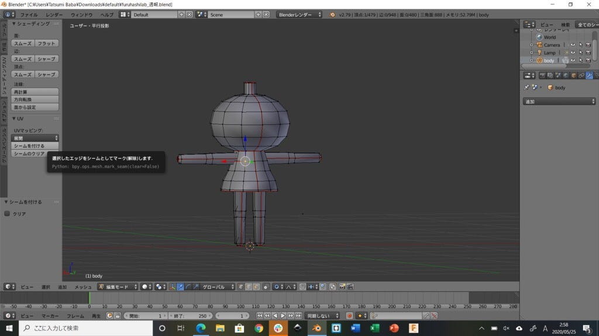
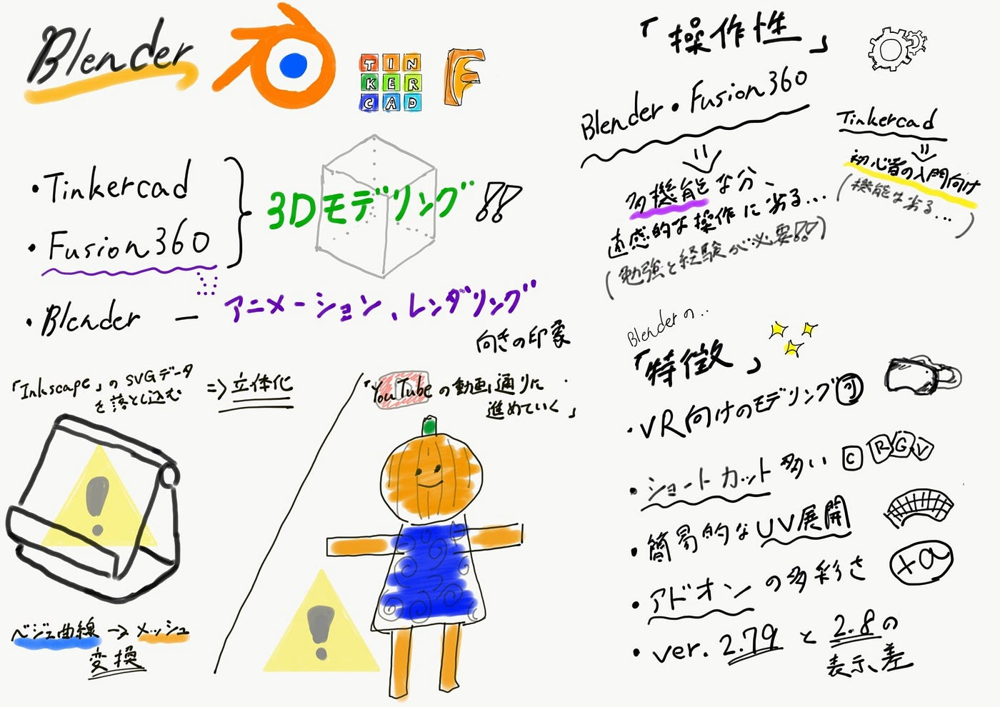

### 〔3DCAD比較〕blender編

今回は主な無料3DCADソフトの比較シリーズの最後としてblenderを使用してみましたのでTinkercad, Fusion360 と比較しての感想・使用感をレビューしていきます。

#### 3Dプリントのためというより？

> まずこの動画をみるとblenderは単に3Dプリントするためのモデリングソフトというよりはどちらかというとアニメーションやレンダリングをするための3DCGソフトという印象を受けました。この映像はすべてblenderの機能のみで作られていて後半に出てくるリアルな人間までもがすべて3DCGで作られているそうです。Fusion360にもアニメーションやレンダリングの機能はありますがこのblenderは“総合3DCGソフト”という色合いが強いようです。

#### 今回は何つくる？

> TinkerCADではエッフェル塔・スマホスタンド、Fusion360ではコロナ対策グッズなどを作ってきましたが今回神田はIpad スタンド、馬場は を作ることにしました。（作るものはとりあえず3DCADソフトの簡単な比較が目的なのでなんでもいいということで決めています。）

#### **モデリング開始！(blender 2.8)**

これが作業画面です。Fusion360と同じくらい、もしくはそれ以上に多機能なのではないかというくらい様々なツールが用意されています。ショートカットキーをある程度覚えておかないと思い通りの操作をするには時間がかかりそうです。

#### インポート機能

インポートからいくつかのファイルの読み込みをすることができました。SVGファイルの読み込みもできたので神田は今回この機能を使ってモデリングすることにしました。 この場合IllustratorやInkscapeなんかでSVG形式で書き出したデータをblenderで立体化できます。左下の画像はInkscape でのパス化です。

まずこのSVGをインポートして原点を中央に合わせます。次にこれを編集モードに切り替えてみるとベジェ曲線（カーブ）で構成されていることがわかります。blenderではこのままでは編集できないためカーブをメッシュ（通常のモデリングで使用する）に変換し、その後これを平面から立体にしていきます。

モディファイアーからソリッド化を選択して起こしてみるとこうなります。これに幅を持たせて終了の予定がそのための面を用意するという操作が分からず現時点ではここまでになっています。

#### 馬場のモデリング(blender 2.7）

**気づいた点**

・VR向けのモデリングも可能

・ショートカットの多さ

・UV展開が比較的簡単に可能

・Blender向けのアドオンが多彩

・バージョン2.79と2.8で表示の差が多くあり混乱

・テクスチャ、下絵の読み込み可能

#### ３つの３DCADソフトを使ってみて

操作性に関しては**[blender](https://www.blender.org)と[Fusion360**](https://www.autodesk.co.jp/campaigns/design-now)は多機能なツール面から直感的に操作するのが難しく、思い通りにつかいこなせるようになるにはそれなりの勉強と経験が必要だなという印象が強かったです。**[Tinkercad**](https://www.tinkercad.com)はこれらの本格的なソフトに入る前の未経験の人のための入門ソフトという位置付けになるのかなという感想です。

#### 今回のグラレコ

