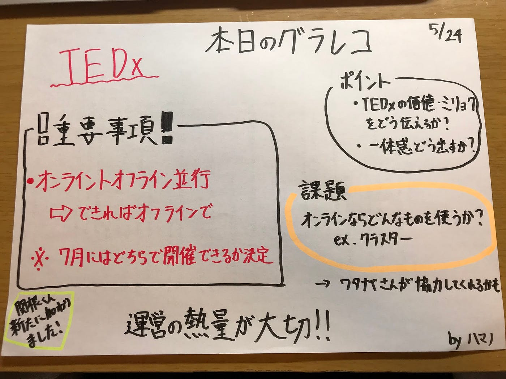

オンライン？オフライン？

今回TEDxAoyamaGkuinUでは前回に引き続きオンライン開催かオフライン開催かの話し合いに決着をつけました。

話し合いの選択肢としては、

> Aオンライン一本

> Bオンラインの準備をしつつ第一はオフライン

の二点まで絞られたうえでの話し合いになりました。

### A．オンライン一本派

・コロナが流行ってるからこそできる新しい試み

・オンラインとオフラインの同時並行は現実的に難しい

・工夫一つで青学らしさの提供が可能

### B.オンラインの準備しつつ第１はオフライン派

・著名人のスピーチなどはユーチューブなどで簡単に視聴できる世の中であるのにどこで差別化をつけるのか

・具体性に欠ける

・アフターパーティー

・TEDxのよさはオフラインだからこそ感じられる。

#### という感じで議論が堂々巡りしてしまい、最終的にはオンライン上でtedxの魅力や価値が実現することは可能なのか？

> tedxの価値ってどこにある？

> ・熱量の高さとアフターパーティーでの社会人との交流

> ・会場の空気感と一体感

### 決定事項

オフラインをあきらめきれない声や人員のやる気が大事となり

#### Bオンラインの準備しつつ第１はオフライン

に決定しました。しかし、、、

現実的な話普段よりも多くのの作業が必要。

→・人員増やす必要性

・tedxAoyamaGakuin内でのグループ分け

> 次回

> ・各自オンライン開催のためのツールを調べて発表。

> ・具体的なオンラインの方向性を固めていきます。

・
