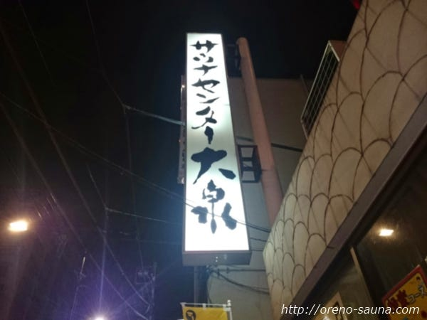
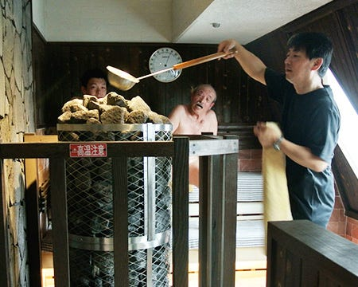
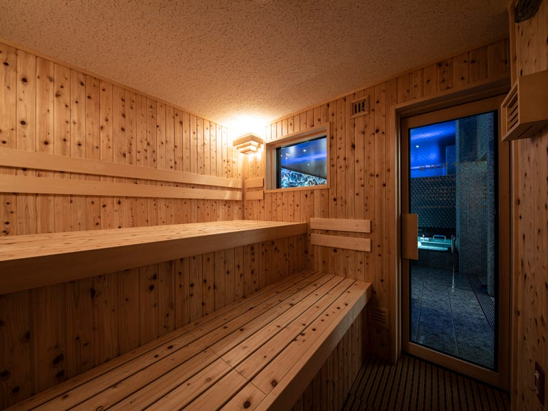
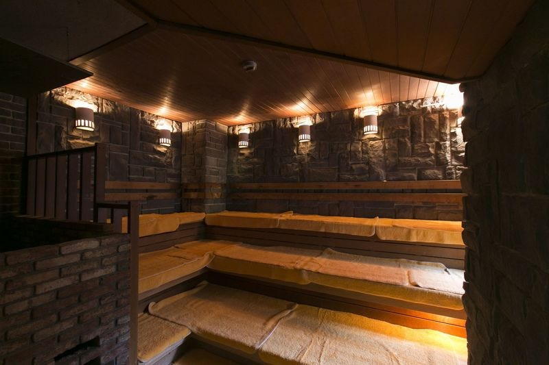
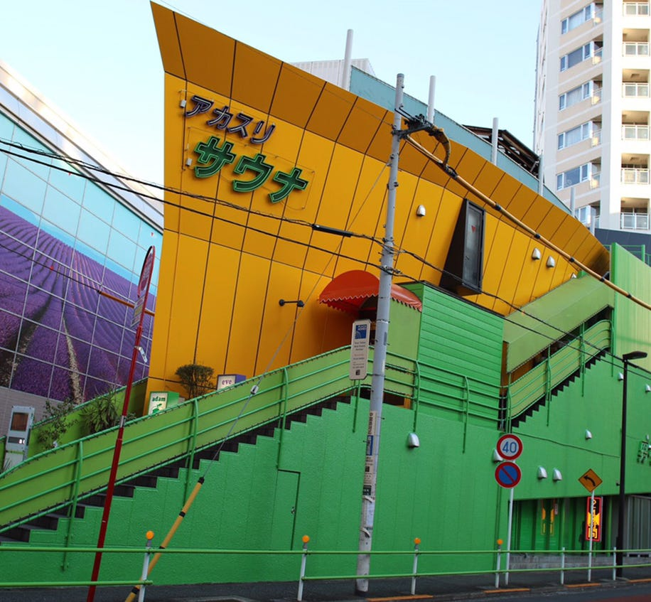

### 横瀬部週報

こんにちは！横瀬部のあんぼです！

今年度の横瀬部の活動の軸として「サウナ」を取り上げ活動してきています。前回にゼミで夏合宿の日程が仮決定したので、横瀬部としてサウナイベント実施に向けて本腰を入れて行こうと思います。

今回の週報はその第一弾として「実際にサウナを感じよう」ということで、都内の人気サウナを取り上げ、サウナ巡りの企画を行いました。

#### ＜サウナの健康効果＞

①血流促進による肩こり解消

サウナに入ると体温が上がり体の血流が促進される。約2倍程の血流が促進され、疲労物質が汗と共に流れ出すことによって疲労回復効果を期待することができ、合わせて肩こりや腰痛といったものにも効果的。

②免疫力の向上

サウナに入ることでタンパク質が破壊され、ヒートショックプロテインという成分が生成されます。このヒートショックプロテインは細胞の働きを活発にさせ、壊れた細胞の再生が行われることで免疫力の向上を高めることが出来ます。肺炎のリスク低下におすすめ。

③疲労回復

疲労のもととなっている乳酸を分解する酸素の摂取量も血流の増加とともに増えるため、乳酸が分解されることによる疲労回復効果がある。

#### ＜都内サウナ巡り企画＞

今回は横瀬部の企画として、都内サウナ巡りの企画を行いました。都内に数多くあるサウナの中から行ってみたいサウナを５つ選びました！

**①[サウナセンター大泉**](http://www.ooizumi.co.jp/uguisudani/)

JR鶯谷駅、東京メトロ日比谷線入谷駅から徒歩3分の場所に位置するサウナセンターは1971年に創業し、2018年にリニューアルした歴史と新しさが共存しているサウナです。サウナを愛する人々、通称「サウナー」から太鼓判を押されているほど完成度は高く、特にサウナセンターのロウリュを一度味わってしまうと他のロウリュでは物足りなくなってしまうとのこと。

**②[天空のアジト マルシンスパ**](http://marushinspa.jp/guide/)

天空のアジトマルシンスパは京王線笠塚駅徒歩1分のマルシンビルの10階に店を構える、男性専用の男の隠れ家的スパです。地上10階の眺望を眺めることのできる浴室はもちろんですが、マルシンスパの醍醐味は何と言ってもサウナ浴であり、本場フィンランドの[ikiサウナ](https://metos.co.jp/products/sb/iki/)を採用している本格派。サウナ自体は90度前後の中温ですが、定期的に行われるロウリュや室内に設置されている岩塩や桜島溶岩の遠赤外線によって高温サウナと同じ程度の体感温度でサウナを楽しむことができます。

**③[改良湯**](https://kairyou-yu.com)

JR渋谷駅と恵比寿駅の中間あたりに位置し、それぞれの駅から歩いて8分ほどの場所に立地している改良湯は創業から100年の歴史を持つ老舗の銭湯です。サウナは遠赤外線サウナを採用しており、疲労回復・美容効果・安眠効果・老化防止効果などを期待することが出来ます。効能に加えて、薄暗い照明とおしゃれなBGMがおしゃれな雰囲気です。サウナの他にも様々な健康効果のある炭酸水風呂などもおすすめ。

**④[サウナ＆カプセルホテル北欧**](https://www.saunahokuou.com)

上野駅浅草口より徒歩1分の場所に店を構える上野サウナ&カプセルホテル北欧はサウナだけでなく宿泊施設としても利用できるおすすめサウナです。サウナは100℃を超える高温サウナであり、十分な広さがあります。サウナで体を温めたあとは併設されているドゴールの湯という少しぬるい温度設定のお風呂に浸かるのが定番。

**⑤[アダムアンドイブ**](https://www.adamandeve.biz)

サウナーの間では、「アダイブ」という名称で有名なお店。芸能人一のサウナーと言われるオリラジの藤森慎吾さんをはじめ、芸能人お忍びのサウナとしても知られているお店。また、「オロナミンC」と「ポカリスウェット」を合わせたサウナー御用達スペシャルドリンク「オロポ」発祥の店でもある。「六本木」「入れ墨OK」「韓国系」「芸能人御用達」というキーワードから、かなりディープなサウナであることは想像できる（笑）

今回は以上の5つをピックアップして、都内サウナ巡りを行いたいと思います。サウナーの方々でおすすめがあったら教えてくれると嬉しいです。早ければ次週にでも1軒目のサウナ行けたらいいなと思っています。乞うご期待。
