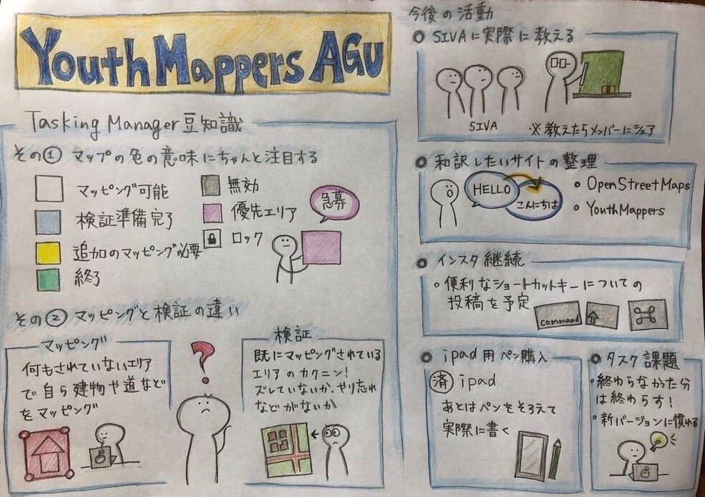

### SIVAへmapping布教

こんにちは！

YouthMappersAGUの佐藤です。

今週の活動と来週の活動について書きます。

#### ＜１週間の振り返り＞

**課題：TaskingManager 30タスク！**

●終わった人（さすがです！）

・KITA 早めに終わらせてた。

●終わらなかった人（引き続きやってください。）

・KITA以外全員。。。。。

その理由の一つは

新しい**TaskingManagerが使いずらい！**

・YAHIRO 履歴に反映されない

→投稿する前に、マッピングが完全にされているとチェックする必要があった。

・全体的にバグってるかも（リリースしてすぐだから？）

#### →あとは早く慣れましょう。

.

#### **＊タスクの見方確認＊**

白（まだマッピングしてないところ）

水色 バリデイト（確認するところ）

黄色（追加でマッピングするとこが見つかったところ）

緑（確認済みのところ）

.

#### ＜来週の活動＞

### **1.SIVAにマッピング講習**

日向野が２６日（21時半）からにSIVAメンバー１０人程にレクチャー

2. 和訳したいサイトの整理

スプシに記入！

3. プルリクを絶対送る！

4. インスタを引き続き更新

以上です！

来週も頑張りましょう〜!

.

今週のグラレコです↓

