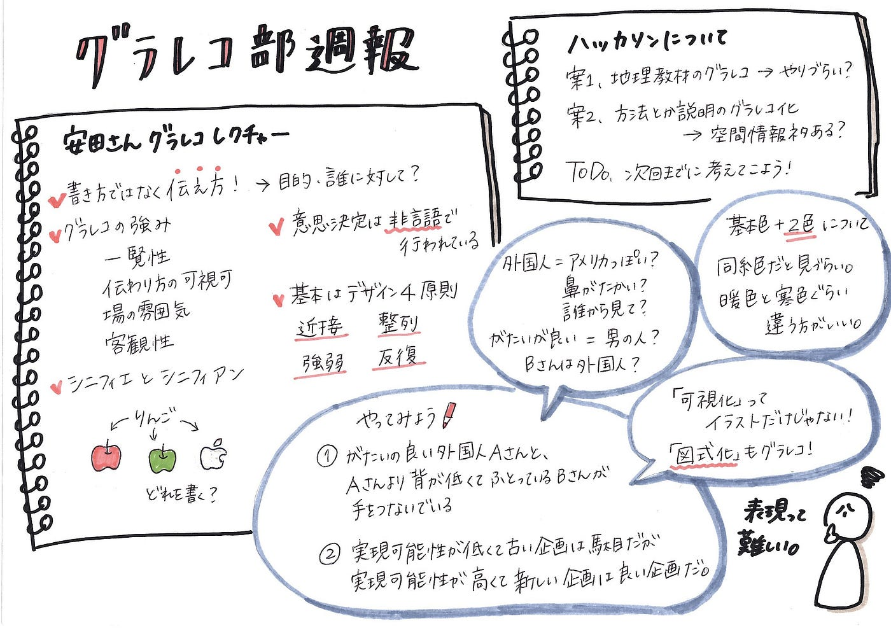
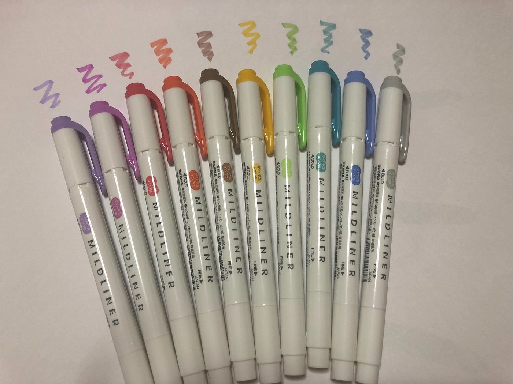
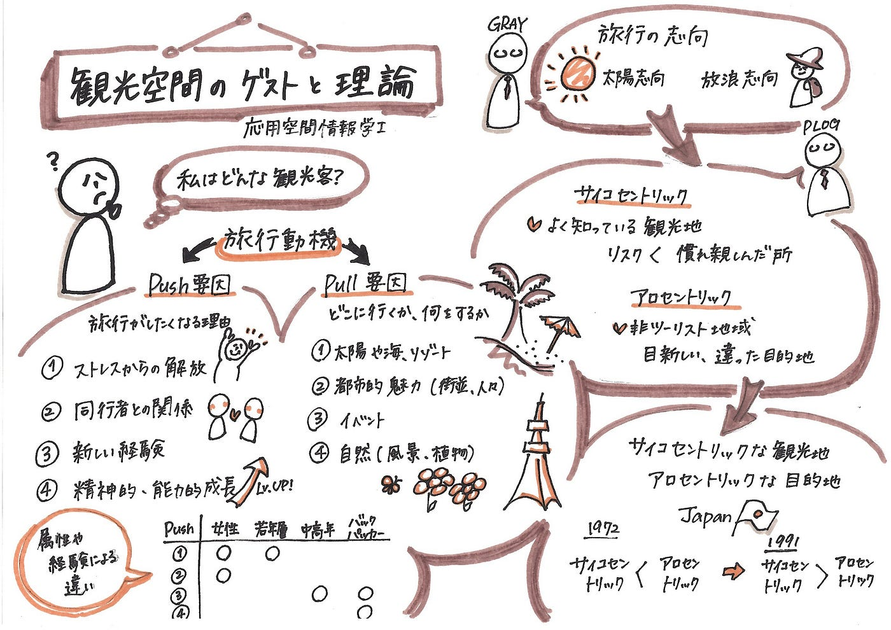
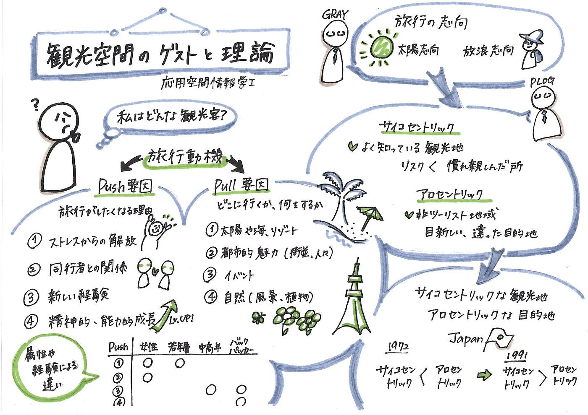
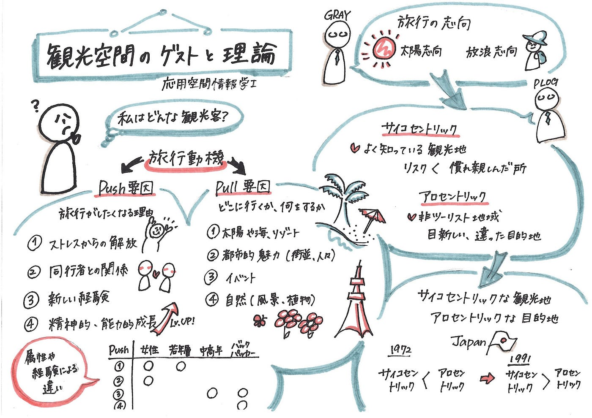
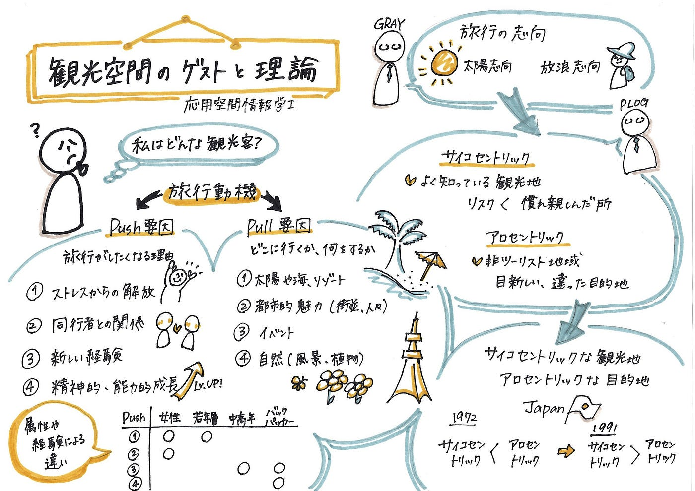

### いろいろな色

雨の日が増えてきましたね…。もうそろそろ梅雨でしょうか？
「梅雨」をイラスト化すると、雨、傘、長靴、アジサイ…。
アジサイは日本発祥！土が酸性かアルカリ性かによって青くなったり赤くなったりするそうです。海外では赤っぽい方が多いそう。

というわけでグラレコ部の週報です。

#### **##グラレコ部MT**

今回のミーティングは、「安田遥さんのグラレコレクチャー」と「ハッカソンどうする？」の2つを話し合いました。

**①安田遥さんのグラレコレクチャー**

今度安田さんがグラレコのレクチャー授業をされるということで、そのデモンストレーションをやっていただきました！

「やってみよう」は、練習問題になっています！
あえてグラフィック化しなかったので、皆さんにもぜひこれに挑戦していただきたい…！（かなり難しいです。）
吹き出しのところにちょっとしたヒントを入れてみたので参考にしてみてください。

**②ハッカソンについて**

5月のハッカソンでは「ICTでシェアする地図教材のグラレコ化」をやりました。いくつかの画材を作成したところで終わってしまったので、案1はその続きをするというもの。

[-ICTでシェアする地理教材研究会-
今コロナウイルスの影響で、様々な場所でオンライン化が進んでおります
そんな中、学校での授業でパワポやGoogleスライドを使用する場面が増えてきています！medium.com](https://medium.com/furuhashilab/ict%E3%81%A7%E3%82%B7%E3%82%A7%E3%82%A2%E3%81%99%E3%82%8B%E5%9C%B0%E7%90%86%E6%95%99%E6%9D%90%E7%A0%94%E7%A9%B6%E4%BC%9A-762ebe6bbdd8)

案2は、例えばコロナウイルス関連の給付金申請など、巷にはやり方がややこしくて説明書を読んだだけでは理解できないものがいっぱいあります。それをグラレコ化してみては？というもの。
ただしやはり古橋研なので、空間情報に絡めたネタを、となるとなかなか難しいかも…。

というわけで、次週までにハッカソンテーマを考えるのが宿題です！

#### ##色もこだわりたい

今回ミーティングで「色」についても議題に上がりました。
よくグラレコ界では「基本色＋2色」と言われますが、この2色をもっとこだわって選んだほうがいいのではないか、ということです。

色使いについての基本は、早崎さんの以前の記事を参照してください！

[より「伝わる」色使いを目指して
時には自分の傷口を見てみることも必要だと思い、私がグラフィックレコーディングをする際に苦手と感じていることを書き出してみました。そして、真っ先に思いついたのが、色使いでした。medium.com](https://medium.com/furuhashilab/%E3%82%B0%E3%83%A9%E3%83%AC%E3%82%B3%E9%83%A8%E9%80%B1%E5%A0%B1-%E3%82%88%E3%82%8A-%E4%BC%9D%E3%82%8F%E3%82%8B-%E8%89%B2%E4%BD%BF%E3%81%84%E3%82%92%E7%9B%AE%E6%8C%87%E3%81%97%E3%81%A6-2ef97fff875)

というわけで今回、いろいろな色でグラレコしてみました！

題材は、私が受講中の観光地理学の授業グラレコです。
今回は「観光空間のゲストと理論」というテーマでした。

1枚目は暖色系のマイルドバーミリオンとマイルドブラウン。

2枚目は寒色系のマイルドグリーンとマイルドダークブルー。

3枚目は強調色に暖色のマイルドレッドと、サブ色に寒色のマイルドスモークブルー。

こうしてみると色と色の差があったほうが、強調色が目立って見やすい！
1枚目はわかりやすく見にくいですね（笑）2枚目も色の相性があまりよくない気がします。
そしてやっぱり、赤いほうが東京タワー感が出ますね！

最後に、「夏」をイメージしてマイルドゴールドとマイルドスモークブルーで描いてみました。

夏が待ち遠しいですね…。

今回は基本色をすべて黒（マッキーケア極細）で書いていますが、基本色を変えることでまた色合いの変化が生まれてきそうです…。

まだまだ研究の余地あり！

青山学院大学 古橋研究室 3年

大岸 裕紀
