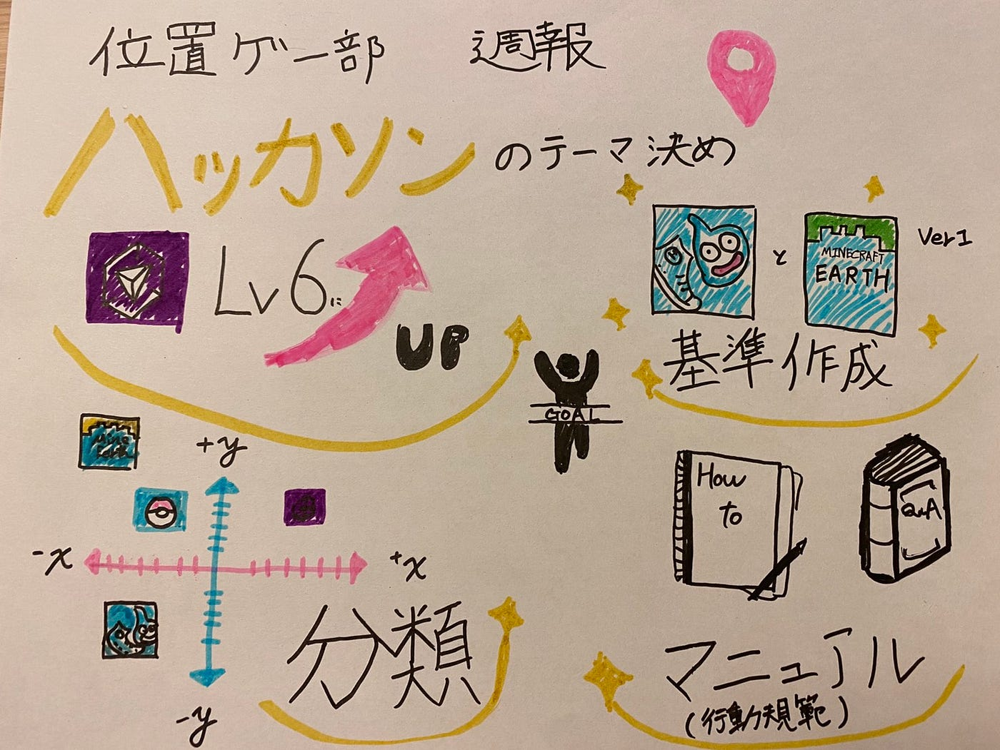

位置ゲー部週報： ハッカソンのテーマ決め

今回の位置ゲー部のミーティングでは前回話し合いをしたハッカソンのテーマを再度決めなおしました。

**① Ingressのレベルを最低６以上にする**

まず私たち位置ゲー部では前回それぞれの担当のゲームを決めていきました。それぞれの個々のゲームをプロフェッショナルになるためでも基本となるIngressは前回の通り実行することにしました。

**②グラフで分類する**

次にハッカソンで位置情報のゲームをしたときに、それぞれのゲームの長所や短所が表れてくると思うのでX軸・Y軸でそれぞれの位置情報ゲームの分類分けをグラフにすることにしました。X軸・Y軸となる基準は今後決めていきます。このグラフを作成することによって新たに位置情報ゲームをする3年生も難易度やどれくらい動くかというのが可視化されます。

**③新たな基準 ver1の作成**

そして今回のハッカソンIngressのレベルを６にすることで新たな位置情報ゲームの基準を比較して決めることができるようになったのでver1の基準を発表します。発表する位置情報ゲームは、「ドラゴンクエストウォーク」、「Minecraft Earth」の基準を決めます。

**④マニュアル（行動規範）の作成**

基準を作成したところで、各ゲームのレベルアップの効率的な上げ方やレベルに応じてのやることを作成していきます。またよくある質問なども書いていきたいです。

今回のグラレコはこちらです。

