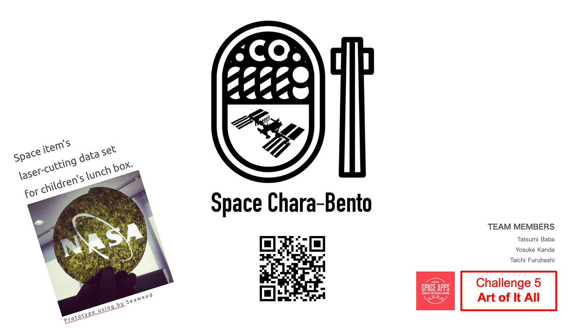
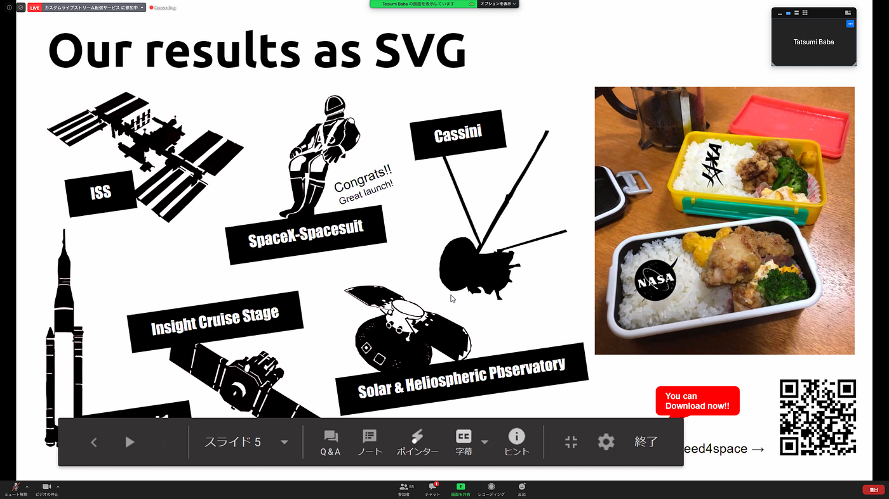
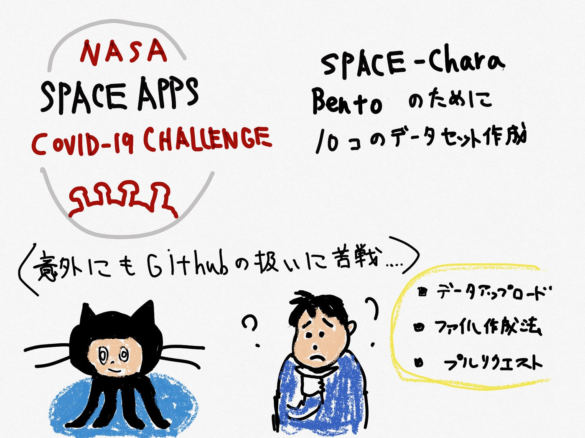

### Space Apps COVID-19 Challenge を終えて…

5月30,31日で開催されたSpace Apps COVID-19 Challenge では、2日間にわたってハッカソン形式で各チームプロジェクトを行っていきました。前回の記事の通り、我々ものづくり部も焼きのりをレーザーカッターを用いて宇宙に関連した海苔弁を作成しようということを行いました。

ここでは、そのイベントを通して学んだことを記していこうと思います。

まず、レーザーカッターに落とし込む為に、SVGデータを作成する必要があるのですが、その際にベジェ曲線を使用したのですが、”ベジェ曲線で描く”という事に慣れる必要があり、最初の方は少し大変でした。しかしこの段階では、作業を集中して行ううちに段々スムーズにできるようになりました。

次に、古橋ゼミでも度々使用するGitHubの使いこなしです。作成したSVGデータの置き場所としてGitHubを使用したのですが、データのアップロードの仕方、ファイルの作成方法、プルリクエストの方法など理解していなく苦労しました。そもそもプルリクエストがどーゆーものなのかも分かっていなかったので、この機会で知る事が出来てよかったです。

10月にもまたSpace Appsが控えているとの事なので、それにも参加していきたいと思っています。

**＜グラレコ＞**

