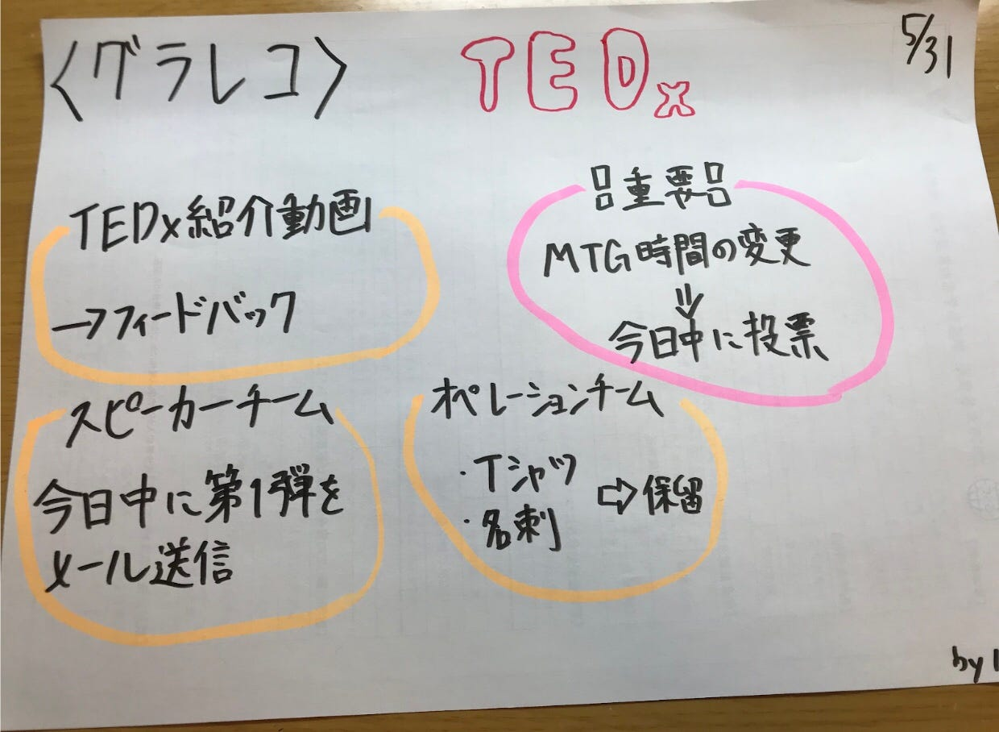

### VR/MRを体験してみよう

**5/28**にVR/MR クリエイティブプラットフォーム「[STYLY](https://styly.cc/ja/)」を提供する[Psychic VR Lab](https://psychic-vr-lab.com)の渡邊さんにオンライン開催VR/MRで利用する場合に関してお話を伺う機会がありました。オフラインとオンラインそれぞれの場合についての活用法と注意点をお聞きすることができました。

#### **1.オフラインの場合**

・ステージ上に作り出したMR空間内でパフォーマンスしているスピーカーの姿をスクリーンへ投影する。観客はスクリーンを通しMR空間と一体化したスピーカーのパフォーマンスを見ることができる。

#### 2.オンラインの場合

→観客が所有するスマホ/ パソコン上に、MR空間にいるスピーカー(アスタジオなどの会場にいる)を映して中継。観客が二次元でYouTubeで見る。

ヘッドバンドディスプレイがない人でも、上記の手法なら二次元でMR空間を楽しむことができる。

#### 注意すること

◎MR空間を、ステージ上につくるかどうかは、スピーカー次第。

スピーカーのスピーチ内容によってはそういった空間が必要ない。

◎スピーカーがどんなプレゼンをしたいかをよく話し合うことが重要。

◎出演者と技術者、主催者が協力、打ち合わせし作っていく。

#### これからやることについて

一度STYLYのVR/MR空間を実際に体験してメンバーでなにをしたいか、どう活用していくかを検討する。(6/12) を予定。

**5/31**のミーティングでは以下の近況報告と今後の方針について話し合いました。

#### ・**動画作成**：TEDx紹介動画完成

問題: 滑舌が改善の余地あり？（聞き取りやすい）・音質悪い

→YouTube非公開にして、フィードバックもらう

#### ・**スピーカーチーム**：

説明資料＆メールテンプレ作成完了。

5/31中に6・７人メール送信。（6・７人送って返答待ち✖️3＝21人完了予定）

#### ・**オペレーションチーム**：

Tシャツ：（中村デザイン）ロゴをそのまま入れる。その他の制約はなし。

名刺：デザインは必要。必要なタイミング・枚数が分かり次第発注。

#### ２・決定したいこと

・MTG時間について：<水曜日の空きコマ> or <土日のAM10:00~>（5/31中投票）

・MTGはグループ活動メインになっていく。

#### 今回のグラレコ

