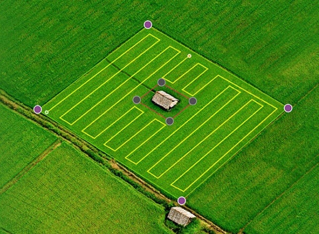
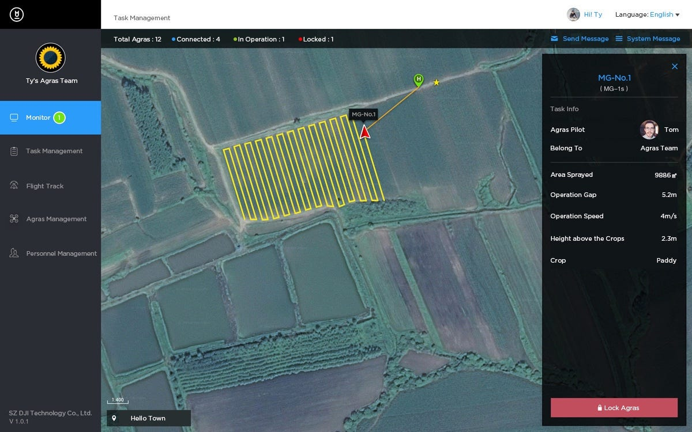
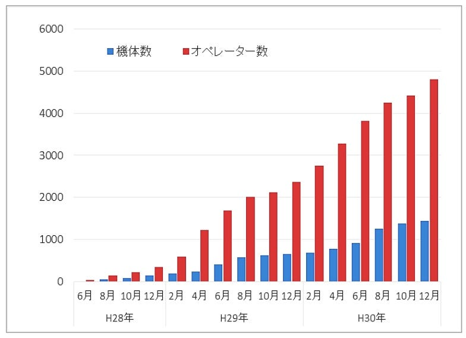
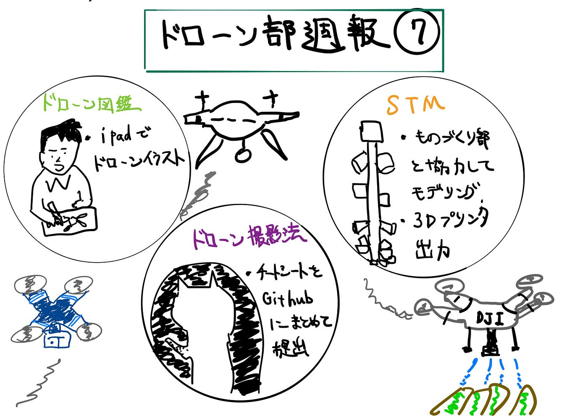

### ドローン部週報⑦

今週のドローン部ではハッカソンに向けての各チームの進捗状況、to doについて確認しました。

#### #今週の議論内容

1.ドローン図鑑

・ドローン図鑑の絵はデジタルにすることで決定

・1人３企業のタスク

2.航空法等のチートシート作成

iPadと手書きで書いたチートシートをGitHubに提出

3.STM

・STMモデリングはものづくり部と協力、実際に印刷する

#### #農業分野の産業用ドローンについて

今回は農業分野で使われるドローンについて調べてみました。農業分野でのドローンは日本国内では1980年代から活用されており主に農薬散布や種まき作業の効率化に貢献しています。

[Agras MG-1S - Agricultural Solutions - DJI
The Agras MG-1S integrates a number of cutting-edge DJI technologies, including the new A3 Flight Controller, and a…www.dji.com](https://www.dji.com/jp/mg-1s)

こちらはDJI社の農業用ドローンです。この機体は以下の特徴により液体の農薬、肥料および除草剤の様々な散布を高精度・良効率で行うことができます。

- レーダー認識機能

- 自律散布システム

- DJI農薬散布管理プラットフォーム

自律散布システムや農薬散布機能を使えば、自分で効率的な飛行ルートを自動的に作成したり、編集したりすることができ効率を高めるのにとても役立ちます。※この機能については農林水産航空協会の承認を取得してから導入する予定ということです。

もう一つヤマハ発動機から出ている[YMR-08](https://www.yamaha-motor.co.jp/ums/multi/)というマルチローターは二重反転ローターを採用し力強いダウンウォッシュ（降下気流）を生むことで散布農薬が風に流されにくく、狙い通りの散布と高い薬剤効果を実現しています。

**︎**

**︎◼︎農業用ドローンの未来**

こうした農業用ドローンの普及拡大には農林水産省の官民連携の取り組みなどがあります。現場の人手不足 が深刻な問題となっている中、ドローン（マルチローター）や無人ヘリコプター技術の発展に注目し年々普及拡する計画を進めてられています。ドローン活用市場の中でも大きな割合を占める農業利用について、これからも注目していきたいですね。

#### #今回のグラレコ

