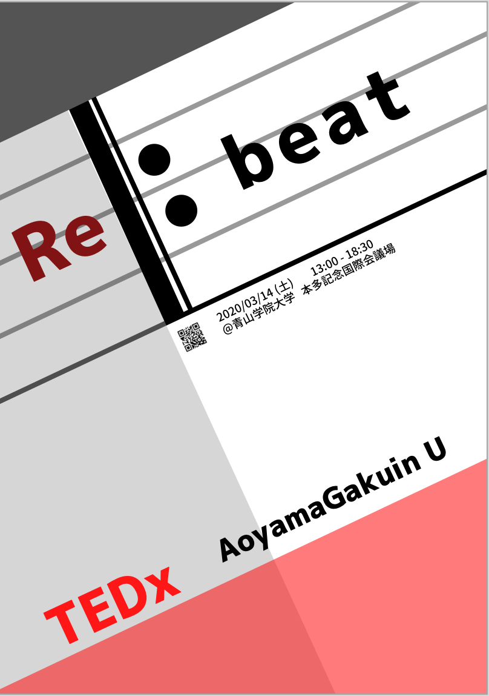
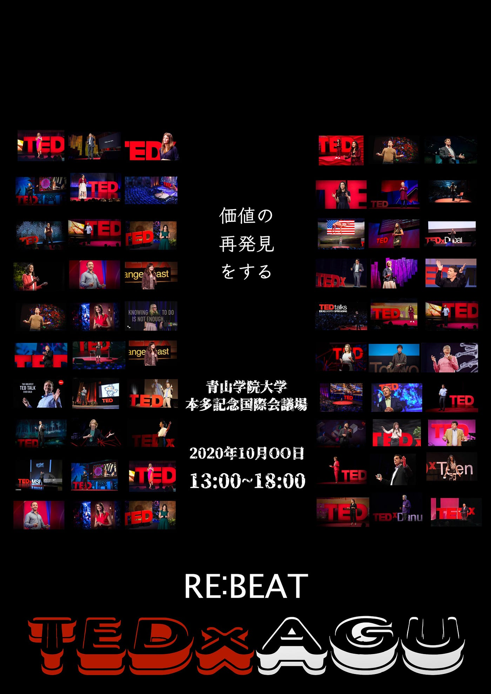
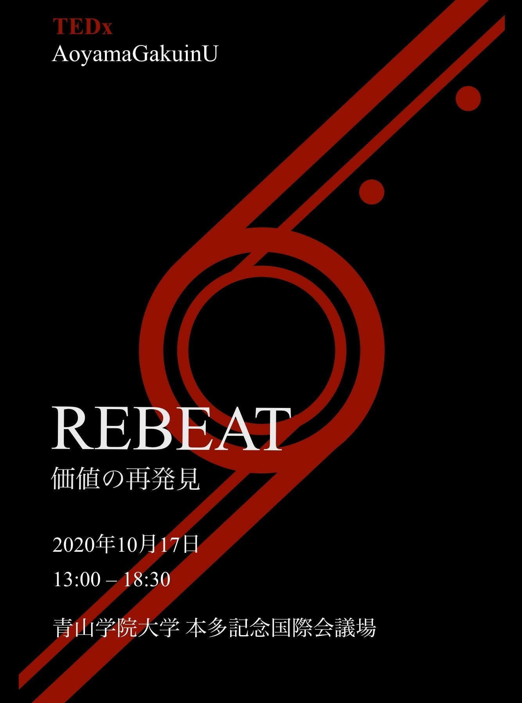
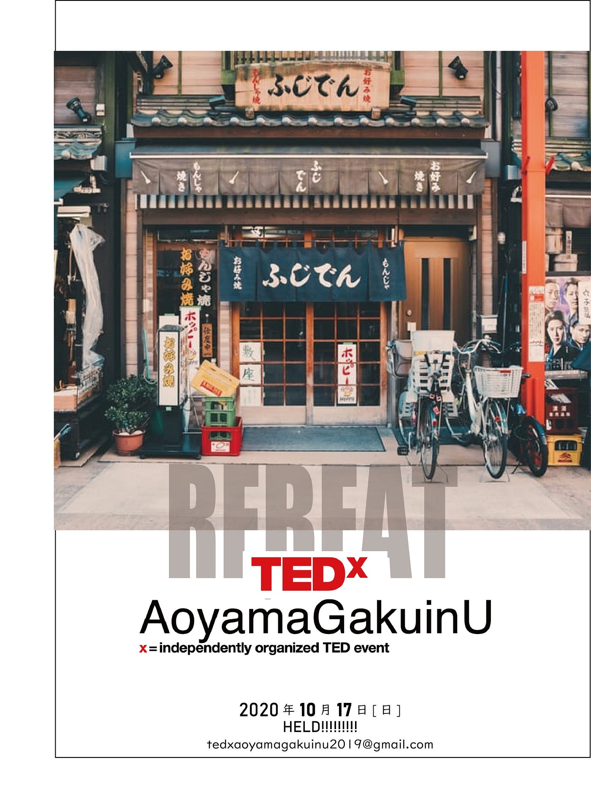
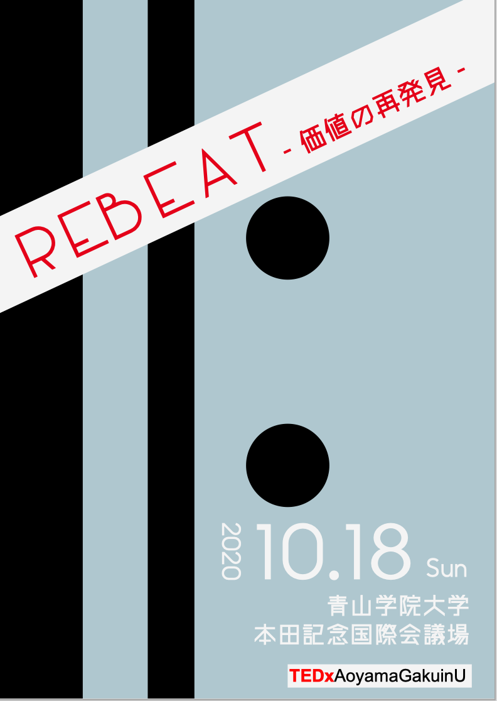
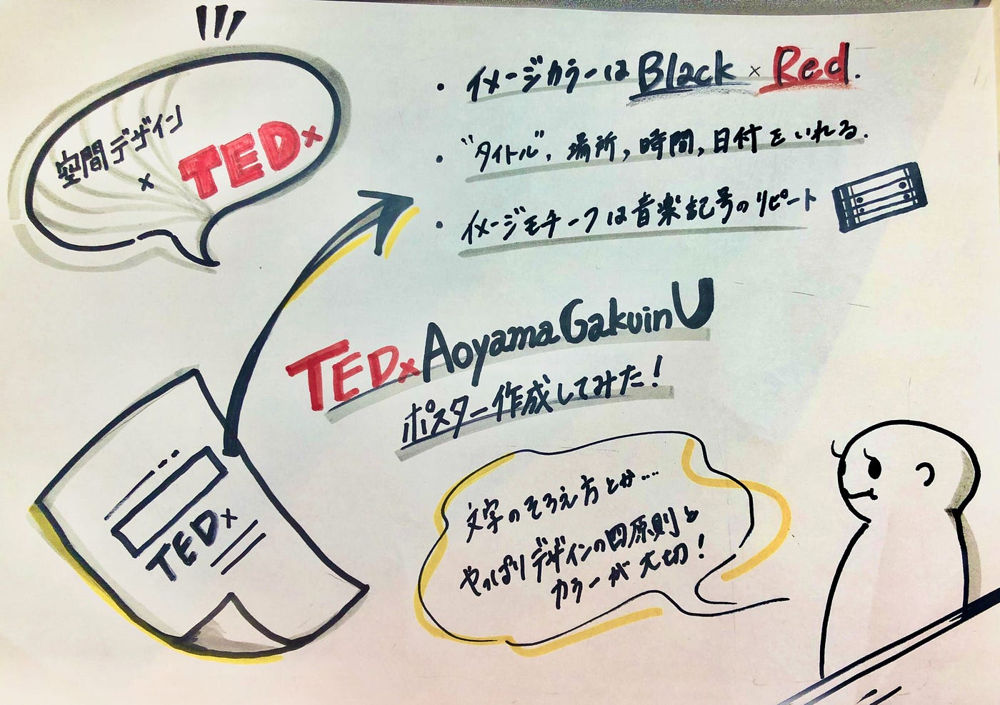

### ポスターデザイン練習！

#### 今週のMTG内容

> ・TEDxAoyamaGakuinUのポスターデザインしてみた！

> ・ Clusterイベントの参加感想

> ・TEDxオンライン開催について

> ・来月のハッカソン課題どうする？

> ・（余談 messenger rooms を使ってみた）

> ・次週の空間デザイン部

#### TEDxAoyamaGakuinUのポスターデザインしてみた！

先週学んだデザインの４原則とノンデザイナーズデザインブックの「色」についての章を参考にTEDxのデザインを考えて見ました。

最初に見たとき、みんなのレベルが初めてポスターを作った時から爆上がりしていてびっくりしました。定期的に作るとデザイン力がどの程度ついたのかわかるのでいいのではないかと思います！

slackでコメントを下さった方ありがとうございました。

▶︎斎藤作

リピート記号を大胆に入れてみた

情報＜＜＜興味を引かれる デザインを意識

tedのイメージカラーである赤をアクセントカラーとして使用

▶︎ 青木 作

中央揃え、やるなら大胆に！

「価値の再発見」というキーワードを重視

▶︎ 川嶋 作

黒と白と赤のtedのイメージカラーのみで作る

リピート記号を使用

▶︎水谷 作

近接、整列、コントラスト、トーンを意識して作成

画像はunsplash, unminus, pixabay から探した

▶︎若松 作

赤の補色である青にグレーを足してベースの色を作った

リピート記号を使用した

#### Cluster参加の感想

５月19日、clusterで開催された[「バーチャル渋谷 オープニングイベント」](https://fds.or.jp/pressrelease/143/?fbclid=IwAR1qM8D_q9HZSg2USr2WCBWJC5JVaKqfChogx6YVjA-iOgAQJDJV4wLcXGs)にメンバー全員で参加しました。

想像以上に渋谷が再現されていて凄かった！！！

また登壇者と一緒に渋谷を歩くことができて驚きました。

友達と会うことが難しかったり、使い方に慣れるのに少し時間がかかるのでは？といった懸念もあったり、デバイスへの負荷が大きく入れなかったり、落ちてしまうこともしばしば。PCから入れなかった、など課題はまだまだありそうです！

でも自粛期間中に渋谷に行った気分になれました＾＾

#### TEDxAGU

▶︎オフライン、オンライン の準備を同時並行と決定

空間デザイン部としてはどちらの準備に対して対応できるようにしたい！

オンライン班とオフライン班に分かれてデザインを学ぶことを検討中

#### 来月のハッカソン、空間デザイン部としての課題

cluster をいろいろいじってみる。

withコロナの時代において注目も高まっており、clusterを使っていこうという大学や団体も増えているようです。

TEDxのオンライン開催対応のためにCluster 上で発表会のスタジオ作りなどができたらいいと考えています。

わからない点が多すぎるclusterなのでどこまでできるかやってみようという結論に至りました！

**（余談ですが、、、今回のMTGをFacebook rooms 使ってみました）**

毎週のMTGはzoomのプロアカウントが使えることもあり、zoomを主に使用しているのですが、今週のMTGはfacebook roomsで行いました。

時間制限：なし

画面共有：可能

チャット機能：なし（messengerで代用可能？）

画面録画機能：なし

背景設定：できない

音声の遅れもあることや、少しデバイスへの負担も大きいこと、zoomの方が使いやすいと思います！facebookアカウントを持っていれば招待コードからログインできるのでFacebookユーザー同士、messengerでやりとりをしている場合に有効なテレビ会議ツールだと思いました！

#### 次週 ▶ ︎Clusterについて調べてみよう！

ハッカソンの内容も決まってきたので、clusterそもそもなんなの？どうやって始められる？仕組みは？など初心者だからこそ生まれるわからないところを勉強していきます！

#### 今週のグラレコ

