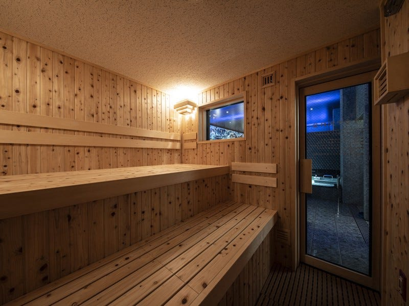
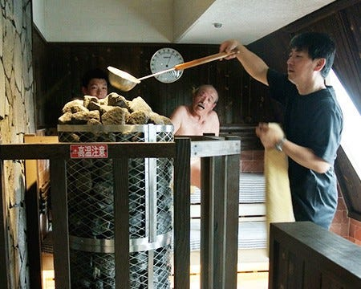
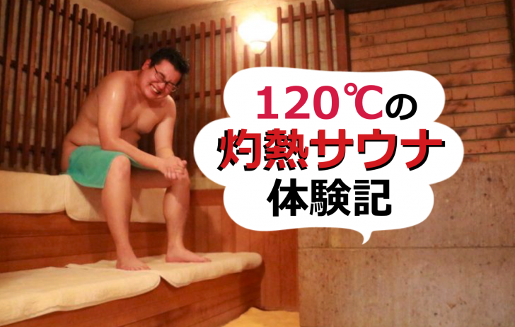
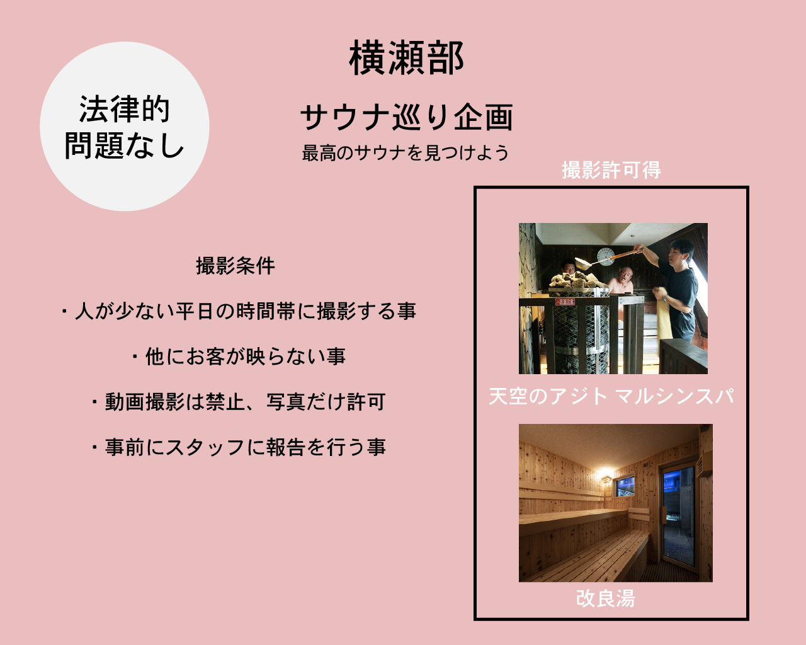

### 横瀬部週報

こんにちは、横瀬部のイジユルです。

前回、横瀬部のあんぼからサウナの健康効果及び都内サウナ巡り企画について報告しました。そして、今回の週報はそのサウナ巡り活動について報告する予定でしたが、現在、コロナの状態や少ない部員の中、スケジュールを合わせるのが難しいという問題でサウナ巡り活動ができなかった為、今週はサウナを巡る前の必要な事前調査について話し合いました。

### サウナ撮影許可について調査

サウナを巡った後、皆さんによりリアルな体験をお届けしたいと趣旨でサウナで撮影を考えましたが、サウナという場所の特徴上、撮影は事前許可を取らなきゃ行けないと思い、前回、紹介した五つのサウナに直接電話し、撮影可能について調べました。

**その結果！！**

ほとんどのお店から基本**撮影不可**という連絡を頂きましたが！

幸いに

**・_ 改良湯_**

_**・天空のアジトマルシンスパ_**

この二つのお店からは条件付きで撮影OK許可をしてくれました。

その**条件**としては

・人が少ない平日の時間帯に撮影する事

・他にお客が映らない事

・動画撮影は禁止、写真だけ許可

・事前にスタッフに報告を行う事

などかなり多い条件で許可をもらいました。（コロナの影響で客が少なくなった事もあり、サウナからの許可を得られたと思います。）

> _撮影自体が法律的に問題ないという事が沢山のサウナレポートから確認できましたので、問題はないと思います。）サウナレポート[事例_](https://onsenbu.net/22473)

従って、撮影は可能でありますが、様々な問題が発生する恐れがある為、なるべく法律と公衆マナーを侵害しない範囲でリアルな体験レポートを書こうと思います。

そして、部員のスケジュールが整えてくる次第に、来週から横瀬で再現できるような最高のサウナを見つけるという目的として、本格的にサウナ巡りを開始して行きたいと思います。

