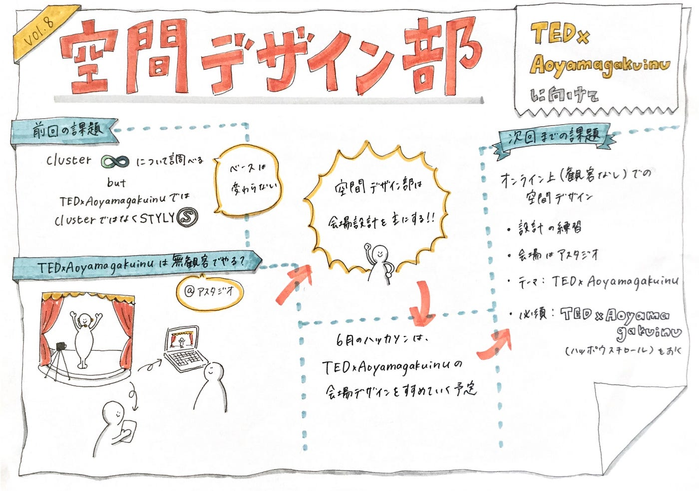

### [cluster]ハッカソンに向けて

> ・Clusterについて調べた（6月のハッカソンに向けて）

> ・TEDxではSTYLYを使う（無観客）

> ・次回の空間デザイン

### Clusterについて調べた（6月のハッカソンに向けて）

今週はバーチャル空間でイベントができるclusterについて調べました！

主に、clusterで使う空間とアバターの作り方についてをリサーチしました。6月のハッカソンの発表用のワールドをものづくり部と協力して制作したいと考えているので頑張りましょう！！

#### ＜アバター作り＞

アバターは3DモデリングをblenderまたはVRoid Studio を使用して作成する。作ったアバターをclusterにアップロードすることで使えます。一度チャレンジしてみればこの先活かせるということでやってみようと思います。

参考サイト
[https://note.com/745810/n/n702b2d4ed186](https://note.com/745810/n/n702b2d4ed186)

#### ＜ワールド作り＞

使用ツールはUnity。

Unityのベースのワールドに置きたいオブジェクト（3Dモデル）を配置していきます。そして、完成したワールドをclusterにアップロードすることで使用できます。

やり方はシンプルですが、3DモデリングやUnityの使い方は難しいので、細かな機能を勉強していくのがこれからの課題となりそうです。

実際に作業をしている方の動画も参考にさせていただきました。
[https://www.youtube.com/watch?v=6jrgj3kYukk&t=204s](https://www.youtube.com/watch?v=6jrgj3kYukk&t=204s)

### TEDxではSTYLYを使う（無観客）

今週はClusterについて学びましたが、10月に開催されるTEDxAoyamagakuinUでは、同じくVR空間を作成できる「STYLY」を使う方向性になりました！

本番は現時点（6月時点）で会場候補となっているアスタジオを使用し無観客でイベントを開催する可能性が出てきています。
そして、STYLYを活用してMR空間をステージ上に作ることでサーバーの重さなどを軽減できるとのこと！

ということで、実際にオフラインの会場を使って開催する可能性もあり、空間デザイン部は会場の美術や音楽等を含めたデザインをやろうという結論になりました。

アスタジオさんからホールの間取り図もいただきましたので、それに沿って考えていきます。

※ハッカソンではBlenderやUnityを経験しておくということでClusterをやります。

### ＜次回の空間デザイン＞

次回は早速、アスタジオにて無観客で配信することを考慮して、スタジオの空間デザインを考えてくるという課題になりました！

> 設計の練習やデザインを実際に考えてみる段階に入り、まずイメージを掴むことを意識！

> コスト面や準備・撤退のことを考えられているとなおよし！

> これまでインプットしてきたテクニックや心理学的要素も組み込もう！

これらを意識して取り組みます。

**＜グラレコはこちら＞**

