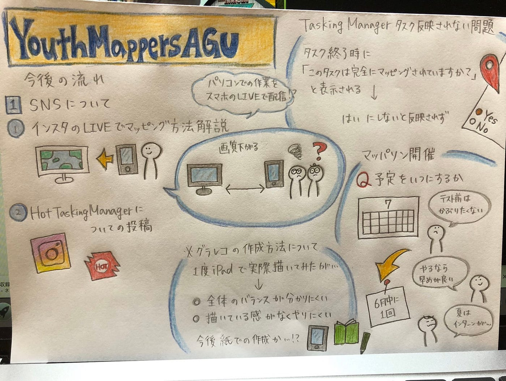

### マッパソンの準備

こんにちは、今回担当する2年の村松です。

6月1日に第10回Youth Mappers AGUの定例会議を行いましたので報告させていただきます。

今回の議題はSNSとマッパソンの開催について話しました。

1. SNS（インスタグラム）

インスタグラムのライブを通して、マッピング方法を解説することや、HOT Tasking Manager についての投稿をする予定です。まだどのように配信するか検討中です。

2. マッパソンの開催

マッパソンは3回に分けて行う予定です！第1回目は6月中にオンラインにて開催します。ボランティアサークルのSIVAのメンバーを対象に、建物のみのマッピングを7チームに分け完了タスク数を競います！具体的な日程が決まり次第告知する予定です。

**今週のグラレコ**

