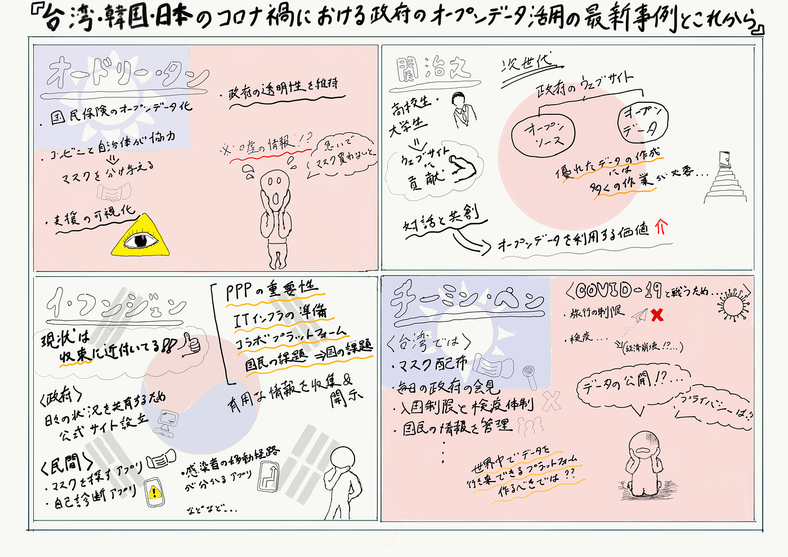

### 「台湾・韓国・日本のコロナ禍における政府のオープンデータ活用の最新事例とこれから」に参加して…

Responding to COVID-19 utilizing open data in Taiwan, Japan, Korea with Audrey Tang

6月2日（火）19時から行われたオンラインでの国際会議を視聴してきた。台湾からは、オードリー・タン氏、チーミン・ペン氏が、韓国からは、イ・フンジュン氏、日本からは、関 治之氏が参加した。この国際会議では、COVID-19の影響で混乱状態になっている世界中に向けて自国を例に出し、オープンデータの有効活用に関して議論なされていた。

オードリー・タン氏は、国民保険のオープンデータ化であったり、コンビニと自治体が協力し、マスクの在庫情報を確認しながら共有し合っていくということ、支援の可視化についてなど話された。中には、嘘の情報が出回り、国民がパニックになってしまう事もあるという。それを防ぐ為、政府の透明性を維持し、随時偽りのない情報を共有していかなければならないとのことだ。

関 治之氏は、次世代に向けた政府のウェブサイトをオープンデータとオープンソースを用いて作成し活用していく事が重要であると仰っていた。日本では、高校生・大学生がウェブサイトに貢献してくれたという事もあり、今後、ウェブサイトを用いてCOVID-19に関した情報をもっと開示し共有していかなければならないであろう。

韓国のイ・フンジュン氏は、韓国では既にCOVID-19が収束に近づているとのことだ。やはり情報の開示と共有が大事である事を話されており、政府からは日々の状況を知らせるための公式サイト、民間からは、マスクを探すアプリ、自己診断アプリ、感染者の移動経路を把握できるアプリが開発されているとのことだ。これにより分かる事は、PPPの重要性やITインフラの整備、また政府が国民の抱える問題に対しより注目していかなければならないということだ。

もう一人の台湾出身であるチーミン・ペン氏。この方からは、COVID-19と戦うには、まず厳重な入国制限と検疫検査を行い、国に壁を張ることだと話されていた。マスクの配布、毎日の政府からの会見、そして国民の情報を国がしっかり管理する事を台湾は行っている様である。しかし、国民のデータを開示する事により、国民の持つプライバシーや肖像権などはどうなってしまうのかという新たな問題も出てきてしまう。世界中のデータを行き来出来るようなプラットフォームがあれば現状より効率的にCOVID-19と戦い、打ち勝つ事が出来るのではないかとも仰っていた。

#### ＜スクショ＞

#### ＜グラレコ＞

