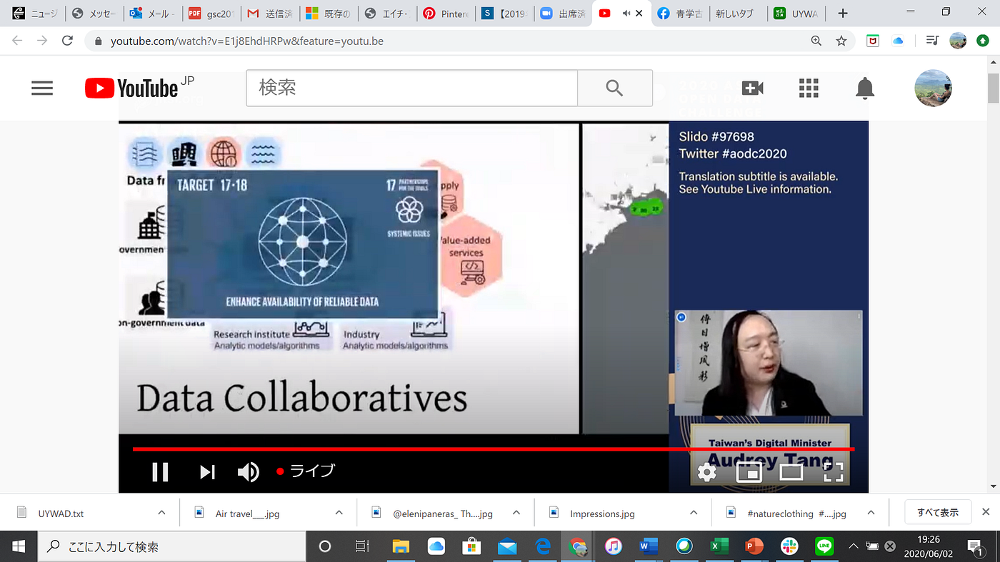
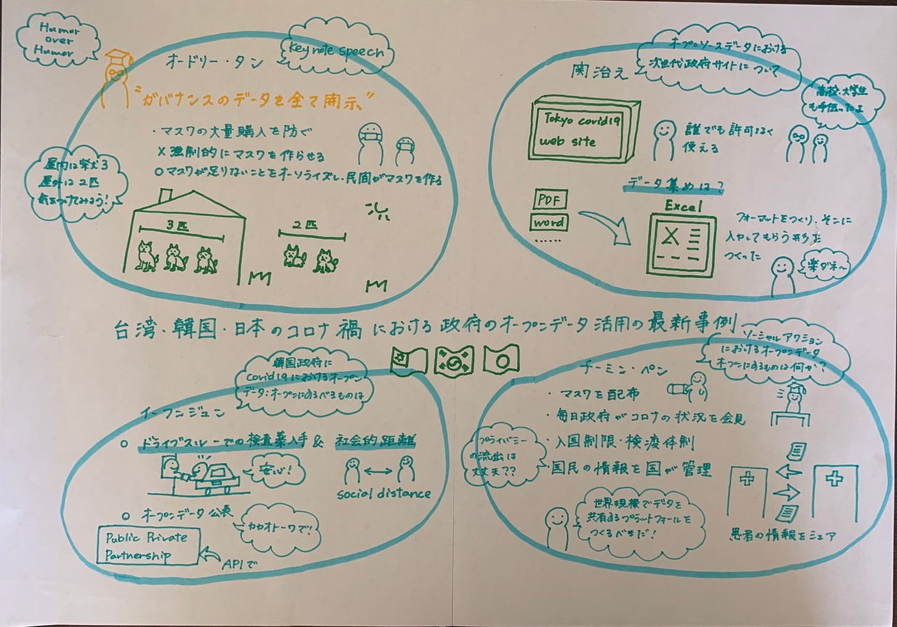

### 台湾・韓国・日本のコロナ禍における政府のオープンデータ活用の最新事例

３年の松山蘭です。

今回国際会議に参加したので、その記事を書きたいと思います。今回は、台湾、韓国、日本でcovid-19に対してオープンデータを活用してどのように対策をとっているのか４名のゲストがスピーチしました。

まず初めに、オードリー・タンさんによる「key note speech」についてまとめたいと思います。台湾では「ガバナンスのデータを全て開示」をすることで、偏向報道によって国民のマスクの大量購入が起きることを防ぎました。また、強制的にマスクを作らせるのではなく、マスクが足りないことをオーソライズし、民間がマスクを作ることを目指しました。さらに、「humor over rumor」という言葉をつけ、例えば屋内では柴犬３匹、屋外では柴犬２匹分の距離をとるという親しみやすい例を出すことによってより国民がソーシャルディスタンスを意識できるような政策をとっています。

次に、日本の関治之さんによる「オープンソースデータにおける次世代政サイトについて」まとめたいと思います。特に、東京都のcovid-19の特設サイトを中心に話してらっしゃいました。東京都はcovid-19のオープンソースデータを作り、誰でも許可なくアクセスできるようにしました。このサイトは高校生や大学生もサイト創立に貢献したそうです。また、このサイトは他の都道府県でも作られるようになり、日本でコロナ対策としての一つの策になっています。このサイトへのデータ集めは、以前は各自バラバラなフォーマットで送られてきており、PDFなど様々な形を一つ一つ手作業で変換入力していかなければならず、非常に手間がかかったものの、現在ではExelでフォーマットを事前に作り、各自そのフォーマットに記入してもらう形にしたため、非常に作業が速くなり、楽になったそうです。

三番目に、イ・フンジュンさんの話についてまとめたいと思います。彼は「韓国政府にcovid-19におけるオープンデータ：オープンにするものは」について話されました。韓国では、ドライブスルーによる検査薬入手と、社会的距離の徹底によって対策をとりました。日本では、ドライブスルー化がないので、このような取り組みを日本でも出来たらいいなと思いました。また、オープンデータを公表しています。データの集め方としては、カカオトークなどのアプリを使い、国民と共同で収集しています。また、このようなパブリックプライベートパートナーシップを構築させ、これらのサービスはAPIによってデータ接続を考慮して作られています。

最後に、台湾のチーミン・ペンさんの「ソーシャルアクションにおけるオープンデータ：オープンにするものは何か」についてまとめたいと思います。台湾では、国民にマスクを配布することと、毎日政府がコロナの状況について国の方針などを会見することを行っています。また、もちろんのこと、他国からの入国制限を徹底し、検疫体制を整えることを行いました。さらに、国民の情報を国が管理し、かかりつけ医でない病院に行かなくてはならなくなった患者にとって最適な医療処置がとられるようにしています。ただし、この場合、国民の情報を勝手に公開することになり、その点においてはまだ対策が不十分であると言える。また、チーミン・ペンさんが考える世界規模でできる対策については、世界規模でデータを共有するプラットホームを作れば国をまたぐコロナを抑えることが出来るのではないかとおっしゃっていた。最後に、現在コロナの影響で飛行機が飛ばなくなったり、工場が動いていなかったり、車の移動量が少なくなることで、地球環境は改善しているが、また再び、経済活動がもとに戻るため、リバウンドし、結局あまり効果がないと言える。

今回の国際会議に参加し、オープンデータを活用することによって、感染者を抑え、より早く元の世界に戻ってこれることを祈っています。

会議スクショ

グラレコ

