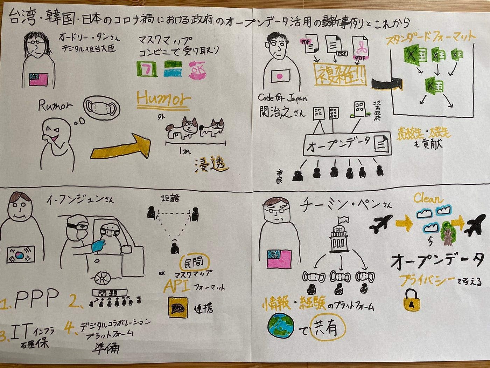
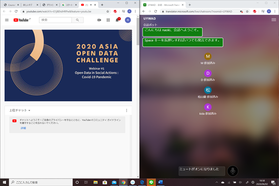

### 国際会議に参加してみて

Responding to COVID-19 utilizing open data in Taiwan, Japan, Korea with Audrey Tang

６月２日に１９時より開催された「台湾・韓国・日本のコロナ禍における政府のオープンデータ活用の最新事例とこれから」に参加しました。この国際会議はオードリー・タン氏、関治之氏、イ・フンジュン氏、チーミン・ペン氏がお話をしてくださいました。

Covid-19が世界中に大きな損害を招き、世界の各国がより効率的なオープンデータの活用をしています。そのオープンデータの活用の事例とこれからについて主に話していました。

最初に話をしていただいたのはオードリー・タンさんによる「Keynote speech」です。すぐに最新のオープンデータとなりマスクの買うことの場所がわかるマスクマップがあったり、コンビニと連携し、マスクをいつでも買うことができるシステムがあったりと、アプリやウェブサイトを持つ人にとってすごく便利であると思いました。情報がパニックでマスクを大量に購入してしまうような問題が生じてしまう可能性があるが台湾政府は情報を開示することで防ぐことができれば防ぐことができると主張しました。「humor over rumor」のような情報の開示の仕方を面白くしたことが特に印象的で面白かったです。室内の時には柴犬が3匹分、室内の時には柴犬が2匹分の距離を開けることが必要で、このようなインパクトのあるユーモアで情報の浸透することの一因になったと思います。

２番目にお話しされたのはCode for Japanの関治之さんの「オープンソース・オープンデータにおける次世代政府サイト構築について」です。東京都のCovid-19に関するサイトを政府からの許諾を得て作りました。このサイトは多くの市民の人たちからの協力がありました。またこのサイトはオープンデータ・オープンソースで誰でも許可なく使うことができ地方の政府も同様のサイトを容易に作ることができました。しかし問題点として公共機関がファイルをPDF形式で送ってくることがあり、行政機関のデータ公開方法のスタンダードフォーマットを作りました。このフォーマットはExcelファイルで収集することによりデータの統一化をすることができました。また高校生や大学生もこれらのサイト作りに貢献していたことが特に印象的でした。オープンデータの重要性を再認識しました。

3番目にお話しいただいたのはイ・フンジュンさんの「韓国政府にCovid-19におけるオープンデータ：オープンにするべきものは何か」でした。現在韓国におけるCovid-19の患者数はドライブスルーでの検査薬の入手と適正な社会的距離によって少なくなってきています。韓国政府はオープンデータを毎日公表しています。政府は民間セクターと協力してkeyデータを公表しました。例えばマスクデータは民間セクターと協力してデータを集め、マスク販売データのAPIフォーマットで情報を適宜収集し開示しました。まとめとしてPPPの重要性、国の問題を解決するための市民の協力の拡大、災害の際安定できるITインフラの確保と準備、先制して対応できるようにするためにデジタルコラボレーションプラットフォームの準備の重要性を学ぶことができました。

最後にお話しされたのはチーミン・ペンさんによる「ソーシャルアクションにおけるオープンデータ：オープンにするべきものは何か」です。台湾で行われているコロナの対策として、マスクを国民に配布をすること毎日政府がCocid-19についての会見を行うことでした。オープンデータの問題点として、個人の医療データも勝手にオープンデータとして公開してしまう部分もあるのでプライバシーの問題があるそうです。気候変動の大気汚染が、飛行機が飛ばなくなりクリーンになりましたが経済が回復すればまたもとに戻ると主張していました。まとめとして、オープンデータは重要であるがプライバシーの問題を考えていかなければならないことと、情報や経験を共有するプラットフォームを持つことが大事であるとお話ししました。

今回のグラレコはこちらです。

そして国際会議中のスクリーンショットはこちらです。

