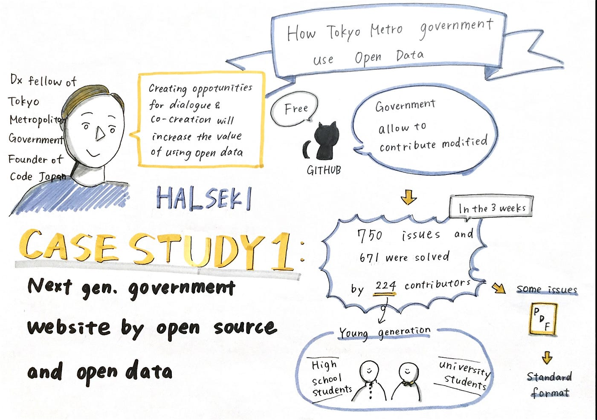
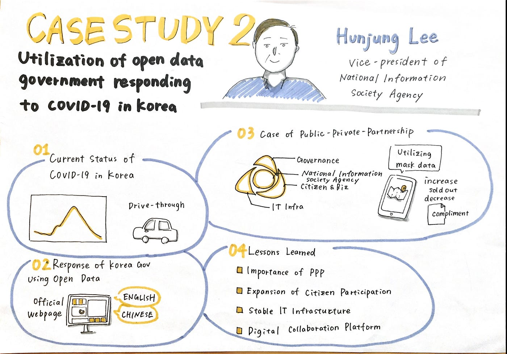
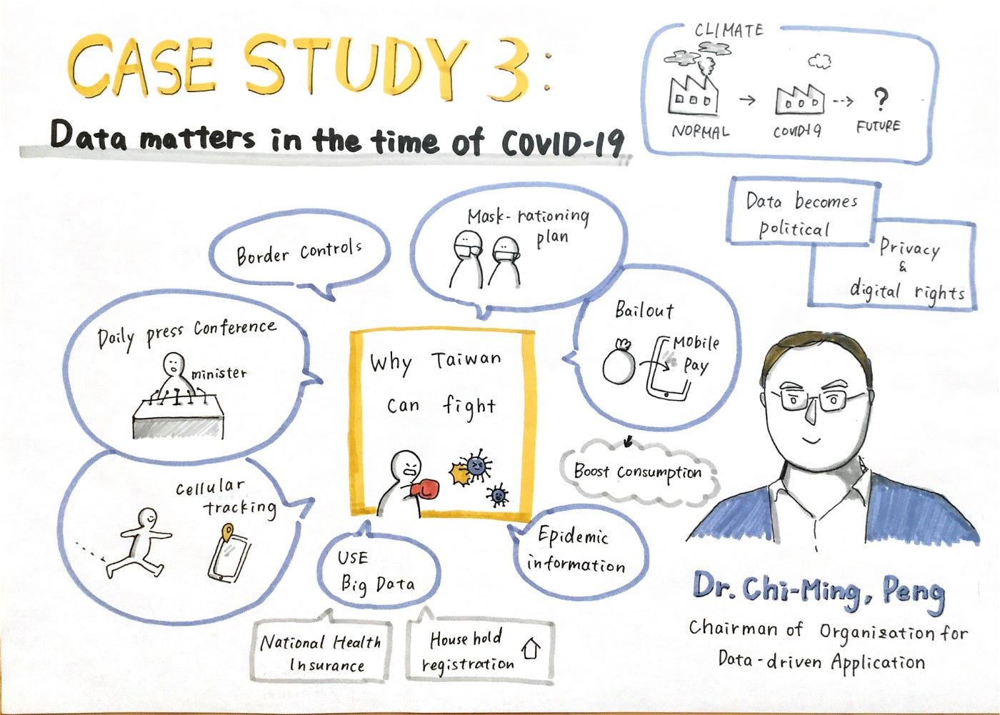
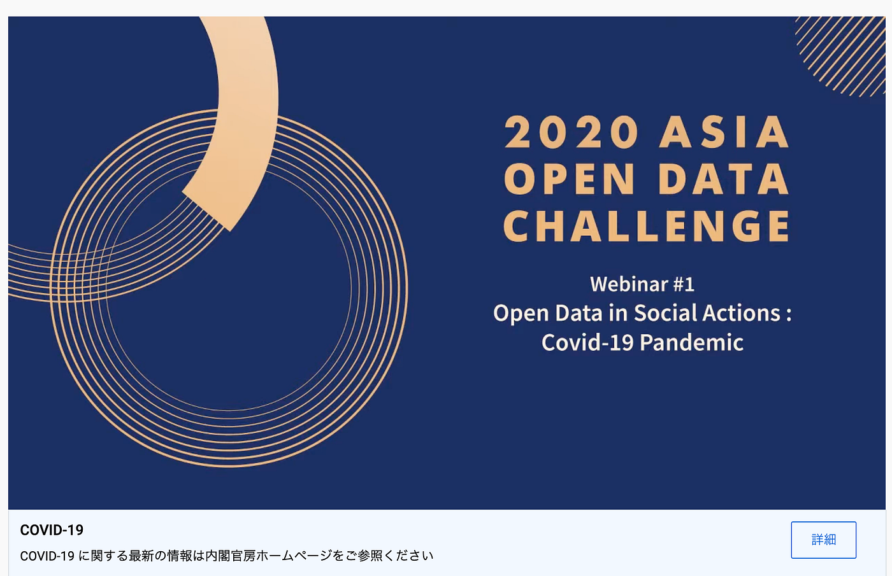
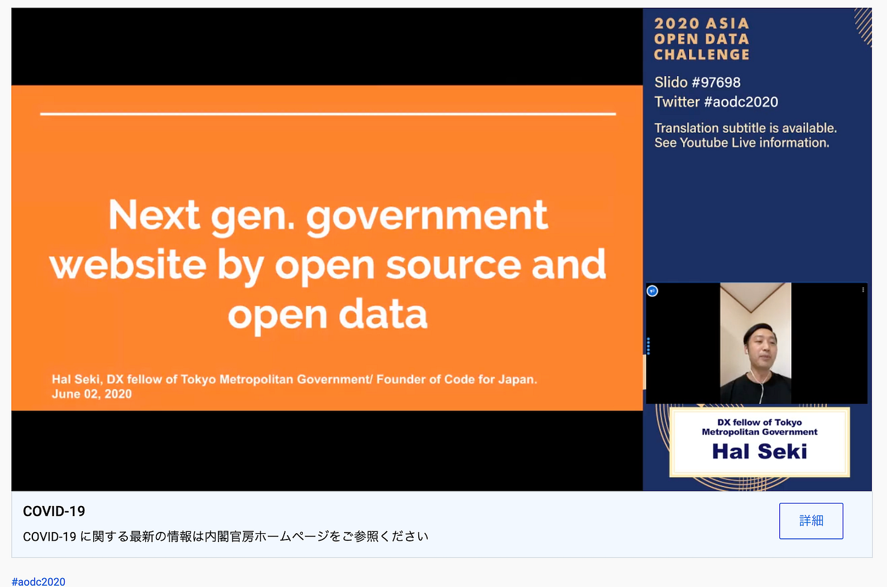

### 2020 ASIA OPEN DATA CHALLENGE に参加してみて

6月2日（火）に開催された「台湾・韓国・日本のコロナ禍における政府のオープンデータ活用の最新事例とこれから」に参加しました。初めての国際会議、英語でのグラレコと貴重な経験をできました。

アジア各国の事例をオードリー・タン氏、関治之氏、イ・フンジュン氏、チーミン・ペン氏の４名のゲストスピーカーがお話しするというとても貴重なイベントでした。

#### Keynote speech / Audrey Tang, Taiwan’s Digital Minister

台湾のIT担当大臣のオードリー・タン氏によるスピーチから始まりました。FAIR, FUN と三密ならぬ３Fの観点から台湾の事例を紹介していました。

#### Case study1: Next-gen. government website by open source and open data

次のスピーカーはCord for Japanの 関 治之氏。東京都のcovid-19の特設サイトの活用についてお話しされていました。誰でも編集可能なため、高校生や大学生、そして海外からの多くの協力者と一緒にCOVID-19の情報サイトを作成していたそうです。

#### Case study2: Utilization of open data government responding to COVID-19 in Korea

韓国政府がどのようにopen dataを活用していたか、イ・フンジュン氏によって説明されていました。ドライブスルー検疫やマスク情報の開示などを通しCOVID-19に対応をされていました。

#### Case study3: Data matters in the time of COVID-19 (Data use, Open Data and Privacy)

最後に台湾のチーミン・ペン氏による発表。コロナウイルスの情報開示や国民の情報を政府が管理し医療現場などで活用をしていました。また、コロナウイルスの影響で経済活動が停止したことで地球環境が改善しましたが、また再開されると元に戻ってしまうということも言及されていました。

スクリーンショット

