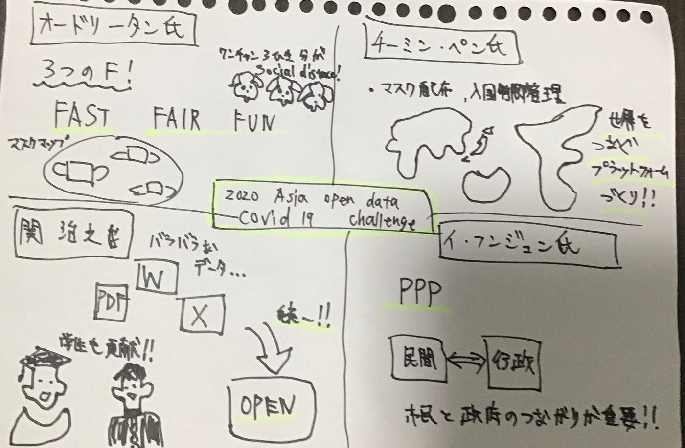
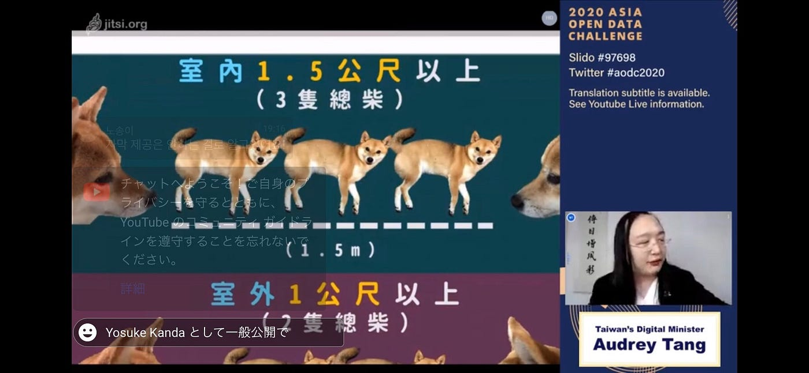

### 2020 ASIA OPEN DATA CHALLENGEに参加して

今回は初めての国際会議となった2020 ASIA OPEN DATA CHALLENGE – open Data in Social Actions: Covid-19 Pandemic に参加しての感想や気付いた点をまとめていきます。「台湾・韓国・日本のコロナ禍における政府のオープンデータ活用の最新事例とこれから」という非常にタイムリーなテーマで刺激を受ける内容でした。

中でも台湾のオードリー・タン氏3つの**F**についての言及が興味深く「**FAST**」-市民や自治体と政府の連携がいち早くとれること。「**FARIR**」-マスクマップやダッシュボードを利用してマスクの供給が行き渡っているかを確認できるシステム。「**FUN**」ユーモアを駆使して国民の記憶に残るユーニークな注意喚起を行う。どれもコロナのパンデミックにあって欠かせない要素で特に「FUN」のように悲観的な状況にあってユーモアを大切にすることは忘れがちな視点だと感じました。

また日本の関 浩之氏は東京都の公式covid-19感染症対策サイトの作成をされた方ということで高校生や大学生をはじめ市民が誰でもコミットできるオープンデータを利用したウェブサイトの存在というのは一個人でも協力することができ素晴らしい対応だと思いました。各国に比べこうした国によるIT活用の遅れが指摘される日本において先進的で、ここからより国民がオープンデータ利用について積極的になっていくのではないかと思います。

韓国のイ・フンジュン氏、台湾のチーミン・ペン氏の説明でも政府と市民、自治体の連携また全世界においての繋がりの重要性も指摘されており今回のイベントを通じてオープンデータが共有されることの大きな可能性を感じることができました。

#### グラレコ

#### スクショ

