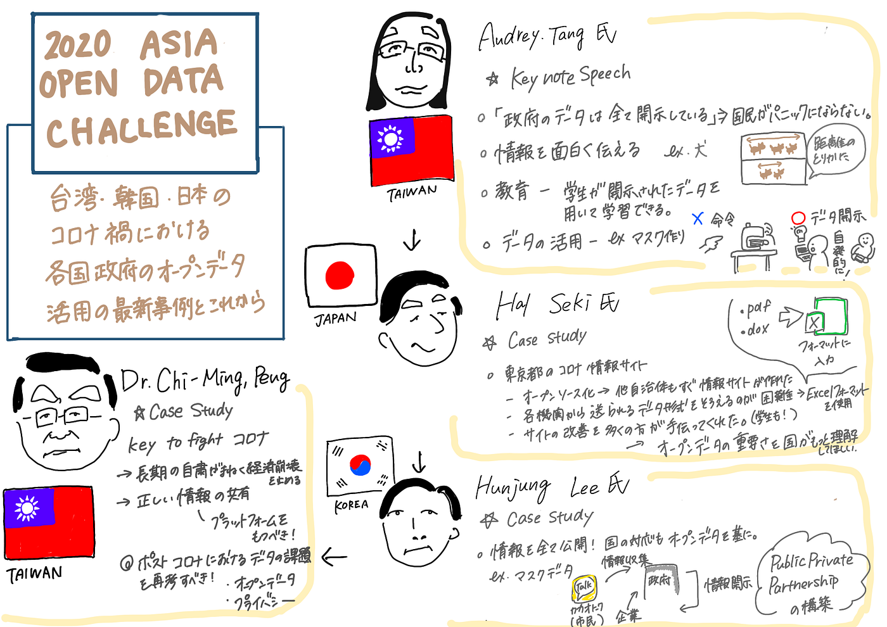
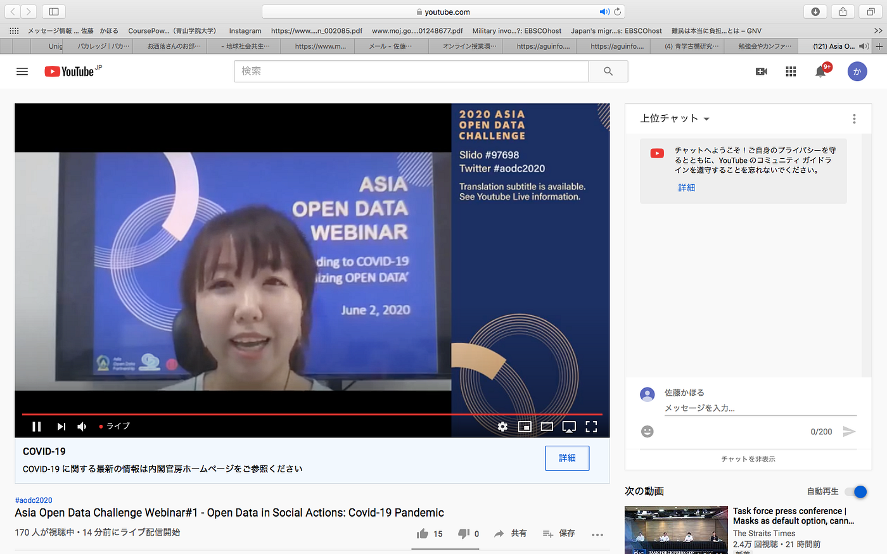
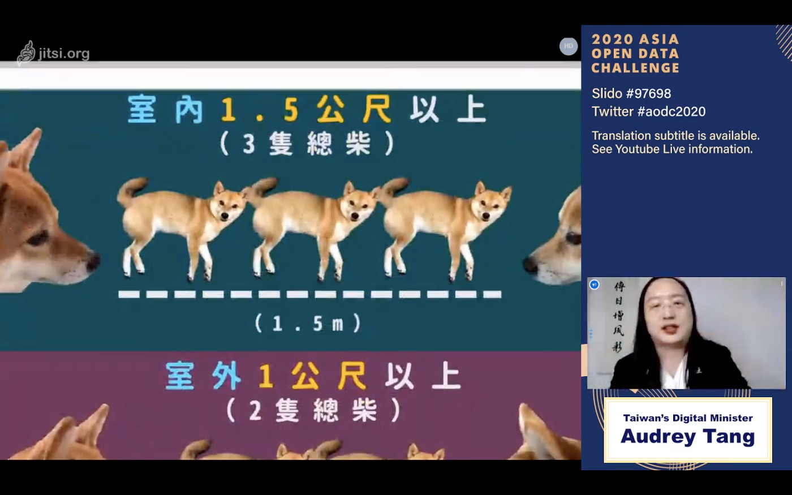

### 2020 Asia OpenData Challengeに参加

３年の佐藤です。

6月2日に行われた国際会議「[2020 Asia OpenData Challenge](https://youtu.be/E1j8EhdHRPw)」に参加しましたので、ここにまとめます。
この国際会議はyoutubeのwebinarを使って行われ、参加というより視聴しました。

本会議は、『台湾・日本・韓国のコロナ禍における各国政府のオープンデータ活用の最新事例とこれから』と題されており、各国の代表４名がお話しされました。順に内容を紹介します。

1. Audrey Tang氏（台湾）

Audrey氏は主に台湾政府が行ったコロナに対する施策についてお話しされました。まずパンデミックにおけるdigital social innovation の重要性を述べ、３つのFからdigital social innovationを特徴付けて説明をされました。

FAST
とても重要。例えば、国民から情報・知見を素早く得るために例えばホットラインとして電話窓口を開設。
FARIR
マスクマップ：マスクが足りているか、オープンデータを用いて在庫などの情報共有。国民がマスクを自主的に作るようになった。
ダッシュボード：コンビニなどと協力し、マスクが足りない自治体に対応。
FUN
「humor over rumor」という言葉を用いて、情報を開示する際の工夫を説明。ユーモアのあるデザインは簡潔に情報を伝えるのに良い。例えば犬を用いたイラストで、ソーシャルディスタンスの重要性を強調。

また、Audrey氏は台湾政府が国民に全ての情報を開示していることを強調されました。

2. Hal Seki氏（日本）

Seki氏は「オープンソースとオープンデータによる次世代政府のウェブサイト」と題し、主に東京都のCOVID-19情報サイトを開設した際のことをお話ししました。

＜主な内容＞

・医療機関等、各機関から送られるデータは、pdfなど形式がバラバラで揃
 えることが困難→Excelフォーマットを使用し、形式を揃える。
・民間の協力が大きかった（学生も参加）→誰でも変更可能で、サイト改
 善に役立つ。
・東京都の情報サイトをオープンソース化したことで、他の自治体も迅速
 に情報サイトを作成することができた。

最後にSeki氏はオープンデータの重要さを国がもっと理解してほしいとおっしゃっていました。

3. Hunjung Lee氏 （韓国）

Hunjung Lee氏も、韓国が情報を全て公開していることを強調していました。国の対応もオープンデータをもとに行っているそうです。

また、Public Private partnershipの構築を唱え、例としてマスクデータについて話されました。韓国政府は民間企業と協力し、カカオトークアプリを用いて市民からの情報収集・情報開示を行っています。その他、感染者の移動軌跡が記録・開示されるアプリなどの国民誰もが対策可能にするアプリが開発されています。

4. Dr. Chi-Ming, Peng氏（台湾）

Dr. Chi-Ming, Peng氏は、「Key to fight Covid-19」として、経済と正しい情報の共有というコンテンツを掲げ、説明されました。

中でも興味深かったのは、どの病院でもその人に適した治療ができるように個人の医療情報を活用・共有することです。

また、Dr. Chi-Ming, Peng氏は環境問題についても触れ、コロナ禍で自然環境が改善したことを説明しましたが、経済活動が再び始まれば自然環境は戻ってしまうと述べられました。

以上が４名の各国代表のスピーチです。会議ではこの後パネルディスカッションがあり、終了しました。

グラレコ

スクショ

