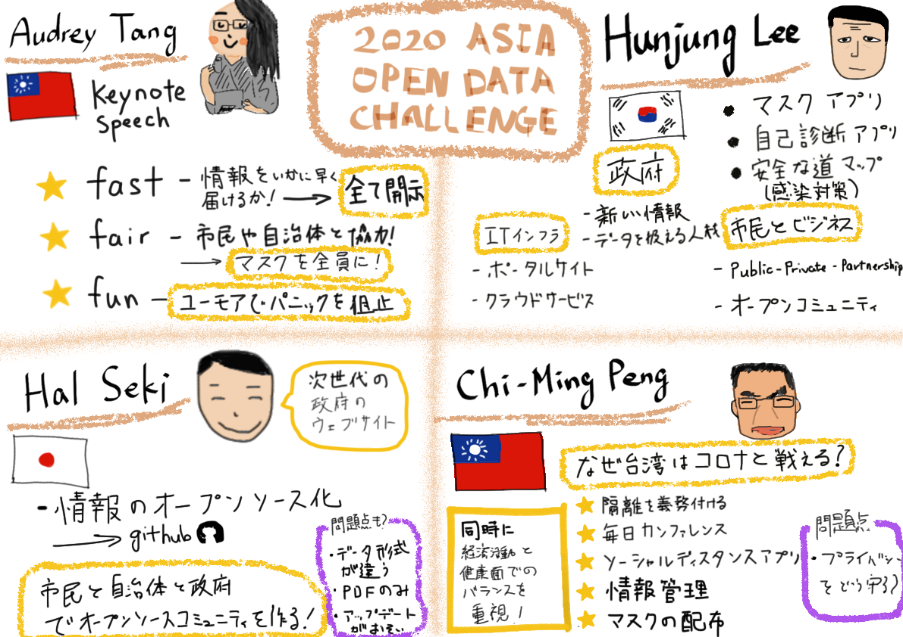
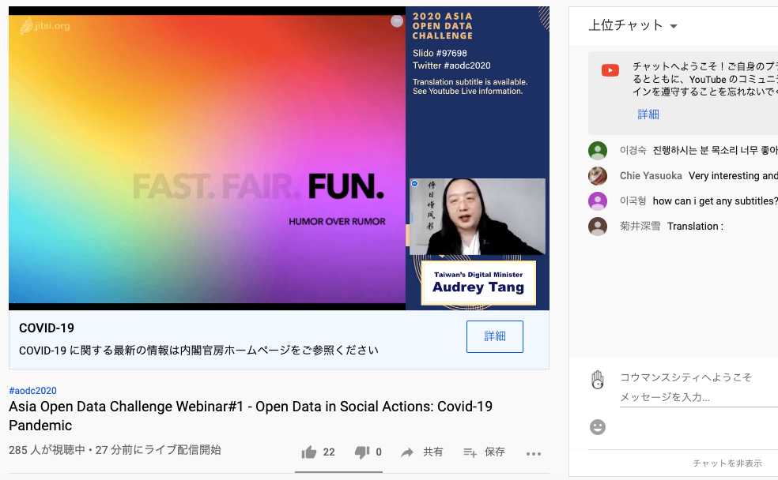

### [AOCD2020]国際会議に参加した

2020 ASIA OPEN DATA CHALLENGE — open Data in Social Actions: Covid-19 Pandemic という題で、今の新型コロナウイルスの感染拡大におけるオープンデータのあり方はどうあるべきなのか？４人のスピーカーのプレゼンテーションを聞きました！

講演を通して自分が重要だと思ったことをまとめます。

#### 情報は早く、全て開示

社会的に影響を与えるような問題、特に今回のようなパンデミックのような状況では情報をオープンにすることで、対応が早くなるということです。

台湾のデジタル担当大臣であるAudrey Tangさんが言っていたように、市民や自治体の情報を迅速に取り入れながら、対応していくことで予期せぬ事態やパニックを防ぐことができる。

また、わかりやすい形式で誰でも簡単に確認できるようにデータを整理することが大切だと思います。

#### コミュニティ作り

関 治之さんは市民、自治体、政府でのオープンソースコミュニティ作りの重要性を話していました。より多くのデータを作成するには多くの作業が必要になります。同様にHunjung Leeさんも市民と行政のコラボレーションについて話していました。Public-Private partnarshipというキーワードをあげて政府と市民のそれぞれの役割を解説されており、政府や自治体とどのように関わっていけば良いか理解できました。

#### 台湾のコロナ対策

Chi-Ming Pengさんのお話で、台湾のコロナ対策から様々なことが学べると思いました。感染者が出てからの情報共有、感染拡大を防ぐための対応（隔離やマスクの配布など）で、どれも迅速に行っていたということで、しかるべき行動を取れていました。正しい情報を共有できたことでデマ情報によるパニックを防いだり、活動自粛による経済崩壊にも対応できたのはこれらの行動の早さによるものだと考えます。

個人的にオープンデータに対するリテラシーがまだ低かったので、これからどうあるべきか考えるきっかけとなりました。

＜グラレコ＞

＜国際会議のスクショ＞

